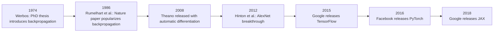

Backpropagation—the backbone of modern deep learning—efficiently computes gradients of a scalar loss with 
respect to millions of parameters by applying the chain rule layer by layer. First popularized by Rumelhart, 
Hinton, and Williams (1986), it transformed neural networks into practical tools for vision, language, and beyond.

In this post, aimed at data scientists and students, we will:

1. Ground backpropagation in scalar derivatives, gradients, and Jacobians.  
2. Derive the backward‐pass equations for a simple multilayer perceptron (MLP).  
3. Show how to implement it efficiently with matrix–vector operations.  
4. Highlight common pitfalls: vanishing/exploding gradients, dying ReLUs, gradient‐clipping bugs.  
5. Survey extensions: backprop through time, normalization layers, auto-differentiation.  
6. Walk through the intuitive “error-nudge” picture linking errors to weight updates.

---

## 1. Introduction

Backpropagation—short for **backward propagation of errors**—is the algorithm that makes training deep networks feasible. By systematically applying the chain rule of calculus, it computes \(\nabla_{\!W} L\) and \(\nabla_{\!b} L\) in time linear in the number of connections rather than exponential in depth[1].



 Timeline of backpropagation’s development—from Werbos (1974) to Rumelhart et al. (1986) to modern frameworks.

---

## Mathematical Foundations

### Scalar Derivatives & the Chain Rule

If  
\[
u = f(v),\quad v = g(w),
\]
then
\[
\frac{du}{dw}
= \frac{du}{dv}\,\frac{dv}{dw}.
\]

$$
\frac{\partial e}{\partial a}
= \frac{\partial e}{\partial c}\,\frac{\partial c}{\partial a}
\quad\text{and}\quad
\frac{\partial e}{\partial b}
= \frac{\partial e}{\partial c}\,\frac{\partial c}{\partial b}
+ \frac{\partial e}{\partial d}\,\frac{\partial d}{\partial b}
$$

A neural network is a deep composition of such functions, so applying this rule layer by layer yields gradients for 
every weight and bias[2].

**[INSERT FIGURE: Computational-graph “slice” showing local chain-rule multiplications.]**  
*Source: Stanford XCS224N Handouts, “Neural Networks, Backpropagation” (https://github.com/scpd-proed/XCS224N-Handouts/raw/main/Neural%20Network%20Learning/Neural%20Networks%2C%20Backpropagation.pdf), p. 4, Fig. 2.*

{: width="500" height="250" }
_Derivatives on a computational graph,” [Chris Olah, “Calculus on Computational Graphs: Backpropagation”](https://colah.github.io/posts/2015-08-Backprop/#derivatives)_


### 2.2 Gradients & Jacobians

For \(\mathbf{y}=f(\mathbf{x})\) mapping \(\mathbb{R}n\to\mathbb{R}m\), the **Jacobian** \(J\) has entries \(J_{ij}=\partial y_i/\partial x_j\).  Backprop never forms full Jacobians; instead it propagates **error signals** \(\delta\) and multiplies by local derivative matrices, collapsing large Jacobians into efficient vector–matrix products[3].

---

## 3. Deriving Backpropagation for an MLP

Consider a two-layer MLP:

- **Input** \(\mathbf{x}\in\mathbb{R}d\)  
- **Hidden layer**: \(\mathbf{W}{[1]}\in\mathbb{R}{h\times d},\; \mathbf{b}{[1]}\in\mathbb{R}h,\; \sigma(\cdot)\)  
- **Output layer**: \(\mathbf{W}{[2]}\in\mathbb{R}{k\times h},\; \mathbf{b}{[2]}\in\mathbb{R}k,\; f_{\mathrm{out}}(\cdot)\)  
- **Loss** \(L(\hat{\mathbf{y}},\mathbf{y})\)

### 3.1 Forward Pass

\[
\begin{aligned}
\mathbf{z}{[1]} &= \mathbf{W}{[1]}\,\mathbf{x} + \mathbf{b}{[1]}, 
&\mathbf{a}{[1]} &= \sigma(\mathbf{z}{[1]}),\\
\mathbf{z}{[2]} &= \mathbf{W}{[2]}\,\mathbf{a}{[1]} + \mathbf{b}{[2]},
&\hat{\mathbf{y}} &= f_{\mathrm{out}}(\mathbf{z}{[2]}).
\end{aligned}
\]

### 3.2 Backward Pass

Let \(\delta{[2]} = \partial L/\partial \mathbf{z}{[2]}\).  Then

\[
\delta{[2]}
= \frac{\partial L}{\partial \hat{\mathbf{y}}}
\;\circ\;
f_{\mathrm{out}}'(\mathbf{z}{[2]}), 
\quad
\nabla_{\!W{[2]}}L
= \delta{[2]}\,(\mathbf{a}{[1]})\top,
\quad
\nabla_{\!b{[2]}}L
= \delta{[2]}.
\]

Propagating back to layer 1:

\[
\delta{[1]}
= (\mathbf{W}{[2]})\top\,\delta{[2]}
\;\circ\;
\sigma'(\mathbf{z}{[1]}),
\quad
\nabla_{\!W{[1]}}L
= \delta{[1]}\,\mathbf{x}\top,
\quad
\nabla_{\!b{[1]}}L
= \delta{[1]}.
\]

**[INSERT FIGURE: Full chain-rule derivation on two-layer MLP.]**  
*Source: P. Vincent, “Backpropagation,” Université de Montréal lecture (https://www.iro.umontreal.ca/~vincentp/ift3395/lectures/backprop_old.pdf), p. 2, central diagram.*

---

## 4. Efficient, Vectorized Implementation

Rather than forming giant Jacobians:

- Pass **error signals** \(\delta{[\ell]}\) matching each layer’s pre-activation shape.  
- Compute weight gradients via **outer products**:  
  \(\nabla_{\!W{[\ell]}}L = \delta{[\ell]}\,(a{[\ell-1]})\top\).  
- Use BLAS-optimized matrix–matrix and matrix–vector multiplies.

```python
# Backward pass for L layers
delta[L] = loss_grad(a[L], y) * act_out_grad(z[L])
for ℓ in reversed(range(1, L+1)):
    dW[ℓ] = delta[ℓ] @ a[ℓ-1].T
    db[ℓ] = delta[ℓ]
    if ℓ > 1:
        delta[ℓ-1] = (W[ℓ].T @ delta[ℓ]) * act_grad(z[ℓ-1])
````

**\[INSERT FIGURE: Vectorized backward-pass flowchart (no full Jacobians).]**
*Source: CS231n, “Derivatives and Backpropagation” ([http://cs231n.stanford.edu/handouts/derivatives.pdf](http://cs231n.stanford.edu/handouts/derivatives.pdf)), p. 4, Fig. 3.*

---

## 5. Common Pitfalls & Intuitions

### 5.1 Vanishing & Exploding Gradients

Deep stacks of sigmoid or tanh can shrink or blow up gradients exponentially, making training unstable[4].

**\[INSERT FIGURE: Plot of $\sigma'(x)$ vs. $x$, showing vanishing/exploding regimes.]**
*Source: Andrej Karpathy, “Yes You Should Understand Backprop” ([https://karpathy.medium.com/yes-you-should-understand-backprop-e2f06eab496b](https://karpathy.medium.com/yes-you-should-understand-backprop-e2f06eab496b)), Fig. 3 (“Vanishing Gradients”).*

### 5.2 Dying ReLUs

ReLUs can become inactive if inputs stay negative—Leaky ReLU or PReLU keep a small gradient when “off”[5].

### 5.3 Gradient-Clipping & Framework Gotchas

Karpathy recounts a TensorFlow RNN bug where inadvertent buffer reuse clipped gradients, stalling learning[5].

---

## 6. Extensions & Variations

* **Backpropagation Through Time (BPTT):** Unroll RNNs over timesteps and apply the same chain-rule, with truncation to limit graph size[5].
* **Batch Normalization:** Adds backward terms for mean/variance—see Collobert et al., Fig. 2[6].
* **Auto-Differentiation:** Reverse-mode AD generalizes backprop to arbitrary graphs, computing Jacobian–vector products automatically[7].

**\[INSERT FIGURE: Sketch of BPTT unrolling and BN backward-pass flow.]**
*Source: Collobert et al., “Natural Language Processing (Almost) from Scratch,” JMLR 12:2493–2537 (2011), p. 8, Fig. 2 ([https://www.jmlr.org/papers/volume12/collobert11a/collobert11a.pdf](https://www.jmlr.org/papers/volume12/collobert11a/collobert11a.pdf)).*

---

## 7. Intuitive “Error-Nudges” Walkthrough

3Blue1Brown visualizes each output error as a colored “force” that flows backward through the network, nudging weights by their share of responsibility[8].

**\[INSERT FIGURE: 3Blue1Brown “error-nudge” diagram.]**
*Source: 3Blue1Brown, “But what is a neural network? | Chapter 3: Backpropagation” ([https://www.3blue1brown.com/lessons/backprop](https://www.3blue1brown.com/lessons/backprop)).*

---

## 8. Conclusion

Backpropagation remains the **cornerstone** of deep learning. Master its derivation, efficient implementation, 
and pitfalls—and visualize the “error-nudge” mechanics—to debug and innovate beyond black-box frameworks.

---


[1]: Werbos P. J. “Beyond Regression: New Tools for Prediction and Analysis in the Behavioral Sciences,” PhD thesis, Harvard University (1974). [https://www.researchgate.net/profile/Paul-Werbos/publication/35657389_Beyond_regression_new_tools_for_prediction_and_analysis_in_the_behavioral_sciences/links/576ac78508aef2a864d20964/Beyond-regression-new-tools-for-prediction-and-analysis-in-the-behavioral-sciences.pdf?origin=publication_detail&_tp=eyJjb250ZXh0Ijp7ImZpcnN0UGFnZSI6InB1YmxpY2F0aW9uIiwicGFnZSI6InB1YmxpY2F0aW9uRG93bmxvYWQiLCJwcmV2aW91c1BhZ2UiOiJwdWJsaWNhdGlvbiJ9fQ&__cf_chl_tk=bp776zei6FRHy_7VsMiJ3_ADsHP0DVcS5Xc4TlN.1Gg-1751061551-1.0.1.1-EDmWCh.g2QqJUkvmNRYrxR4h15olqXCJIfirDvsEPIM](https://www.researchgate.net/profile/Paul-Werbos/publication/35657389_Beyond_regression_new_tools_for_prediction_and_analysis_in_the_behavioral_sciences/links/576ac78508aef2a864d20964/Beyond-regression-new-tools-for-prediction-and-analysis-in-the-behavioral-sciences.pdf?origin=publication_detail&_tp=eyJjb250ZXh0Ijp7ImZpcnN0UGFnZSI6InB1YmxpY2F0aW9uIiwicGFnZSI6InB1YmxpY2F0aW9uRG93bmxvYWQiLCJwcmV2aW91c1BhZ2UiOiJwdWJsaWNhdGlvbiJ9fQ&__cf_chl_tk=bp776zei6FRHy_7VsMiJ3_ADsHP0DVcS5Xc4TlN.1Gg-1751061551-1.0.1.1-EDmWCh.g2QqJUkvmNRYrxR4h15olqXCJIfirDvsEPIM)
[2]: Rumelhart D. E., Hinton G. E., Williams R. J. (1986). “Learning representations by back-propagating errors.” *Nature* 323(6088):533–536. [https://www.cs.utoronto.ca/~hinton/absps/naturebp.pdf](https://www.cs.utoronto.ca/~hinton/absps/naturebp.pdf)
[3]: Stanford XCS224N Handouts, “Neural Networks, Backpropagation,” [https://github.com/scpd-proed/XCS224N-Handouts/raw/main/Neural%20Network%20Learning/Neural%20Networks%2C%20Backpropagation.pdf?utm\_source=genmind.ch](https://github.com/scpd-proed/XCS224N-Handouts/raw/main/Neural%20Network%20Learning/Neural%20Networks%2C%20Backpropagation.pdf?utm_source=genmind.ch)
[4]: Karpathy A. (2016). “Yes You Should Understand Backprop.” [https://karpathy.medium.com/yes-you-should-understand-backprop-e2f06eab496b?utm\_source=genmind.ch](https://karpathy.medium.com/yes-you-should-understand-backprop-e2f06eab496b?utm_source=genmind.ch)
[5]: Vincent P. (2004). “Backpropagation.” Université de Montréal lecture, [https://www.iro.umontreal.ca/\~vincentp/ift3395/lectures/backprop\_old.pdf?utm\_source=genmind.ch](https://www.iro.umontreal.ca/~vincentp/ift3395/lectures/backprop_old.pdf?utm_source=genmind.ch)
[6]: Collobert R., Weston J., Bottou L., Karlen M., Kavukcuoglu K., Kuksa P. (2011). “Natural Language Processing (Almost) from Scratch.” JMLR 12:2493–2537. [https://www.jmlr.org/papers/volume12/collobert11a/collobert11a.pdf?utm\_source=genmind.ch](https://www.jmlr.org/papers/volume12/collobert11a/collobert11a.pdf?utm_source=genmind.ch)
[7]: Nielsen M. A. (2015). *Neural Networks and Deep Learning*, Chapter 2, “How the Backpropagation Algorithm Works.” [http://neuralnetworksanddeeplearning.com/chap2.html?utm\_source=genmind.ch](http://neuralnetworksanddeeplearning.com/chap2.html?utm_source=genmind.ch)
[8]: 3Blue1Brown. “But what is a neural network? | Chapter 3: Backpropagation.” [https://www.3blue1brown.com/lessons/backpropagation?utm\_source=genmind.ch](https://www.3blue1brown.com/lessons/backpropagation?utm_source=genmind.ch)

