Have you ever tapped on your phone’s keyboard and seen it guess your next word? That “magic” used to (and often still does!) come from **n-gram language models**—the statistical workhorses that predate today’s fancy LLMs.
N-gram language models are one of the classic approaches to predicting text. 


In this deep dive we’ll:

1. Define n-grams and the Markov assumption
2. Show the math behind n-gram probabilities
3. Walk through a simple Python bigram example
4. Explore real-world uses (e.g., keyboards, speech recognition)
5. Compare to modern neural LLMs

Let’s get started!

---

## What Is an “N-gram”? 📚

In natural language processing, an **n-gram** is simply a contiguous sequence of *n* items from text. Typically those items are words (though they could also be characters or syllables). For example:

* **Unigram (1-gram):** a single word, e.g. "hello".
* **Bigram (2-gram):** a sequence of two consecutive words, e.g. "machine learning".
* **Trigram (3-gram):** three consecutive words, e.g. "deep neural network".

The value of *n* defines the order of the model: a *bigram model* uses the previous 1 word of context, a *trigram model* uses the previous 2 words, and in general an *n-gram model* looks at the previous *n-1* words of context. By breaking text into these chunks, n-gram models capture local context in language – for instance, that "New" is often followed by "York", or "credit card" is a common two-word phrase.


By counting how often each n-gram appears in a large corpus, we can estimate how likely certain word sequences are—and use that to predict the next word!

---

## How N-gram Language Models Work

An n-gram **language model** uses n-grams to estimate how likely a given sequence of words is. The core idea is the **Markov assumption**: the probability of each word depends only on the *preceding* n-1 words, not the entire history. In other words, n-gram models approximate language by looking at a sliding window of n words.

Let's break that down with an example. Suppose we want to estimate the probability of a sentence *W* = "There was heavy rain". According to the chain rule of probability, we could factor it as:

$$

\begin{aligned}
P\bigl(\text{“There was heavy rain”}\bigr)
&= P\bigl(\text{“There”}\bigr)\,
    P\bigl(\text{“was”}\mid\text{“There”}\bigr)\\
&\quad\times P\bigl(\text{“heavy”}\mid\text{“There was”}\bigr)\,
    P\bigl(\text{“rain”}\mid\text{“There was heavy”}\bigr)\,.
\end{aligned}

$$

This is exact but in practice hard to compute for long contexts. The Markov assumption simplifies it. If we choose a **bigram (2-gram) model**, we assume each word depends only on *one* previous word. The sentence probability then approximates to:

$$
\begin{aligned}
P\bigl(\text{“There was heavy rain”}\bigr)
&\approx P\bigl(\text{“There”}\bigr)\,
    P\bigl(\text{“was”}\mid\text{“There”}\bigr)\\
&\quad\times P\bigl(\text{“heavy”}\mid\text{“was”}\bigr)\,
    P\bigl(\text{“rain”}\mid\text{“heavy”}\bigr)\,.
\end{aligned}
$$

We dropped the longer context in conditional probabilities, using only the immediate predecessor (previous one word). In a **trigram model**, we would use the previous two words of context for each prediction, and so on. The trade-off is that higher-order models consider more context but also become more complex and data-hungry.

### Counting N-grams and Calculating Probabilities

N-gram models are **statistical** models: we build them by counting how often word sequences occur in a large text corpus. These counts are then converted into probabilities. For an n-gram model, the **conditional probability** of a word given its previous n-1 words is calculated as:

$$
P(w_i \mid w_{i-(n-1)}, \dots, w_{i-1}) \;=\; \frac{\text{count}(w_{i-(n-1)}, \dots, w_{i-1}, w_i)}{\text{count}(w_{i-(n-1)}, \dots, w_{i-1})} \,
$$

i.e. the ratio of the count of the whole n-gram to the count of its (n-1)-word prefix. For example, with a bigram model, the probability of "rain" given "heavy" would be the count of the bigram ("heavy", "rain") divided by the count of the word "heavy" in the training text.

These probabilities allow the model to predict text. If you're at a word sequence (context) and want to guess the next word, the model will look at all possible next words that followed this context in the training data, and choose the one with the highest probability (or sample according to those probabilities). In our example above, a bigram model might know *"heavy rain"* is a more frequent combination than *"heavy flood"* in normal language, so after seeing "heavy" it would predict "rain" as the likely next word.

**Note:** To handle sentence boundaries, n-gram models often include special start-of-sentence `<s>` and end-of-sentence `</s>` tokens. For instance, a trigram model estimating the probability of the first word in a sentence would use `<s>` tokens as placeholders for preceding context.


### Avoiding the Zero-Probability Problem (Smoothing)

One challenge with n-gram models is that if a particular n-gram never appeared in the training data, the naive calculation would assign it zero probability – meaning the model would consider that sequence impossible. Language is creative, so we need to mitigate this! Various **smoothing** techniques are applied to give some probability to unseen n-grams. Simple approaches include adding a small fixed count to every possible n-gram ("add-one" or Laplace smoothing), or more advanced methods like Good–Turing discounting and Katz back-off. The details of smoothing are beyond our scope here, but the key point is that an n-gram model must handle unseen words or combinations gracefully (often a special `<unk>` token represents any unknown word).


$$
\text{count} \leftarrow \text{count} + \delta
$$

More advanced: Good–Turing, Katz back-off, Kneser–Ney…

---
## Building an N-gram Model for Word Prediction (Python Example)

To make this more concrete, let's **build a simple bigram model** and use it to predict the next word. We'll use a short sample text as our "corpus." In practice, you'd use a much larger text dataset to get good predictions, but the process is the same.

```python
# Sample training text (corpus)
text = "I love cats. I love dogs. Cats and dogs love me."
words = [w.lower().strip(".") for w in text.split()]  # basic tokenization into words

# Count bigrams (pairs of consecutive words)
from collections import Counter
bigrams = list(zip(words, words[1:]))
bigram_counts = Counter(bigrams)

# Generate next-word prediction for a given context word
prev_word = "i"
candidates = {w2: count for (w1, w2), count in bigram_counts.items() if w1 == prev_word}
if candidates:
    next_word = max(candidates, key=candidates.get)  # most frequent continuation
    print(f"Most likely word after '{prev_word}' is: {next_word}")

# Let's also see the probabilities of each candidate after 'love'
context = "love"
candidates = {w2: count for (w1, w2), count in bigram_counts.items() if w1 == context}
total_count = sum(candidates.values())
for word, count in candidates.items():
    prob = count / total_count
    print(f"P({word!r} | {context!r}) = {prob:.2f}")
```

Running this code, we first count all bigrams in the text. The bigram counts might look something like:

```
{('i', 'love'): 2, ('love', 'cats'): 1, ('love', 'dogs'): 1, ('love', 'me'): 1, ...}
```

This tells us "I love" appears twice, and after "love" the words "cats", "dogs", and "me" each appear once in our mini-corpus. Using these counts:

* If the previous word is `"i"`, the model finds that `"love"` is the most likely next word (it’s the only candidate, appearing 2 out of 2 times after "i"). So it would predict **"love"** after "I".
* If the previous word is `"love"`, the candidates for next word are `"cats"`, `"dogs"`, and `"me"` – each with equal probability 1/3 (33%) in this toy example. The code above would choose the most common (in Python's `max`, ties are broken arbitrarily, so it might pick `"cats"`). A smarter approach could be to randomly **sample** the next word according to these probabilities, but either way, the distribution is 0.33 each for those three words.

> **Tip:** In a real application, the n-gram counts would come from a large corpus (like millions of words). Then, given your current context, you compute probabilities for the next word as `count(context + candidate) / count(context)` and choose a likely word. The strength of n-gram models is that they are **simple and fast** to compute. So you’d train on millions of words and **sample** according to probability rather than always choosing the max, to keep suggestions varied.

---


## Practical Applications of N-gram Models

Even though n-gram models are simple, they've been very useful in NLP tasks:

* **Predictive Text Keyboards:** Many smartphone keyboards historically used n-gram models to suggest your next word as you type. For example, the popular SwiftKey keyboard (prior to its neural upgrade) looked at the last two words you typed (a trigram context, since it used a 2-word prefix) and used a large database of phrase frequencies to guess the next word. This made typing faster by recommending common word sequences. (The downside: if you typed an unusual phrase or a very long context, the suggestions might be off, because the model only knew about short contexts.)
* **Speech Recognition:** N-gram models help decode speech by predicting which word likely comes next given the last few words, thus filtering out acoustically ambiguous results. For example, after "I'd like a cup of", an n-gram model strongly predicts "tea" or "coffee" over a random word, aiding the speech recognizer.
* **Machine Translation:** Early translation systems used n-gram language models to ensure the output sounded fluent. The translator would choose wordings that have higher n-gram probabilities in the target language.
* **Spell Checking & Correction:** N-grams can help decide if "rain" is more likely than the typo "rainn" by looking at surrounding words. They can even catch mistakes that a simple dictionary check won't, e.g. distinguishing "about fifteen minutes" vs "about fifteen minuets" (both "minutes" and "minuets" are valid words, but an n-gram model knows "fifteen minutes" is a common phrase whereas "fifteen minuets" is not).

In summary, n-gram models have been a foundational tool in NLP applications that need quick predictions of text. They shine when there's a lot of local regularity in language usage (like common phrases). However, they do have limitations, especially when context or global meaning matters more – which is where modern techniques come in.


_mock-up of a phone keyboard suggestion bar, annotating how the last two words map to an n-gram lookup_


---
## From N-grams to Modern LLMs: What’s Improved? 🤖

N-gram models are **fast and simple**, but they have clear shortcomings. They consider only a limited context (fixed window of n-1 words) and don't truly understand meaning – they just count occurrences. As we use larger n (4-gram, 5-gram, etc.), we capture a bit more context, but we also run into the problem of data sparsity (many possible word combinations never appear in training) and **combinatorial explosion** in storage. In practice, beyond a certain n (often around 3 to 5), the gain from adding more context is very small compared to the increase in model size and data requirements. For example, SwiftKey's old engine capped at using 2-word context because using 3 or 4 words would require a *huge* database and be too slow on a phone.

**Enter neural network language models and LLMs.** Modern large language models like GPT-3 or GPT-4 are built with neural networks (specifically Transformers) rather than raw n-gram counts. These models overcome many n-gram limitations:

* **Longer Context:** LLMs can consider dozens or even hundreds of words of prior context, rather than just a few. They are not bound to a fixed n-1 context window. For instance, a Transformer-based model can attend to information at the beginning of a paragraph when predicting an outcome at the end, capturing long-range dependencies that n-grams would miss.
* **Generalization:** Rather than memorizing exact word sequences, LLMs learn patterns via *training on huge datasets*. Words and phrases are encoded in vector representations (embeddings) that capture semantic relationships. This means an LLM can understand that "meet you at the airport" is similar in intent to "meet you at the hotel", even if the exact phrase wasn't seen during training. N-gram models, by contrast, would treat those sequences as unrelated unless those exact word combinations were counted. In the SwiftKey example, the neural model could suggest "airport" or "office" after "Meet you at the" by understanding context, whereas the n-gram model, stuck on a two-word context "at the", could only suggest generic continuations like "moment" or "end".
* **Fluency and Accuracy:** Because they capture more context and nuanced word meanings, neural LLMs produce more fluent and contextually appropriate text. In many benchmarks (e.g. speech recognition, translation), neural models have **significantly outperformed** n-gram models.
* **Handling Unseen Words:** LLMs can handle new or rare words better by using subword units or character-level information. They don't assign zero probability to a novel word sequence outright; they can infer something from component pieces or context. An n-gram model would have given an unseen sequence a zero probability (unless smoothing is applied).

It's worth noting that these improvements come at a cost: LLMs are computationally heavy, requiring lots of data and processing power to train (and often even to run). N-gram models, in contrast, are lightweight enough to run on your device with minimal latency. That's why earlier mobile apps stuck with n-grams, but as technology has advanced, even phones can now leverage compact neural models for better predictions.
To put it succinctly, **n-gram models treat language like a collection of frequent snippets, while LLMs attempt to *learn* language, capturing both local and global patterns**. N-gram models were a crucial stepping stone in NLP, but they have been *largely superseded* by neural network models and modern LLMs that achieve far greater accuracy and fluency.
---

## Limitations & the Rise of Neural LLMs 🚀

| **N-gram Models**            | **Modern LLMs (e.g. GPT-4)**            |
| ---------------------------- | --------------------------------------- |
| Fixed context window (n−1)   | Hundreds to thousands of tokens         |
| Must store huge count tables | Learn compact vector representations    |
| Sparsity → lots of smoothing | Generalize to unseen sequences          |
| Lightweight, fast on CPU     | Heavy computation, often GPU/TPU needed |

```mermaid

flowchart LR
    %% Sliding n-gram window
    subgraph Sliding_Window["Sliding n-gram Window (n=3)"]
      direction TB
      SW1["Tokens: the — cat — sat — on — mat"]
      SW2["Window 1: [the, cat, sat]"]  
      SW3["Window 2: [cat, sat, on]"]  
      SW4["Window 3: [sat, on, mat]"]  
      SW1 --> SW2
      SW1 --> SW3
      SW1 --> SW4
    end

    %% Transformer attention
    subgraph Transformer_Attention["Transformer Attention Map"]
      direction TB
      TA1["Tokens: the — cat — sat — on — mat"]
      TA2["Each token attends to ALL tokens"]
      TA1 --> TA2
    end

    %% Layout
    Sliding_Window --- Transformer_Attention
```



While n-grams paved the way—powering NLP from the 1970s through \~2012—their “local counts” approach can’t capture long-range dependencies or semantic nuance the way neural LLMs do. But remember: the core lesson from Manning’s class is **scale + better models**, not scale alone. N-grams still shine when you need a tiny, interpretable model with instant on-device predictions. 😉

---

## Conclusion 🎉

N-gram language models are the **classic** statistical tool for predicting text. By making a simplifying Markov assumption and counting short word sequences, they enabled:

* Early predictive keyboards
* Real-time speech decoders
* Quick, on-device text generation

Though largely superseded by neural LLMs today, n-grams remain an invaluable teaching example—and a lightweight solution when you need speed and simplicity. Next time your phone nails your next word, tip your hat to these humble models! 🎩

