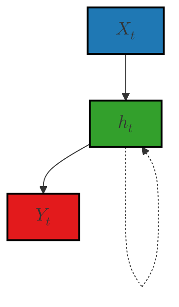

A modern language model must handle vast contexts, share parameters efficiently, and overcome the vanishing-gradient issues 
that plagued early RNNs. Count-based n-grams hit a combinatorial wall: storage blows up and sparsity kills 
generalization ([Limitations of N-gram Language Models and the Need for Neural Networks][1]). 
Bengio et al.’s fixed-window neural LM introduced embeddings and a Softmax over concatenated vectors, 
yet still used separate weights per position ([A Neural Probabilistic Language Model][2]). 
Elman RNNs unify this by reusing input, recurrent, and output matrices $U,W,V$ at every time step, 
making the model compact and context-flexible ([Simple Recurrent Networks][3]). 
However, simple RNNs suffer vanishing gradients, effectively “forgetting” information more than \~7 steps back ([Why do RNNs have Short-term Memory?][4]). 
LSTMs fix this with additive cell-state updates gated by forget, input, and output gates, 
preserving long-term dependencies ([LSTM and its equations][5]). 
Training minimizes average cross-entropy—whose exponentiation yields perplexity (lower is better) ([en.wikipedia.org][6], [medium.com][7])—via 
Backpropagation Through Time, often truncated for efficiency ([neptune.ai][8]). 
RNNs also power speech, translation, and time-series tasks, and at scale demand tricks like 
Facebook’s adaptive softmax for billion-word vocabularies ([engineering.fb.com][9]). 
Despite remedies like gradient clipping for exploding gradients ([arxiv.org][10]), 
vanilla RNNs remain eclipsed by LSTM/GRU and now Transformers ([en.wikipedia.org][11]).

---

## Why Go Beyond N-grams?

N-gram models estimate $P(w_t\mid w_{t-n+1}^{t-1})$ using counts, but as $n$ grows the number of possible sequences 
explodes exponentially, leading to severe sparsity and massive storage requirements ([medium.com][1]). 
Smoothing helps (e.g., Kneser-Ney), yet cannot capture dependencies beyond its fixed window, 
limiting context to a handful of words ([linkedin.com][12]). 
Moreover, count-based methods assign zero probability to unseen n-grams, 
forcing back-off strategies that degrade fluency and accuracy ([jmlr.org][2]).

## Fixed-Window Neural Language Models

Bengio et al. (2003) introduced a neural LM that embeds the previous $n$ words into continuous vectors, 
concatenates them, and passes through a hidden layer $h = \tanh(W^\top [e_{t-n+1};\dots;e_{t-1}] + b)$ followed by

$$
  P(w_t \mid w_{t-n+1}^{t-1}) = \frac{\exp(v_{w_t}^\top h + c_{w_t})}{\sum_{w'} \exp(v_{w'}^\top h + c_{w'})},
$$

showing better generalization than n-grams by smoothing via embeddings instead of counts ([jmlr.org][2]). 
Yet this model still fixes the context length and uses separate parameters for each position in the window, 
limiting scalability.

## Elman RNNs: Shared Weights & Variable Context

### Architecture & Math

Elman RNNs process one token at a time, updating a hidden state $h_t$ that in theory encodes all history:

$$
\begin{aligned}
h_t &= \tanh(Ux_t + Wh_{t-1} + b_h),\\
y_t &= Vh_t + b_y,\\
P(w_{t+1}\!\mid\!w_{1:t}) &= \mathrm{Softmax}(y_t).
\end{aligned}
$$

Here, $U\in\mathbb{R}^{d_h\times d_x}$, $W\in\mathbb{R}^{d_h\times d_h}$, and $V\in\mathbb{R}^{|\mathcal V|\times d_h}$ are 
**reused** at every time step, sharing parameters across positions and allowing arbitrary-length context 
without blowing up model size ([web.stanford.edu][3]).

Above the representation of a Simple Recurrent Nets (Elman nets).
The hidden layer has a recurrence as part of its input.
The activation value $h_t$ depends on $x_t$ but also $h_{t-1}$!

### Short-Term Memory & “Forgetting”

Despite its theoretical power, training via Backpropagation Through Time 
multiplies gradients by the recurrent Jacobian $\partial h_t/\partial h_{t-1}$ many times. When the largest singular value of $W$ is <1, gradients shrink exponentially, effectively wiping out signals from >7 steps back in practice ([medium.com][4]). This vanishing-gradient issue means simple RNNs primarily “remember” their most recent hidden state, forgetting earlier inputs ([reddit.com][13]).

## 4. Long Short-Term Memory (LSTM)

LSTMs introduce a **cell state** $c_t$ and three gates—forget $f_t$, input $i_t$, and output $o_t$—that control how information is added or removed:

$$
\begin{aligned}
f_t &= \sigma(W_f x_t + U_f h_{t-1} + b_f),\\
i_t &= \sigma(W_i x_t + U_i h_{t-1} + b_i),\\
o_t &= \sigma(W_o x_t + U_o h_{t-1} + b_o),\\
\tilde c_t &= \tanh(W_c x_t + U_c h_{t-1} + b_c),\\
c_t &= f_t \odot c_{t-1} + i_t \odot \tilde c_t,\\
h_t &= o_t \odot \tanh(c_t).
\end{aligned}
$$

The **additive** update to $c_t$ preserves gradient flow over long sequences, effectively solving the vanishing-gradient problem and giving LSTMs true long-term memory ([medium.com][5]).

{: width="300" height="500" }
_LSTM memory cell source [medium.com][5]_

## 5. Training Objective: Cross-Entropy & Perplexity

We train by minimizing **average cross-entropy** over a dataset of $N$ words $\{w_i\}$:

$$
  \mathcal{L} = -\frac{1}{N}\sum_{i=1}^N \log q(w_i),
$$

where $q(w_i)$ is the model’s predicted probability ([en.wikipedia.org][6], [medium.com][14]). Exponentiating this gives **perplexity**:

$$
  \mathrm{Perplexity} = \exp(\mathcal{L}),
$$

which measures model uncertainty—**lower is better** ([medium.com][7]).

## 6. Backpropagation Through Time (BPTT) & Truncation

Training involves **unrolling** the RNN for $T$ steps and applying standard backprop on the expanded graph, summing gradients for shared weights $U,W$ across all steps. To reduce memory and computation, one uses **truncated BPTT**, backpropagating through only the last $k\ll T$ steps without severely harming performance ([neptune.ai][8]).

## 7. Other Uses of RNNs

Beyond language modeling, RNNs excel at any sequential signal:

* **Speech recognition & synthesis**, modeling audio frames over time
* **Time-series forecasting**, leveraging hidden states to predict stock prices or sensor data
* **Machine translation**, via encoder–decoder RNNs that map source to target sequences ([jmlr.org][2])

### 7.1 RNNs in Machine Translation

Encoder–decoder RNNs encode a source sentence into a vector, then decode it into a target sentence, forming the basis of early neural MT systems and paving the way for end-to-end translation pipelines ([jmlr.org][2]).

## 8. Scaling to Billions of Words: Adaptive Softmax

Training on billion-word corpora with million-word vocabularies is intensive. Facebook AI Research’s **adaptive softmax** clusters rare words to reduce per-step computation on GPUs, achieving efficiency close to full Softmax while slashing training time ([engineering.fb.com][9], [arxiv.org][15]).

## 9. Limitations: Exploding Gradients & Clipping

In addition to vanishing gradients, RNNs can suffer **exploding gradients**, where errors grow unbounded during BPTT. The standard remedy is **gradient clipping**—rescaling gradients when their norm exceeds a threshold—to stabilize training ([arxiv.org][10]).

## 10. Conclusion & Next Steps

RNN LMs marked a breakthrough beyond n-grams by sharing parameters across time and handling arbitrary contexts, but vanilla RNNs remain handicapped by short-term memory. Gated architectures like LSTM/GRU overcame this, and efficient approximations (adaptive softmax) enabled scaling. In the next post, we’ll dive deeper into LSTM/GRU variants and unveil the **Transformer** revolution, which now dominates sequence modeling ([en.wikipedia.org][11]).

---

**Visual Checklist:**

* RNN unrolled cell (Section 3)
* LSTM cell diagram (Section 4)
* Mermaid flow (Section 3.2)

Let me know if you’d like to adjust any depth or add more code samples!

[1]: https://medium.com/%40sakshiba22comp/limitations-of-n-gram-language-models-and-the-need-for-neural-networks-13aa5d2dc190?utm_source=genmind.ch "Limitations of N-gram Language Models and the Need for Neural ..."
[2]: https://www.jmlr.org/papers/volume3/bengio03a/bengio03a.pdf?utm_source=genmind.ch "[PDF] A Neural Probabilistic Language Model"
[3]: https://web.stanford.edu/~jurafsky/slp3/slides/rnnjan25.pdf?utm_source=genmind.ch "[PDF] RNNs and LSTMs Simple Recurrent Networks (RNNs or Elman Nets)"
[4]: https://medium.com/data-science/a-true-story-of-a-gradient-that-vanished-in-an-rnn-56437c1eea45?utm_source=genmind.ch "Why do RNNs have Short-term Memory? | by Essam Wisam - Medium"
[5]: https://medium.com/%40divyanshu132/lstm-and-its-equations-5ee9246d04af?utm_source=genmind.ch "LSTM and its equations - Medium"
[6]: https://en.wikipedia.org/wiki/Cross-entropy?utm_source=genmind.ch "Cross-entropy - Wikipedia"
[7]: https://medium.com/%40shubhamsd100/understanding-perplexity-in-language-models-a-detailed-exploration-2108b6ab85af?utm_source=genmind.ch "Understanding Perplexity in Language Models: A Detailed Exploration"
[8]: https://neptune.ai/blog/recurrent-neural-network-guide?utm_source=genmind.ch "Recurrent Neural Network Guide: a Deep Dive in RNN - Neptune.ai"
[9]: https://engineering.fb.com/2016/10/25/ml-applications/building-an-efficient-neural-language-model-over-a-billion-words/?utm_source=genmind.ch "Building an efficient neural language model over a billion words"
[10]: https://arxiv.org/abs/1511.06909?utm_source=genmind.ch "BlackOut: Speeding up Recurrent Neural Network Language Models With Very Large Vocabularies"
[11]: https://en.wikipedia.org/wiki/Transformer_%28deep_learning_architecture%29?utm_source=genmind.ch "Transformer (deep learning architecture)"
[12]: https://www.linkedin.com/advice/0/what-some-challenges-limitations-n-grams-nlp-search?utm_source=genmind.ch "N-gram Challenges and Limitations for NLP in Search - LinkedIn"
[13]: https://www.reddit.com/r/deeplearning/comments/txayjp/rnn_vanishing_gradient/?utm_source=genmind.ch "RNN Vanishing Gradient : r/deeplearning - Reddit"
[14]: https://medium.com/ai-assimilating-intelligence/cross-entropy-in-large-language-models-llms-4f1c842b5fca?utm_source=genmind.ch "Cross Entropy in Large Language Models (LLMs) | by Charles Chi | AI"
[15]: https://arxiv.org/abs/1609.04309?utm_source=genmind.ch "Efficient softmax approximation for GPUs"
