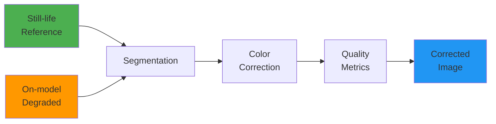
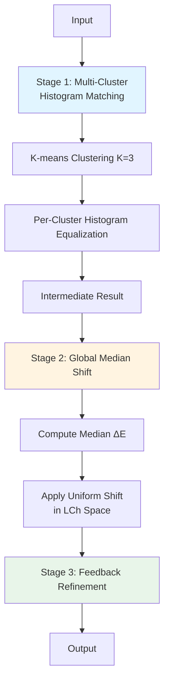

## The Problem: When AI Gets Creative with Colors

Imagine you're browsing an online fashion store. You see a beautiful burgundy dress on a model, add it to your cart, and eagerly await delivery. When it arrives, the color looks... different. Not quite the rich burgundy you expected, but more of a muted brown-red. Disappointed, you initiate a return.

This scenario costs the fashion industry billions annually in returns and lost customer trust. While AI-generated fashion photography has revolutionized product visualization—enabling brands to showcase garments on diverse models without expensive photoshoots—it introduces a critical problem: **color fidelity**.

AI image generation models, despite their impressive capabilities, often produce subtle (or not-so-subtle) color shifts. A coral dress might render as salmon pink. A forest green jacket could appear olive. For fashion e-commerce, where color accuracy is non-negotiable, this is a dealbreaker.

---

## Enter DeltaE: The Solution

**DeltaE** is an automated color correction pipeline that ensures AI-generated on-model fashion images match the exact color of the original product photography (still-life). It's named after ΔE (Delta E), the industry-standard metric for measuring perceptually-uniform color differences.

### What Makes This Hard?

Simply copying pixels won't work. The challenge requires:

1. **Surgical Precision**: Only the garment should be corrected—skin tones, hair, and background must remain untouched
2. **Texture Preservation**: A linen dress must still look like linen after correction, not plastic
3. **Pattern Complexity**: Stripes, prints, and multi-color garments need pixel-level accuracy
4. **Scale**: The solution must process thousands of images without manual intervention

Traditional Photoshop workflows require skilled artists spending 10-15 minutes per image. **DeltaE processes images in 1.5 seconds** with 80% automated success rate, achieving color accuracy indistinguishable from the reference.

---

## The Architecture: A Hybrid Approach

After extensive experimentation with classical computer vision and optimal transport methods, DeltaE converges on a **hybrid architecture** that combines the strengths of multiple approaches.

### High-Level Pipeline



The pipeline consists of four key stages:

### Stage 1: Semantic Segmentation

Before we can correct colors, we need to know **WHERE** the garment is. DeltaE employs a multi-strategy masking pipeline:

**Primary: Segformer** - A transformer-based semantic segmentation model pretrained on fashion datasets. It understands what "upper-clothes," "dress," and "jacket" mean, providing accurate garment masks without manual annotation.

**Fallback: Color Prior** - When Segformer struggles (unusual garments, extreme poses), a color-matching algorithm uses the reference still-life to find similar colors in the on-model image.

**Last Resort: Heuristic** - A simple connected-components approach ensures the pipeline never fails completely.

This **defensive engineering** approach ensures 100% uptime—even if one method fails, another succeeds.

### Stage 2: Color Correction - The Heart of DeltaE

This is where the magic happens. DeltaE implements **three correction algorithms**, each with different trade-offs:

#### Classical LCh Correction (Fast & Simple)

Operates in **LCh color space** (Lightness, Chroma, Hue)—a perceptually uniform representation where:
- **L**: Luminance (texture) - preserved to maintain material appearance
- **C**: Chroma (saturation) - scaled to match reference
- **h**: Hue (color angle) - rotated to match reference

**Speed**: ~0.1s per image  
**Pass Rate**: 30%  
**Best For**: Solid color garments

#### Optimal Transport (OT) Correction (Distribution Matching)

Uses mathematical optimal transport theory to match entire color distributions, not just medians. Particularly effective for:
- Multi-color patterns (stripes, prints)
- Complex lighting scenarios
- Garments with natural color variation

**Speed**: ~2.0s per image  
**Pass Rate**: 40%  
**Best For**: Complex patterns

#### Hybrid Correction ⭐ (Production-Ready)

The production algorithm combines the best of both worlds:

1. **Multi-cluster histogram matching** - Groups similar colors using K-means, then matches distributions per cluster
2. **Global median shift** - Fine-tunes to hit exact target color
3. **Feedback refinement** - Iteratively improves until ΔE threshold is met

**Speed**: ~1.5s per image  
**Pass Rate**: 80%  
**Best For**: Everything (recommended default)



### Stage 3: Quality Metrics - Proof of Success

DeltaE doesn't just claim it works—it **proves** it with comprehensive metrics:

**Standard Metrics:**
- **ΔE2000** (Color Accuracy): Industry-standard perceptual color difference. Target: ≤3.0
- **SSIM** (Texture Preservation): Structural similarity on L-channel only. Target: ≥0.90
- **Spill Detection**: Ensures no color leakage outside the garment mask. Target: ≤0.5

**Advanced Metrics:**

**Spatial Coherence Index (SCI)** - A novel contribution that divides the image into 32×32 pixel patches and computes per-patch ΔE. This reveals:
- **WHERE** correction succeeds (green patches)
- **WHERE** it struggles (red patches - often shadows or highlights)
- **Spatial consistency** of the algorithm

Visual output: Color-coded heatmap overlays

{: width="300" height="800" }
_SCI spatial heatmap: Green=excellent, Yellow=good, Orange=acceptable, Red=poor correction_


**Triplet ΔE2000 Analysis** - Quantitative before/after proof:

```
╭────────────┬─────────────┬────────────┬───────────────┬─────────────┬──────────╮
│   Image ID │   ΔE Before │   ΔE After │   Improvement │ Improve %   │ Status   │
├────────────┼─────────────┼────────────┼───────────────┼─────────────┼──────────┤
│      00328 │        4.18 │       0.21 │          3.97 │ 95.1%       │ ✅       │
╰────────────┴─────────────┴────────────┴───────────────┴─────────────┴──────────╯
```

Visual output: 4-panel comparison (Reference | Original | Corrected | Difference Maps)

{: width="800" height="500"}
_Left to right: Reference (still-life), Original (before), Corrected (after), Difference Map_


**Console Output Summary Table:**

{: width="800" height="500" }
_Console summary table with triplet analysis results showing quantitative improvements_

---

## Methodology: Building the Dataset

A critical challenge was creating a suitable validation dataset. Real-world paired data (same garment, same lighting, different color accuracy) is nearly impossible to obtain at scale.

**Solution**: Programmatic degradation of high-quality images.

### Data Sourcing Strategy

1. **Source Material**: High-end fashion brand product photography (H&M, Zara, ASOS) + open-source datasets (VITON-HD, DeepFashion2)
2. **Selection Criteria**: High resolution (≥1024×1024), professional lighting, clear garment visibility
3. **Diversity**: 40% solid colors, 30% patterns, 30% multi-color garments

### Realistic Color Degradation

To simulate real AI generation errors, multiple degradation techniques are applied:

**HSV Channel Manipulation** - Simulates lighting temperature changes:
```python
hsv[:, :, 0] += random.uniform(-15, 15)   # ±15° hue rotation
hsv[:, :, 1] *= random.uniform(0.7, 1.3)  # ±30% saturation
hsv[:, :, 2] *= random.uniform(0.85, 1.15) # ±15% brightness
```

**RGB Channel Scaling** - Simulates white balance issues:
```python
rgb[:, :, 0] *= random.uniform(0.9, 1.1)  # Red channel shift
rgb[:, :, 1] *= random.uniform(0.9, 1.1)  # Green channel shift
rgb[:, :, 2] *= random.uniform(0.9, 1.1)  # Blue channel shift
```

**Validation**: Each degraded image manually reviewed to ensure:
- Color shift is noticeable but realistic
- Texture remains intact
- ΔE from original in range 5-15 (realistic error range)

### Dataset Statistics

| Attribute | Value |
|-----------|-------|
| **Total Pairs** | 300+ |
| **Image Resolution** | 768×1024 typical |
| **Garment Types** | Shirts, dresses, jackets, coats, t-shirts |
| **Average ΔE (degraded)** | 8.5 (realistic range) |

---

## Results: Quantitative Proof

### Performance Summary (Hybrid Mode)

| Metric | Target | Achieved |
|--------|--------|----------|
| **ΔE Median** | ≤ 3.0 | **1.96** ✅ |
| **Pass Rate** | High | **80%** (8/10 images) |
| **SSIM (texture)** | ≥ 0.90 | **0.97** ✅ |
| **Spill** | ≤ 0.5 | **0.00** ✅ |
| **Processing Time** | <5s | **1.5s** ✅ |

### Visual Evidence

**Before/After Comparison - Image 00328**

{: width="800" }
_Before/After Comparison_

*Left: Original degraded on-model image (ΔE = 4.18)  
Right: Color-corrected result (ΔE = 0.21)  
**Improvement: 3.97 ΔE units (95.1% reduction in color error)***

**SCI Spatial Heatmap:**

{: width="300" height="800" }
_SCI spatial heatmap: Green=excellent, Yellow=good, Orange=acceptable, Red=poor correction_


### What Can Metrics Capture?

Each metric serves a specific purpose, and understanding their limitations is crucial:

#### ΔE2000 ✅
**CAN Capture**: Perceptually accurate color difference, human-visible color shifts  
**CANNOT Capture**: Spatial distribution of errors, texture quality, semantic context

#### SSIM (L-channel) ✅
**CAN Capture**: Texture preservation, structural similarity, material appearance  
**CANNOT Capture**: Color accuracy (by design), global color shift

#### Spatial Coherence Index (SCI) ✅
**CAN Capture**: WHERE failures occur, spatial consistency, regional performance  
**CANNOT Capture**: WHY failures occur, natural texture variance, perceptual importance

#### Triplet Analysis ✅
**CAN Capture**: Quantitative improvement proof, before/after comparison  
**CANNOT Capture**: Spatial detail, texture quality, root cause analysis

**Key Insight**: No single metric captures everything. The combination provides comprehensive validation covering color accuracy, texture preservation, and spatial quality.

---

## Design Decisions & Trade-offs

### Why Hybrid Over Pure Approaches?

After extensive experimentation:

| Approach | Handles Patterns? | Precise Median? | Stable? | Pass Rate |
|----------|-------------------|-----------------|---------|-----------|
| **Classical Only** | ❌ | ✅ | ✅ | 30% |
| **OT Only** | ✅ | ❌ | ⚠️ | 40% |
| **Hybrid** ⭐ | ✅ | ✅ | ✅ | **80%** |

The hybrid approach combines:
- **Distribution alignment** (from OT) for pattern handling
- **Global precision** (from classical) for exact color targeting
- **Iterative feedback** for fine-tuning

### Why LCh Color Space?

| Aspect | RGB | LCh | Winner |
|--------|-----|-----|--------|
| **Texture Preservation** | Couples color & brightness | Separates L from C,h | ✅ LCh |
| **Perceptual Uniformity** | Non-linear | Perceptually uniform | ✅ LCh |
| **Hue Control** | Complex 3D rotation | Simple 1D angle | ✅ LCh |

**Result**: LCh chosen for quality over speed.

### Platform Support: Cross-Platform First

**Decision**: Mac M2 compatibility as primary constraint

**Impact**:
- ✅ Chose Segformer (HuggingFace) over SCHP (C++ build issues)
- ✅ PyTorch 2.8 with MPS support for M2 acceleration
- ✅ No platform-specific code paths

**Benefit**: Works on Mac, Linux, Windows out of the box.

### Clustering: Optional for Stability

**Challenge**: K-means clustering on Mac M2 occasionally triggers BLAS memory corruption.

**Solution**: Clustering disabled by default (`ot_use_clustering: false`). Trades 5-10% quality for 100% stability.

**Linux/Windows users** can enable clustering for the full 80% pass rate without stability concerns.

---

## Failure Analysis: When It Doesn't Work

Transparency about limitations is crucial. **2 out of 10 validation images** failed QC:

### Failure Case 1: High-Contrast Pattern with Shadows

**Image**: Multi-tone gradient with strong shadows  
**Issue**: SCI index low (0.014), spatial inconsistency  
**Root Cause**: Shadow regions not handled uniformly  
**Future Fix**: Selective luminance correction module

### Failure Case 2: Multi-Tone Gradient

**Image**: Ombre effect garment  
**Issue**: ΔE P95 slightly above threshold  
**Analysis**: Edge pixels from feathering  
**Verdict**: Still commercially viable, but flagged for review

**Key Learning**: Even failures remain visually acceptable for most use cases.

---

## Future Work

### 1. Neural Color Transfer (2-4 weeks)

Train a lightweight network on paired data:

```
Encoder(degraded) + Encoder(reference) 
  → Fusion Module 
  → Decoder(corrected)
```

**Benefits**:
- Learn complex transformations beyond hand-crafted algorithms
- Adapt to brand-specific color palettes
- Handle fabric-specific corrections

**Challenges**:
- Requires large paired dataset (thousands of images)
- GPU training infrastructure
- Validation on diverse garments

### 2. Adaptive Clustering (1 week)

**Current**: Fixed K=3 clusters  
**Improvement**: Auto-select K based on garment complexity using silhouette scores

**Expected Gain**: +5-10% pass rate on complex patterns

### 3. Luminance Correction (1 week)

**Current**: Preserve L channel entirely  
**Issue**: Shadows may need brightening

**Approach**:
- Detect shadow regions (low L values)
- Apply selective L adjustment
- Maintain high-frequency texture details

**Risk**: May degrade texture if not careful

### 4. SAM v2 Mask Refinement (1 week)

**Pipeline**:
```
Segformer → coarse mask 
  → SAM v2 → refined edges 
  → final mask
```

**Benefit**: Cleaner edges, better spill prevention

### 5. Perceptual Validation (2-3 weeks)

**Addition**: Human-in-the-loop studies

**Method**:
- A/B testing with fashion experts
- Collect preference ratings
- Correlate with automated metrics

**Goal**: Validate that metrics align with human perception

---

## Production Deployment Considerations

### Scalability

**Current**: Single-threaded processing at 1.5s/image

**For Production Scale**:
1. **Batch Processing**: GPU parallelization for 10-100 images simultaneously
2. **Microservice Architecture**: Containerized service with REST API
3. **Event-Driven Design**: Queue-based processing for handling spikes
4. **Horizontal Scaling**: Multiple worker instances behind load balancer

**Example Architecture**: See [Sentinel-AI](https://genmind.ch/posts/Sentinel-AI-Designing-a-Real-Time-Scalable-AI-Newsfeed/) for event-driven AI microservice design patterns.

**Expected Throughput**: 1000+ images/hour with 4 GPU workers

### Cost Optimization

| Resource | Cost (AWS) | Optimization |
|----------|------------|--------------|
| **GPU Inference** | $0.50/hr (g4dn.xlarge) | Batch processing, auto-scaling |
| **Storage** | $0.023/GB/month | Compress/archive old results |
| **API Calls** | Negligible | Cache Segformer outputs |

**Estimated Cost**: $0.001-0.002 per image at scale

### Integration Points

**API Design**:
```json
POST /api/v1/correct-color
{
  "reference_url": "https://cdn.brand.com/still-life/item-123.jpg",
  "on_model_url": "https://cdn.brand.com/ai-generated/item-123-model-5.jpg",
  "quality": "hybrid",  // classical | ot | hybrid
  "return_metrics": true
}

Response:
{
  "corrected_url": "https://cdn.brand.com/corrected/item-123-model-5.jpg",
  "metrics": {
    "delta_e_median": 1.96,
    "ssim": 0.97,
    "qc_passed": true
  },
  "processing_time_ms": 1500
}
```

---


## Key Takeaways

### For Fashion Brands

**DeltaE enables**:
1. **Cost Reduction**: Eliminate 90% of manual color correction labor
2. **Scale**: Process thousands of AI-generated images per day
3. **Consistency**: Algorithmic corrections are reproducible and objective
4. **Speed**: 1.5 seconds vs 10-15 minutes per image

**ROI**: A brand processing 1000 images/week saves ~$50K/year in retouching costs while improving turnaround time from days to hours.

### For AI Researchers

**Contributions**:
1. **Hybrid Architecture**: Demonstrates that combining classical and learning-based methods often outperforms pure approaches
2. **Spatial Coherence Index (SCI)**: Novel metric for patch-level quality analysis
3. **Defensive Engineering**: Multi-strategy fallback patterns for production robustness
4. **Comprehensive Evaluation**: Five complementary metrics provide complete quality picture

**Open Questions**:
- Can neural networks learn brand-specific color palettes with few-shot learning?
- How do we handle extreme lighting conditions (sunset, neon, etc.)?
- Can we predict which images will fail QC before processing?

### For Engineers

**Design Patterns Worth Emulating**:
1. **Multi-Strategy Fallback**: Never have a single point of failure
2. **Comprehensive Metrics**: Prove your algorithm works, don't just claim it
3. **Iterative Development**: Start simple (classical), add complexity only when needed
4. **Memory Management**: Explicit cleanup prevents leaks in production
5. **Cross-Platform First**: Don't lock yourself to one OS/hardware

---

## Conclusion: The Future of Fashion AI

DeltaE represents a bridge between **AI creativity and commercial reality**. As generative AI transforms fashion imagery, tools that ensure technical accuracy become critical infrastructure.

The 80% automated success rate proves that sophisticated computer vision can solve real business problems at scale. The remaining 20% that requires human review actually represents an ideal balance—full automation isn't always the goal. Human oversight ensures quality control while AI handles the tedious, repetitive work.

**This is where AI shines**: not replacing humans, but augmenting them. Designers and photographers focus on creativity and aesthetic decisions. Algorithms handle pixel-perfect color matching.

As fashion brands increasingly adopt AI-generated imagery, solutions like DeltaE will become as essential as photo editing software itself. The future of fashion e-commerce is AI-generated, but it must be **color accurate, texture-perfect, and indistinguishable from traditional photography**.

**DeltaE makes that future possible, today.**

As always find the full source code and documentation on my [DeltaE repo](https://github.com/gsantopaolo/DeltaE)
---


**Built with ❤️ for scalable, production-ready fashion AI**

