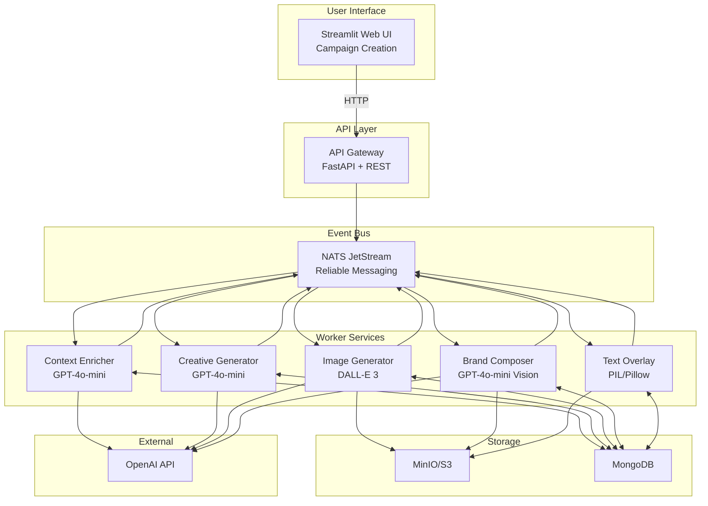
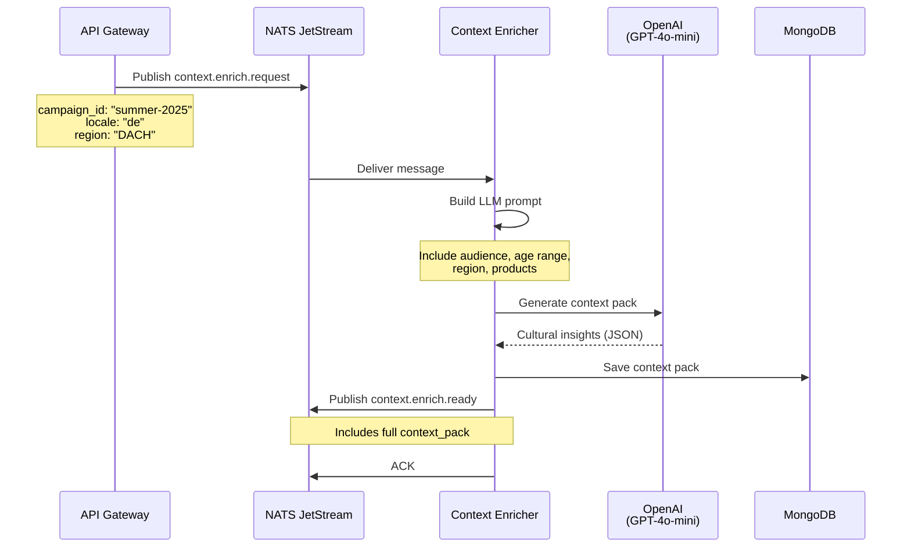
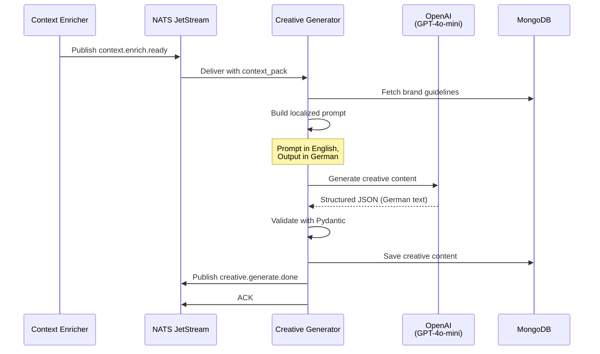
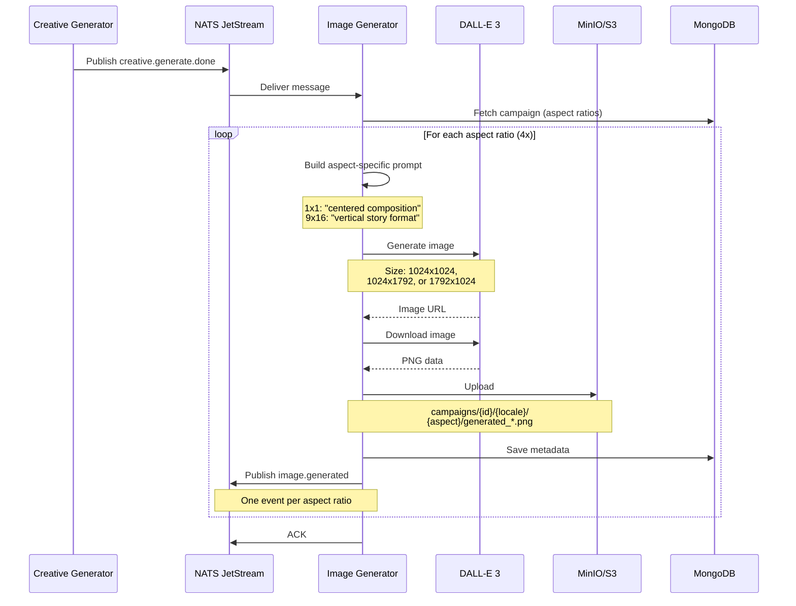
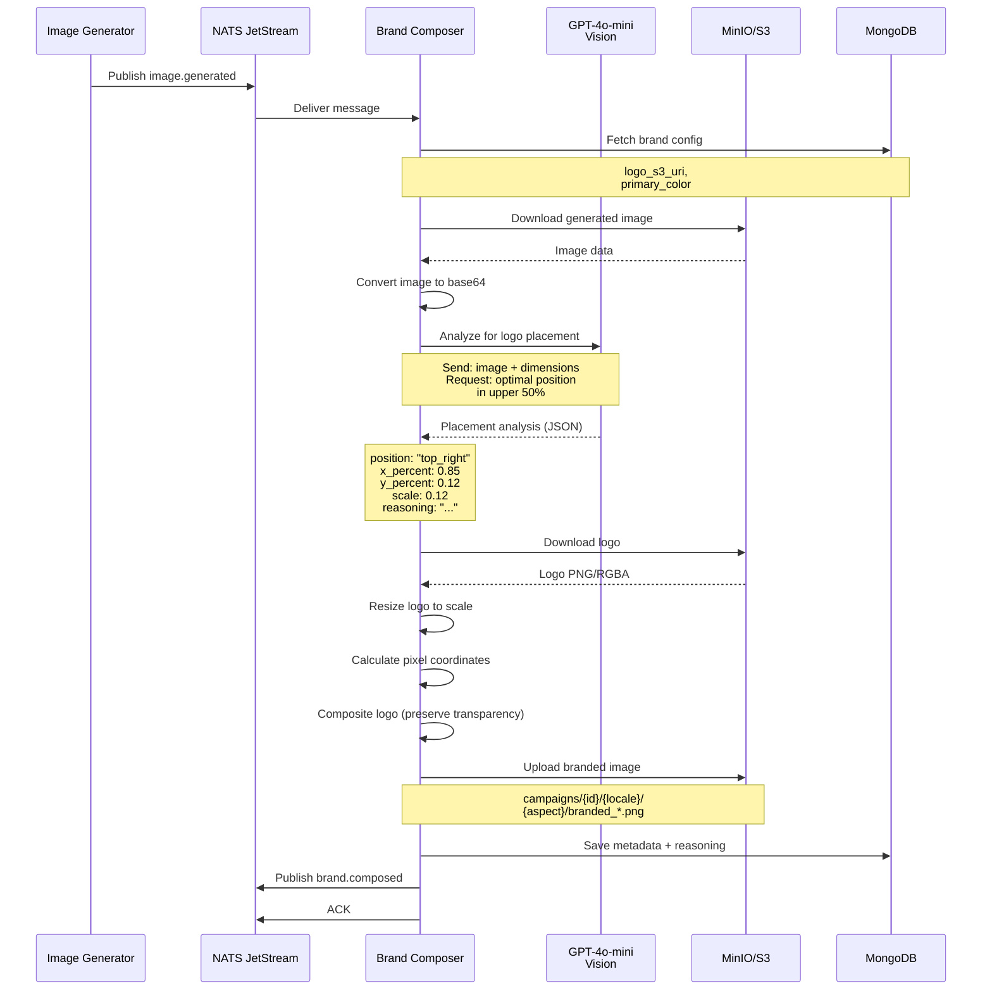
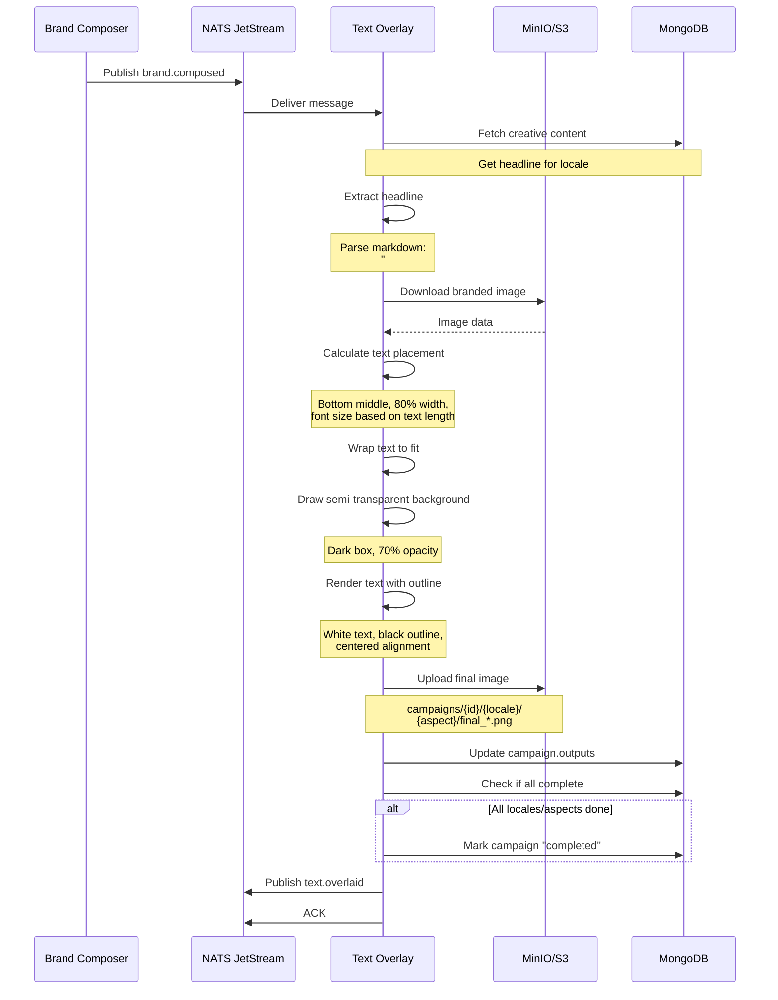

The marketing automation problem hasn't changed: creative teams spend days generating localized ad variants across markets and formats. A single campaign with 2 products × 4 locales × 4 aspect ratios = **32 unique assets**. Each needs culturally-appropriate copy, branded visuals, and format-specific composition.

**CreativeCampaign-Agent** automates this end-to-end using event-driven microservices and OpenAI APIs. From campaign brief to production-ready assets in under 10 minutes.

**GitHub:** [github.com/gsantopaolo/CreativeCampaign-Agent](https://github.com/gsantopaolo/CreativeCampaign-Agent?utm_source=genmind.ch)

---

## The Problem: Manual Creative Work Doesn't Scale

Imagine you're launching a beauty campaign across 4 markets (EN, DE, FR, IT) with 2 products and 4 aspect ratios (1:1, 4:5, 9:16, 16:9). That's **32 unique creative assets**. Each needs:

- ✍️ **Localized copy** respecting cultural nuances and legal guidelines
- 🎨 **Product images** optimized for each aspect ratio
- 🏷️ **Brand elements** (logo, colors) intelligently placed
- 📝 **Text overlays** positioned for maximum impact

**Manual approach:**
- Creative team: 2 days writing localized copy
- Designers: 3 days positioning logos and exporting variants  
- QA: 1 day checking brand compliance

**Total:** 6+ days, $5,000-$10,000, zero scalability.

---

## The Solution: Event-Driven AI Pipeline

CreativeCampaign-Agent automates the entire workflow:

- **GPT-4o-mini** for cultural context, creative copy, and AI vision-based logo placement
- **DALL-E 3** for aspect-ratio-optimized product images
- **NATS JetStream** for reliable event-driven orchestration
- **MongoDB + S3** for persistence
- **Docker Compose** for one-command deployment

**Result:** 32 variants in **under 10 minutes**, ~$1.20 in API costs.

---

## System Architecture

Event-driven microservices orchestrated via NATS JetStream:



**Five specialized services**, each with a single responsibility. Let's walk through the pipeline.

---

## Service 1: Context Enricher

**Purpose:** Generate locale-specific cultural insights to inform creative generation.

### What It Does

For each locale, it generates:
- Cultural notes and sensitivities
- Appropriate messaging tone
- Visual style preferences  
- Do's and don'ts for the market
- Legal/compliance guidelines

### Sequence Diagram



### Example Output (German Market)

```json
{
  "locale": "de",
  "culture_notes": "DACH region values precision, quality, and scientific backing. Consumers are detail-oriented and appreciate transparency in ingredients and manufacturing processes.",
  "tone": "professional yet approachable",
  "dos": [
    "Emphasize product quality and efficacy",
    "Use formal 'Sie' initially",
    "Highlight natural ingredients with specifics"
  ],
  "donts": [
    "Avoid overly casual language",
    "Don't make unsubstantiated health claims",
    "Avoid aggressive sales tactics"
  ],
  "legal_guidelines": "Must comply with EU cosmetics regulations..."
}
```

**Code:** [src/context_enricher/main.py](https://github.com/gsantopaolo/CreativeCampaign-Agent/blob/main/src/context_enricher/main.py?utm_source=genmind.ch)

---

## Service 2: Creative Generator

**Purpose:** Generate localized creative content in the target language using the enriched context.

### What It Does

Generates in the target language:
- Catchy headline (5-15 words)
- Campaign description (50-100 words)
- Call-to-action (3-8 words)
- Suggested visual elements

### Sequence Diagram



### Example Output (German)

```json
{
  "headline": "Natürliche Schönheit jeden Tag",
  "description": "Entdecken Sie unsere premium Hautpflege-Kollektion mit natürlichen Inhaltsstoffen. Vitamin C Serum und Hydration Cream für strahlende, gesunde Haut. Wissenschaftlich getestet, dermatologisch bestätigt.",
  "call_to_action": "Jetzt entdecken",
  "visual_elements": ["Natürliche Inhaltsstoffe", "Elegante Produktverpackung"]
}
```

**Key:** All content is in the **target language** (German), respecting cultural context from the enricher.

**Code:** [src/creative_generator/main.py](https://github.com/gsantopaolo/CreativeCampaign-Agent/blob/main/src/creative_generator/main.py?utm_source=genmind.ch)

---

## Service 3: Image Generator

**Purpose:** Generate product images using DALL-E 3 with aspect-ratio-specific prompts.

### What It Does

Generates **4 images per locale**, each optimized for its aspect ratio:
- **1x1** - Square (Instagram feed) - centered composition
- **4x5** - Portrait (Instagram) - vertical flow, product in upper portion
- **9x16** - Story (Instagram/TikTok) - dramatic vertical, product top/center
- **16x9** - Landscape (YouTube) - wide cinematic, product left or right

Each format gets **customized composition guidance** in the DALL-E prompt.

### Sequence Diagram



### Aspect-Ratio-Specific Prompts

```python
# Each aspect ratio gets different composition guidance
composition_guidance = {
    "1x1": "centered composition with balanced symmetry, product prominently displayed in middle third",
    "4x5": "vertical portrait composition with product in upper two-thirds, space at bottom for text",
    "9x16": "tall vertical story format with product in center or upper portion, generous bottom space",
    "16x9": "wide horizontal landscape with product positioned left or right, space for text on opposite side"
}
```

**Critical:** Images have **NO text** (text overlay happens later) and leave strategic space for logo (top half) and text (bottom half).

**Code:** [src/image_generator/main.py](https://github.com/gsantopaolo/CreativeCampaign-Agent/blob/main/src/image_generator/main.py?utm_source=genmind.ch)

---

## Service 4: Brand Composer (AI Logo Placement)

**Purpose:** Add brand logo using **GPT-4o-mini Vision** to intelligently determine optimal placement.

### The Innovation: AI Vision for Logo Placement

Traditional systems use fixed positions ("top-right corner"). This can cover products, faces, or look unnatural.

**CreativeCampaign-Agent uses AI vision analysis:**
1. Sends image to GPT-4o-mini Vision
2. AI analyzes image composition, identifies products/faces/focal points
3. AI finds empty space with good contrast in **upper 50%** (text goes in bottom 50%)
4. Returns position, size, and **detailed reasoning**

### Sequence Diagram



### AI Vision Prompt (Simplified)

```
Analyze this {width}x{height}px product image.

CONSTRAINT: Logo MUST be in UPPER HALF (y < 50%) because text goes at bottom.

Find optimal logo position that:
1. Doesn't cover products, faces, or key elements
2. Has good contrast and visibility
3. Feels natural and professional

Scan upper half, identify:
- Visual elements and pixel locations
- Empty spaces suitable for logo
- Best position: top-left, top-right, or top-center

Return JSON:
{
  "position": "top_right",
  "x_percent": 0.85,
  "y_percent": 0.12,
  "scale": 0.12,
  "reasoning": "Top-right corner (x=870-980px, y=50-150px) has plain background. Product centered at 400-700px. Logo at scale 0.12 (123px) ensures visibility without obscuring elements."
}
```

### Example AI Response

```json
{
  "position": "top_right",
  "x_percent": 0.85,
  "y_percent": 0.12,
  "scale": 0.12,
  "reasoning": "Top-right corner identified as optimal placement (x=870-980px, y=50-150px). Plain light background provides excellent contrast. Product imagery centered at 300-700px, face at 400-600px. Placing logo at (870, 123) with 12% scale ensures brand visibility without obscuring key visual elements. Confirmed y=123px is in top 12%."
}
```

**Why AI instead of rules?**
- ✅ Analyzes actual image content
- ✅ Adapts to each unique composition
- ✅ Finds empty spaces automatically
- ✅ Considers contrast
- ✅ Provides transparent reasoning

**Cost:** ~$0.001 per image (~$0.032 for 32 variants)

**Code:** [src/brand_composer/main.py](https://github.com/gsantopaolo/CreativeCampaign-Agent/blob/main/src/brand_composer/main.py?utm_source=genmind.ch)

---

## Service 5: Text Overlay

**Purpose:** Add localized campaign text to branded images and export final assets.

### What It Does

1. Extracts headline from creative content
2. Downloads branded image from S3
3. Calculates text placement (**code-based**, not AI - bottom is predictable)
4. Renders text with semi-transparent background
5. Uploads final asset to S3
6. Marks campaign as "completed" when all locales/aspects done

### Sequence Diagram



### Text Placement Algorithm

```python
def calculate_bottom_middle_placement(width, height, text):
    # Font size: 5% of image width, adjusted for text length
    base_font_size = int(width * 0.05)
    font_size = adjust_for_length(base_font_size, len(text))
    
    # Box: 80% width, centered
    box_width = int(width * 0.8)
    box_x = (width - box_width) // 2
    
    # Position: 5% margin from bottom
    margin_bottom = int(height * 0.05)
    box_y = height - box_height - margin_bottom
    
    return {
        "box_x": box_x,
        "box_y": box_y,
        "font_size": font_size,
        "text_color": "#FFFFFF",  # White
        "background_opacity": 0.7,  # Semi-transparent dark
        "alignment": "center"
    }
```

**Why code-based (not AI)?**
- ✅ Logo already cleared bottom space (AI placed it in top half)
- ✅ Text always goes at bottom (predictable)
- ✅ Faster (no API call)
- ✅ $0 cost
- ✅ Consistent results

**Code:** [src/text_overlay/main.py](https://github.com/gsantopaolo/CreativeCampaign-Agent/blob/main/src/text_overlay/main.py?utm_source=genmind.ch)

---

## Complete Pipeline in Action

For a campaign with **2 locales (EN, DE) × 4 aspect ratios = 8 final assets:**

```
User submits campaign brief
   ↓
API → briefs.ingested → NATS
   ↓
Context Enricher (2 parallel: EN, DE)
   → context.enrich.ready (EN)
   → context.enrich.ready (DE)
   ↓
Creative Generator (2 parallel)
   → creative.generate.done (EN)
   → creative.generate.done (DE)
   ↓
Image Generator (8 parallel: 2 locales × 4 aspects)
   → image.generated × 8
   ↓
Brand Composer (8 parallel with AI vision)
   → brand.composed × 8
   ↓
Text Overlay (8 parallel)
   → text.overlaid × 8
   ↓
Campaign Status: COMPLETED
```

**Timeline:**
- Context enrichment: 10s per locale (parallel) = **10s total**
- Creative generation: 15s per locale (parallel) = **15s total**
- Image generation: 30s per image (sequential per locale) = **2-4 minutes total**
- Brand composition: 8s per image (parallel) = **30s total**
- Text overlay: 5s per image (parallel) = **15s total**

**Total: 5-8 minutes for 8 assets** (or 8-12 minutes for 32 assets)

---

## UI: Completed Campaign View


{: width="500" height="300" }
_Completed Campaign -  Context Enrichment_

{: width="500" height="300" }
_Completed Campaign -  Creative Generation_

{: width="500" height="300" }
_Completed Campaign -  Image Generation_

{: width="500" height="300" }
_Completed Campaign -  Brand Composition and Text Overlay (Final)_


*The Streamlit UI shows:*
- ✅ All generated variants organized by locale and aspect ratio
- 🤖 AI placement reasoning for each logo
- 📊 Processing timeline and status
- 🔄 Option to regenerate specific variants
- 📥 Bulk download of all assets

---


## Installation: Ridiculously Simple

**You don't even need to clone the repo.**

### Prerequisites
- Docker ([Get Docker](https://docs.docker.com/get-docker/?utm_source=genmind.ch))
- OpenAI API key ([Get one](https://platform.openai.com/api-keys?utm_source=genmind.ch))

### Run in 3 Commands

```bash
# 1. Download runner script
curl -O https://raw.githubusercontent.com/gsantopaolo/CreativeCampaign-Agent/main/deployment/run-creative-campaign.sh?utm_source=genmind.ch

# 2. Make executable
chmod +x run-creative-campaign.sh

# 3. Run with your OpenAI API key
./run-creative-campaign.sh sk-proj-YOUR-OPENAI-API-KEY-HERE
```

**That's it.** The script:
1. 🐳 Pulls Docker image from Docker Hub
2. 🚀 Starts all services (API, workers, MongoDB, MinIO, NATS)
3. ✨ Waits for readiness
4. 🌐 Opens UI at http://localhost:8501

**Time to running system:** Under 2 minutes.

**Full setup guide:** [docs/just-run.md](https://github.com/gsantopaolo/CreativeCampaign-Agent/blob/main/docs/just-run.md?utm_source=genmind.ch)

---

## Cost Breakdown (32 variants)

- Context enrichment: $0.08 (GPT-4o-mini × 4 locales)
- Creative generation: $0.12 (GPT-4o-mini × 4 locales)
- Image generation: $1.28 (DALL-E 3 × 32 variants @ $0.04/image)
- Logo placement: $0.03 (GPT-4o-mini vision × 32)
- **Total: ~$1.50 per campaign**

Compare to manual: $5,000-$10,000.

**ROI:** 3,333x - 6,667x

---


## Documentation

Comprehensive docs in the repo:

- [Architecture Deep Dive](https://github.com/gsantopaolo/CreativeCampaign-Agent/blob/main/docs/architecture.md?utm_source=genmind.ch)
- [Agentic System Design](https://github.com/gsantopaolo/CreativeCampaign-Agent/blob/main/docs/agentic-system-design.md?utm_source=genmind.ch)
- [AI Logo Placement](https://github.com/gsantopaolo/CreativeCampaign-Agent/blob/main/docs/ai-logo-placement.md?utm_source=genmind.ch)
- [Implementation Patterns](https://github.com/gsantopaolo/CreativeCampaign-Agent/blob/main/docs/implementation-patterns.md?utm_source=genmind.ch)
- [Why Microservices?](https://github.com/gsantopaolo/CreativeCampaign-Agent/blob/main/docs/why-microservices.md?utm_source=genmind.ch)
- [Service Docs](https://github.com/gsantopaolo/CreativeCampaign-Agent/blob/main/docs/?utm_source=genmind.ch) (Context Enricher, Creative Generator, Image Generator, Brand Composer, Text Overlay)

---

## Final Thoughts

This isn't a toy demo—it's built like a real customer deployment. The architecture demonstrates production patterns you'd use at scale:

✅ **Event-driven microservices** for independent scaling  
✅ **AI-powered intelligence** where it adds value  
✅ **Horizontal scaling** with NATS queue groups  
✅ **Fault tolerance** (retries, health checks, DLQ)  
✅ **Observable & reliable** (structured logs, metrics)  

Built in the spirit of a Forward Deployed Engineer's 2-day customer POC—showing both technical depth and pragmatic engineering judgment.

If you're building AI-powered automation or event-driven systems, I hope this serves as a useful reference architecture.

---


**GitHub:** [github.com/gsantopaolo/CreativeCampaign-Agent](https://github.com/gsantopaolo/CreativeCampaign-Agent?utm_source=genmind.ch)

**Questions?** Open an issue on [GitHub](https://github.com/gsantopaolo/CreativeCampaign-Agent?utm_source=genmind.ch).

