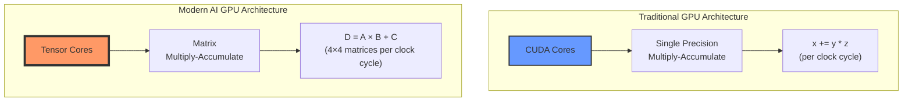
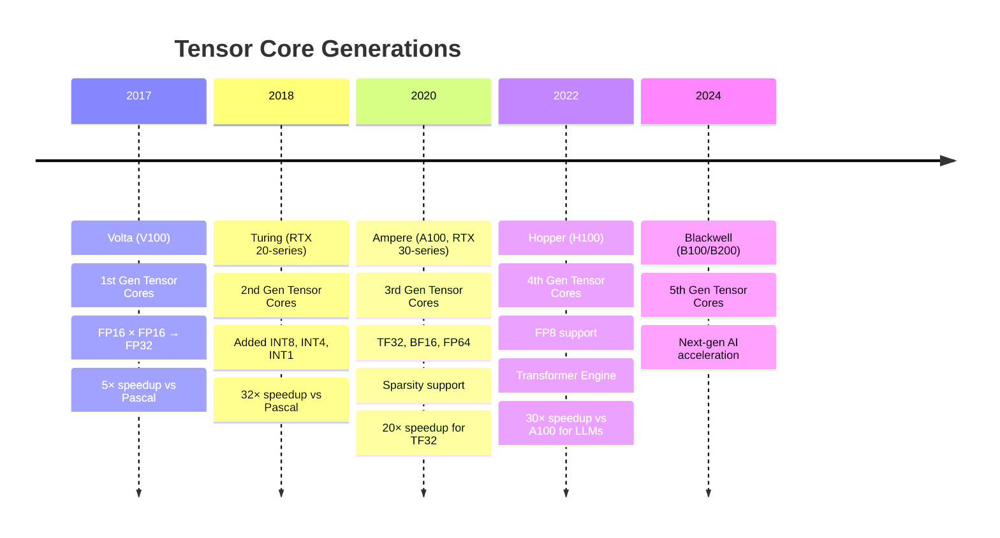
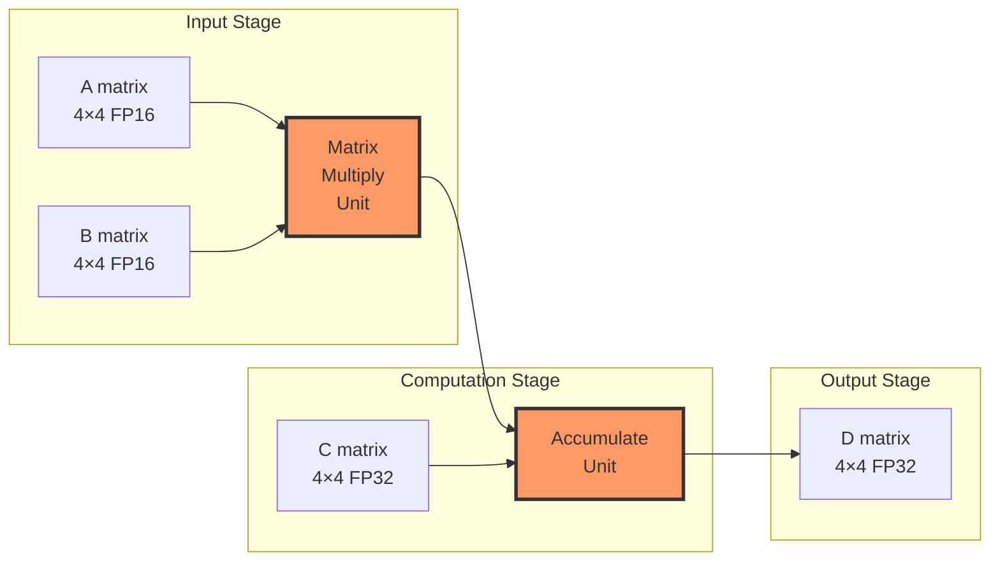

When dealing with deep learning, we quickly encounter the word **tensor**. But what exactly is a tensor? Is it just a fancy name for an array? A mathematical object from physics? Both?

This guide takes you on a journey from intuitive understanding to practical implementation. We'll explore tensors through four lenses:

1. **[The intuitive view](#building-intuition--vectors-and-tensors-explained)**: Understanding vectors and tensors through Dan Fleisch's brilliant explanation
2. **[The computational view](#tensors-in-numpy--from-theory-to-arrays)**: How NumPy handles multi-dimensional arrays
3. **[The hardware view](#why-gpus-love-tensors--the-hardware-perspective)**: Why tensors are the fundamental unit of GPU computation
4. **[The ML practitioner's view](#tensors-in-pytorch--the-ml-practitioners-toolkit)**: Working with tensors in PyTorch


---

## Building Intuition — Vectors and Tensors Explained

> *"What's a tensor?"* — The question Dan Fleisch set out to answer in his book - A Student's Guide to Vectors and Tensors


The best route to understanding tensors starts with understanding **vectors**. Not just as "arrays of numbers," but as geometric objects with components and basis vectors.

### Understanding Vectors Through Components

Think of a 3D Cartesian coordinate system with x, y, and z axes. This coordinate system comes with **basis vectors** (unit vectors):

- **x̂** (or **e**ₓ): unit vector in the x direction
- **ŷ** (or **e**ᵧ): unit vector in the y direction  
- **ẑ** (or **e**ᵤ): unit vector in the z direction

Each basis vector has **length 1** and points along its axis.

Any vector **A** in 3D space can be written as:

**A** = Aₓ x̂ + Aᵧ ŷ + Aᵤ ẑ

Where:
- (Aₓ, Aᵧ, Aᵤ) are the **components** — the numbers
- (x̂, ŷ, ẑ) are the **basis vectors** — the directions

### Visualizing Vector Components

Dan Fleisch uses a beautiful analogy: imagine shining a light perpendicular to an axis. The shadow the vector casts on that axis is its component along that direction.

To find the **x-component**: shine light parallel to the y-axis (perpendicular to x). The shadow on the x-axis is Aₓ.

{: width="500" height="800" }
_Projections using light sources perpendicular to x- and y-axes - image source [A Student's Guide to Vectors and Tensors](https://www4.danfleisch.com/sgvt/)_


Alternatively, think of it as: *"How many x̂ unit vectors and how many ŷ unit vectors would it take to get from the base to the tip of this vector?"*

This is profound because it reveals:

> **A vector is a geometric object.**  
> **Components depend on your coordinate system; the vector itself does not.**

If you rotate your coordinate system, both the basis vectors *and* the components change — but the actual arrow in space remains the same.

### From Vectors to Tensors: The Rank System

Now we can understand the classification:

- **Scalar** (rank-0 tensor): No directional information, no index needed
  - Example: temperature = 42
  
- **Vector** (rank-1 tensor): One directional indicator, **one index**
  - Components: Aᵢ where i ∈ {x, y, z}
  - Example: velocity = [3, 4, 0]

- **Rank-2 tensor**: Two directional indicators, **two indices**
  - Components: Tᵢⱼ where i, j ∈ {x, y, z}
  - In 3D: 3 × 3 = 9 components
  - Example: stress tensor, Jacobian matrix

- **Rank-3 tensor**: Three directional indicators, **three indices**
  - Components: Tᵢⱼₖ where i, j, k ∈ {x, y, z}
  - In 3D: 3 × 3 × 3 = 27 components

{: width="500" height="800" }
_Tensor classification - image source [Avnish's Blog](https://www.avni.sh/)_

### Why Do We Need Higher-Rank Tensors?

Consider **stress** inside a solid object. You might have surfaces with area vectors pointing in the x, y, or z direction. On each surface, forces can act in the x, y, or z direction.

To fully characterize all possible forces on all possible surfaces, you need **9 components** with **two indices**:

- Tₓₓ: x-directed force on a surface whose normal points in x
- Tᵧₓ: x-directed force on a surface whose normal points in y
- And so on...

This is a **rank-2 tensor** — the stress tensor.

### The Power of Tensors: Coordinate Independence

Here's what makes tensors "the facts of the universe" (as mathematician Lillian Lieber called them):

> **All observers, in all reference frames, agree on the combination of components and basis vectors.**

They may disagree on the individual components, and on what the basis vectors are, but the components transform in just such a way to keep the combined result (the actual tensor) the same for everyone.

This is why tensors appear everywhere in physics: they express physical laws in a coordinate-free way that all observers agree on.

---

## Tensors in NumPy — From Theory to Arrays

Now let's bring this down to code. In practice, when we work with tensors in machine learning, we're working with **multi-dimensional arrays**.

### The Hierarchy: Scalar to N-D Tensor

NumPy provides the perfect bridge between mathematical concepts and computational reality with its `ndarray` (n-dimensional array).

**Scalar (Rank 0)**

```python
import numpy as np

x = np.array(42)
print(x)
print(f'A scalar is of rank {x.ndim}')
# Output:
# 42
# A scalar is of rank 0
```

**Vector (Rank 1)**

```python
x = np.array([1, 1, 2, 3, 5, 8])
print(x)
print(f'A vector is of rank {x.ndim}')
# Output:
# [1 1 2 3 5 8]
# A vector is of rank 1
```

**Matrix (Rank 2)**

```python
x = np.array([[1, 4, 7],
              [2, 5, 8],
              [3, 6, 9]])
print(x)
print(f'A matrix is of rank {x.ndim}')
# Output:
# [[1 4 7]
#  [2 5 8]
#  [3 6 9]]
# A matrix is of rank 2
```

**3D Tensor (Rank 3)**

```python
x = np.array([[[1, 4, 7],
               [2, 5, 8],
               [3, 6, 9]],
              
              [[10, 40, 70],
               [20, 50, 80],
               [30, 60, 90]],
              
              [[100, 400, 700],
               [200, 500, 800],
               [300, 600, 900]]])

print(x)
print(f'This tensor is of rank {x.ndim}')
# Output: This tensor is of rank 3
```

### Important Distinction: Terminology

In practice, when we say "tensor" in ML, we typically mean **rank-3 or higher** to avoid confusion. Calling the scalar `42` a "tensor" is technically correct but not helpful.

Mathematically speaking, tensors are more than simply a data container. Aside from holding numeric data, tensors also include descriptions of the valid linear transformations between tensors (like cross product and dot product). From a computer science perspective, tensors can be thought of as objects in an object-oriented sense, not just data structures.

---

## Tensors in PyTorch — The ML Practitioner's Toolkit

PyTorch tensors are where theory meets practice in modern deep learning. They're similar to NumPy arrays but with superpowers.

### What Makes PyTorch Tensors Special?

From [PyTorch's documentation](https://docs.pytorch.org/tutorials/beginner/blitz/tensor_tutorial.html):

> *"Tensors are a specialized data structure that are very similar to arrays and matrices. In PyTorch, we use tensors to encode the inputs and outputs of a model, as well as the model's parameters."*

**PyTorch Tensor = NumPy Array + GPU Acceleration + Automatic Differentiation**

Key differences from NumPy:
- Tensors can run on GPUs or other hardware accelerators
- Tensors and NumPy arrays can often share the same underlying memory
- Tensors are optimized for automatic differentiation (crucial for backpropagation)

### Creating Tensors in PyTorch

**1. Directly from Python Data**

```python
import torch
import numpy as np

# Directly from lists
data = [[1, 2], [3, 4]]
x_data = torch.tensor(data)
print(x_data)
# Output:
# tensor([[1, 2],
#         [3, 4]])
```

**2. From NumPy Arrays**

```python
np_array = np.array(data)
x_np = torch.from_numpy(np_array)

# Tensors and NumPy arrays can share memory!
# Changes to one can affect the other (when on CPU)
```

**3. From Another Tensor**

```python
x_ones = torch.ones_like(x_data)  # Retains shape, changes values
print(f"Ones Tensor:\n {x_ones}\n")

x_rand = torch.rand_like(x_data, dtype=torch.float)  # Override datatype
print(f"Random Tensor:\n {x_rand}\n")
```

**4. With Specified Shapes**

```python
shape = (2, 3)  # 2 rows, 3 columns
rand_tensor = torch.rand(shape)
ones_tensor = torch.ones(shape)
zeros_tensor = torch.zeros(shape)

print(f"Random Tensor:\n {rand_tensor}\n")
print(f"Ones Tensor:\n {ones_tensor}\n")
print(f"Zeros Tensor:\n {zeros_tensor}")

# Output:
# Random Tensor:
#  tensor([[0.4122, 0.1048, 0.6723],
#          [0.0083, 0.1560, 0.6437]])
# 
# Ones Tensor:
#  tensor([[1., 1., 1.],
#          [1., 1., 1.]])
# 
# Zeros Tensor:
#  tensor([[0., 0., 0.],
#          [0., 0., 0.]])
```

### Tensor Attributes: Shape, Datatype, Device

Every tensor has three crucial attributes:

```python
tensor = torch.rand(3, 4)

print(f"Shape: {tensor.shape}")           # torch.Size([3, 4])
print(f"Datatype: {tensor.dtype}")        # torch.float32
print(f"Device: {tensor.device}")         # cuda, mps or cpu
```

These attributes tell you:
- **Shape**: The dimensions of the tensor
- **Datatype**: The data type of elements (float32, int64, etc.)
- **Device**: Where the tensor is stored (CPU or GPU)

### Moving Tensors to GPU/Accelerator

One of PyTorch's killer features is seamless CPU-GPU operations:

```python
# Check for accelerator availability and move tensor
if torch.accelerator.is_available():
    tensor = tensor.to(torch.accelerator.current_accelerator())
    print(f"Device: {tensor.device}")  # cuda:0 or mps:0

# Or specifically for CUDA
if torch.cuda.is_available():
    tensor = tensor.to('cuda')
```

**Important**: Copying large tensors across devices is expensive in time and memory!

### Essential Tensor Operations

PyTorch offers over 1200 tensor operations, including arithmetic, linear algebra, matrix manipulation, sampling, and more.

**Indexing and Slicing (NumPy-style)**

```python
tensor = torch.ones(4, 4)

print(f"First row: {tensor[0]}")        # First row
print(f"First column: {tensor[:, 0]}")  # First column
print(f"Last column: {tensor[..., -1]}")  # Last column

# In-place modification
tensor[:, 1] = 0
print(tensor)
# Output:
# tensor([[1., 0., 1., 1.],
#         [1., 0., 1., 1.],
#         [1., 0., 1., 1.],
#         [1., 0., 1., 1.]])
```

**Joining Tensors**

```python
# Concatenate along dimension 1 (columns)
t1 = torch.cat([tensor, tensor, tensor], dim=1)
print(t1)
# Output: 4 rows, 12 columns (3x the original width)

# Stack creates a new dimension
t2 = torch.stack([tensor, tensor, tensor], dim=0)
# Output: [3, 4, 4] - stacks along new first dimension
```

**Arithmetic Operations**

```python
# Matrix multiplication
y1 = tensor @ tensor.T
y2 = tensor.matmul(tensor.T)

y3 = torch.rand_like(y1)
torch.matmul(tensor, tensor.T, out=y3)  # In-place result

# Element-wise product
z1 = tensor * tensor
z2 = tensor.mul(tensor)

z3 = torch.rand_like(tensor)
torch.mul(tensor, tensor, out=z3)  # In-place result
```

**Single-element Tensors**

```python
# Aggregation to scalar
agg = tensor.sum()
agg_item = agg.item()  # Convert to Python number
print(agg_item, type(agg_item))  # 12.0 <class 'float'>
```

**In-place Operations**

```python
# Operations with _ suffix modify tensors in-place
tensor.add_(5)  # Adds 5 to every element
tensor.mul_(2)  # Multiplies every element by 2

# Warning: In-place ops save memory but can cause issues
# with automatic differentiation!
```

### Tensor Shapes in Deep Learning

Understanding tensor shapes is crucial for debugging neural networks:

| Data Type | Tensor Shape | Description |
|-----------|--------------|-------------|
| **Image (RGB)** | `[3, 224, 224]` | 3 channels, 224×224 pixels |
| **Batch of Images** | `[32, 3, 224, 224]` | 32 images in batch |
| **Text Sequence** | `[batch, seq_len]` | Token IDs |
| **Embeddings** | `[batch, seq_len, embed_dim]` | Word vectors |
| **Video** | `[batch, frames, channels, H, W]` | Video clips |

### Common Tensor Transformations

**Reshaping**

```python
x = torch.randn(8, 16)
y = x.view(4, 32)      # Must have same number of elements
                       # Must be contiguous in memory

z = x.reshape(2, 4, 16)  # More flexible, may copy data
                         # Works even if not contiguous
```

**Permuting Dimensions**

```python
x = torch.randn(32, 3, 224, 224)  # [N, C, H, W]
x_perm = x.permute(0, 2, 3, 1)    # [N, H, W, C]
# Useful for converting between different frameworks
```

**Squeezing and Unsqueezing**

```python
x = torch.randn(1, 28, 28)
y = x.squeeze(0)      # Remove dimension 0: [28, 28]
z = y.unsqueeze(0)    # Add dimension 0: [1, 28, 28]

# Common use: adding batch dimension
batch_x = x.unsqueeze(0)  # [1, 28, 28] -> [1, 1, 28, 28]
```

**Broadcasting**

```python
# PyTorch automatically broadcasts tensors with compatible shapes
x = torch.randn(3, 4)
y = torch.randn(4)     # Can broadcast to [3, 4]
z = x + y              # y is broadcast to each row

# Broadcast rules:
# - Dimensions are aligned from right to left
# - Dimensions of size 1 can be broadcast to any size
# - Missing dimensions are added on the left
```

---

## Why GPUs Love Tensors — The Hardware Perspective

Before we dive into practical ML pipelines, we need to understand a crucial fact: **tensors are not just a software abstraction—they're the fundamental computational unit that modern GPUs are built to process.**

### The GPU Revolution: From Graphics to AI

GPUs were originally designed for graphics rendering, which requires massive amounts of parallel matrix operations (transforming 3D coordinates, applying textures, computing lighting). This made them naturally good at the exact operations neural networks need: **matrix multiplications**.

But in 2017, NVIDIA took a revolutionary step: they introduced **Tensor Cores**—specialized hardware units designed specifically to accelerate tensor operations for AI workloads.

### CUDA Cores vs Tensor Cores: A Tale of Two Architectures



**CUDA Cores: The Generalists**

Each CUDA core can perform **one** floating-point operation per clock cycle:

$$
\text{Result} = x + (y \times z) \quad \text{(1 operation/clock)}
$$

- Designed for general-purpose parallel computing
- Thousands of cores per GPU (e.g., RTX 4090 has 16,384 CUDA cores)
- Flexible but not optimized for matrix operations

**Tensor Cores: The AI Specialists**

Each Tensor Core performs an entire **4×4 matrix multiply-accumulate** operation per clock cycle:

$$
\mathbf{D}_{4×4} = \mathbf{A}_{4×4} \times \mathbf{B}_{4×4} + \mathbf{C}_{4×4}
$$

This single operation replaces **64 multiply operations + 64 add operations** = **128 operations per clock cycle**!

### The Power of Mixed Precision

Here's where it gets clever. Tensor Cores use **mixed precision** arithmetic:

$$
\underbrace{\text{FP16}}_{\text{inputs A, B}} \times \underbrace{\text{FP16}}_{\text{inputs}} \rightarrow \underbrace{\text{FP32}}_{\text{accumulator D}}
$$

**Why this matters:**
- **FP16** (half precision): Uses half the memory, 2× faster to move around
- **FP32** (full precision): Maintains accuracy in the final result
- **Result**: Speed of FP16 with accuracy close to FP32

### Evolution of Tensor Cores



### How Tensor Cores Accelerate Deep Learning

Let's break down what happens during a single layer of a neural network:

**Matrix Multiplication is Everywhere:**

```python
# Forward pass of a linear layer
output = input @ weights.T + bias
#        ↑ This @ is the key!
```

This seemingly simple operation involves:
- Input: `[batch_size, in_features]` = `[32, 512]`
- Weights: `[out_features, in_features]` = `[256, 512]`
- Output: `[32, 256]`

**Total operations:** 32 × 256 × 512 = **4,194,304 multiply-adds**

### CUDA Cores vs Tensor Cores: Performance Comparison

**On CUDA Cores:**
- Each core: 1 operation per clock
- With 10,000 CUDA cores at 1.5 GHz: 15 TFLOPS (FP32)
- Time for one layer: ~0.28 ms

**On Tensor Cores:**
- Each core: 128 operations per clock (4×4 matrix)
- With 320 Tensor Cores at 1.5 GHz: **640 TFLOPS (FP16)**
- Time for one layer: **~0.0065 ms**
- **~43× faster!**

### Real-World Impact

| Operation | CUDA Cores (FP32) | Tensor Cores (FP16) | Speedup |
|-----------|-------------------|---------------------|---------|
| **Matrix Multiply** (1024×1024) | 2.8 ms | 0.06 ms | **47×** |
| **Conv2D** (ResNet block) | 5.2 ms | 0.13 ms | **40×** |
| **Transformer Attention** | 12.4 ms | 0.31 ms | **40×** |
| **GPT-3 Training** (1 iteration) | 3.2 hours | 4.8 minutes | **40×** |

### Why "Tensor" Cores?

The name is marketing, but it's accurate! These cores are optimized for:

1. **Tensor contractions**: $C_{ij} = \sum_k A_{ik} B_{kj}$
2. **Batch matrix multiplies**: Essential for transformers
3. **Convolutions**: Can be reformulated as matrix multiplies
4. **Attention mechanisms**: All about matrix operations

### Tensor Core Architecture in Detail

Here's what happens inside a single Tensor Core during one clock cycle:



**The actual operation:**

$$
\begin{bmatrix}
d_{11} & d_{12} & d_{13} & d_{14} \\
d_{21} & d_{22} & d_{23} & d_{24} \\
d_{31} & d_{32} & d_{33} & d_{34} \\
d_{41} & d_{42} & d_{43} & d_{44}
\end{bmatrix}
=
\begin{bmatrix}
a_{11} & a_{12} & a_{13} & a_{14} \\
a_{21} & a_{22} & a_{23} & a_{24} \\
a_{31} & a_{32} & a_{33} & a_{34} \\
a_{41} & a_{42} & a_{43} & a_{44}
\end{bmatrix}
\times
\begin{bmatrix}
b_{11} & b_{12} & b_{13} & b_{14} \\
b_{21} & b_{22} & b_{23} & b_{24} \\
b_{31} & b_{32} & b_{33} & b_{34} \\
b_{41} & b_{42} & b_{43} & b_{44}
\end{bmatrix}
+
\begin{bmatrix}
c_{11} & c_{12} & c_{13} & c_{14} \\
c_{21} & c_{22} & c_{23} & c_{24} \\
c_{31} & c_{32} & c_{33} & c_{34} \\
c_{41} & c_{42} & c_{43} & c_{44}
\end{bmatrix}
$$

**All computed in parallel, in a single clock cycle!**

### PyTorch Automatically Uses Tensor Cores

The beautiful part? PyTorch automatically leverages Tensor Cores when you use certain data types:

```python
import torch

# Automatic Tensor Core usage with FP16
model = MyModel().cuda().half()  # Convert to FP16
input = torch.randn(32, 3, 224, 224).cuda().half()

# This matrix multiply will use Tensor Cores!
output = model(input)

# Or use Automatic Mixed Precision (AMP)
from torch.cuda.amp import autocast, GradScaler

scaler = GradScaler()

for data, target in dataloader:
    with autocast():  # Automatically uses FP16 where beneficial
        output = model(data)
        loss = criterion(output, target)
    
    scaler.scale(loss).backward()
    scaler.step(optimizer)
    scaler.update()
```

### The Complete Picture: Why Tensors Are Fundamental

Now we see the full circle:

1. **Mathematics**: Tensors are multilinear maps with transformation properties
2. **Physics**: Tensors represent coordinate-independent facts
3. **Software**: Tensors are multi-dimensional arrays in NumPy/PyTorch
4. **Hardware**: Tensors are the native computational unit of modern AI accelerators

**Tensors aren't just a data structure—they're the bridge connecting mathematical theory, software implementation, and silicon reality.**

---

## The ML Pipeline — Tensors in Action

Let's see how tensors flow through a typical deep learning workflow:

### Complete Example: Image Classification

```python
import torch
import torch.nn as nn
import torch.nn.functional as F

# 1. Data as tensors
# Batch of 32 RGB images, 224x224 pixels
images = torch.randn(32, 3, 224, 224)  
labels = torch.randint(0, 1000, (32,))  # 32 class labels (ImageNet)

# 2. Model with tensor parameters
class SimpleConvNet(nn.Module):
    def __init__(self):
        super().__init__()
        self.conv1 = nn.Conv2d(3, 64, kernel_size=3, padding=1)
        self.conv2 = nn.Conv2d(64, 128, kernel_size=3, padding=1)
        self.pool = nn.MaxPool2d(2, 2)
        self.fc1 = nn.Linear(128 * 56 * 56, 512)
        self.fc2 = nn.Linear(512, 1000)
    
    def forward(self, x):
        # x: [32, 3, 224, 224]
        x = self.pool(F.relu(self.conv1(x)))  # [32, 64, 112, 112]
        x = self.pool(F.relu(self.conv2(x)))  # [32, 128, 56, 56]
        x = x.view(x.size(0), -1)             # [32, 128*56*56] flatten
        x = F.relu(self.fc1(x))                # [32, 512]
        x = self.fc2(x)                        # [32, 1000]
        return x

model = SimpleConvNet()

# 3. Forward pass: tensor operations
outputs = model(images)  # Shape: [32, 1000]
print(f"Output shape: {outputs.shape}")

# 4. Loss computation: tensor to scalar
criterion = nn.CrossEntropyLoss()
loss = criterion(outputs, labels)

print(f"Loss: {loss.item()}")  # Convert tensor to Python float

# 5. Backpropagation (automatic differentiation)
loss.backward()  # Computes gradients for all parameters

# 6. Access gradients (also tensors!)
for name, param in model.named_parameters():
    if param.grad is not None:
        print(f"{name}: {param.grad.shape}")
```

### Common Tensor Operations in Deep Learning

**Normalization**

```python
# Batch normalization expects [N, C, H, W]
x = torch.randn(32, 3, 224, 224)

# Normalize per channel
mean = x.mean(dim=[0, 2, 3], keepdim=True)  # [1, 3, 1, 1]
std = x.std(dim=[0, 2, 3], keepdim=True)
x_norm = (x - mean) / (std + 1e-5)
```

**Attention Mechanism**

```python
# Simplified attention computation
batch, seq_len, d_model = 32, 128, 512

Q = torch.randn(batch, seq_len, d_model)  # Query
K = torch.randn(batch, seq_len, d_model)  # Key
V = torch.randn(batch, seq_len, d_model)  # Value

# Scaled dot-product attention
scores = torch.matmul(Q, K.transpose(-2, -1))  # [32, 128, 128]
scores = scores / (d_model ** 0.5)
attn_weights = F.softmax(scores, dim=-1)       # [32, 128, 128]
output = torch.matmul(attn_weights, V)         # [32, 128, 512]
```

**Data Augmentation**

```python
# Example: Random horizontal flip
def random_flip(images):
    # images: [N, C, H, W]
    mask = torch.rand(images.size(0)) > 0.5
    images[mask] = torch.flip(images[mask], dims=[3])  # Flip width
    return images

augmented = random_flip(torch.randn(16, 3, 224, 224))
```

---

## Part 5: Bridge to NumPy and Back

One of PyTorch's strengths is easy interoperability with NumPy:

### Converting Between PyTorch and NumPy

```python
# NumPy to PyTorch
np_array = np.array([[1, 2], [3, 4]])
torch_tensor = torch.from_numpy(np_array)

# PyTorch to NumPy (CPU only)
torch_tensor = torch.tensor([[1, 2], [3, 4]])
np_array = torch_tensor.numpy()

# Important: They share memory!
np_array[0, 0] = 999
print(torch_tensor)  # Also changed!
```

**GPU Tensors**

```python
# For GPU tensors, must move to CPU first
if torch.cuda.is_available():
    gpu_tensor = torch.randn(3, 3).cuda()
    np_array = gpu_tensor.cpu().numpy()
```

**With Gradients**

```python
# Tensors with gradients need .detach()
x = torch.tensor([1., 2., 3.], requires_grad=True)
# np_array = x.numpy()  # Error!
np_array = x.detach().numpy()  # OK
```

---

## Key Takeaways

### Theoretical Understanding
- **Tensors are geometric objects** characterized by rank (number of indices) and dimension (number of axes)
- **Components change** with coordinate systems, but **tensors themselves don't**
- Tensors are "facts of the universe" — coordinate-independent descriptions of physical/mathematical relationships

### Practical Understanding
- In ML: **Tensor ≈ Multi-dimensional array** with shape, datatype, and device
- **NumPy** provides the foundation for array operations
- **PyTorch tensors** add GPU acceleration and automatic differentiation
- Understanding tensor **shapes** is critical for debugging neural networks

### From Theory to Practice
1. **Scalars** (rank-0): Single numbers
2. **Vectors** (rank-1): 1D arrays with direction
3. **Matrices** (rank-2): 2D grids  
4. **Higher-rank tensors**: 3D, 4D, 5D+ structures for images, video, batches

### Essential Operations
- **Creation**: `torch.tensor()`, `torch.zeros()`, `torch.rand()`
- **Manipulation**: `.view()`, `.reshape()`, `.permute()`
- **Math**: `@`, `.matmul()`, `*`, `.mul()`
- **Reduction**: `.sum()`, `.mean()`, `.max()`
- **Device management**: `.to()`, `.cuda()`, `.cpu()`

---

## Common Pitfalls and Best Practices

### Shape Mismatches

```python
# Common error
x = torch.randn(32, 3, 224, 224)
y = torch.randn(32, 1000)
# z = x + y  # Error! Shapes don't match

# Solution: Check shapes
print(f"x: {x.shape}, y: {y.shape}")
```

### Memory Management

```python
# Bad: Creates many intermediate tensors
result = tensor.cpu().numpy().tolist()

# Better: Minimize copies
result = tensor.tolist()  # Direct conversion
```

### In-place Operations and Autograd

```python
x = torch.tensor([1., 2., 3.], requires_grad=True)
# x += 1  # Can break autograd!
x = x + 1  # Safe
```

### Device Mismatches

```python
# Error: Tensors on different devices
cpu_tensor = torch.randn(3, 3)
if torch.cuda.is_available():
    gpu_tensor = torch.randn(3, 3).cuda()
    # result = cpu_tensor + gpu_tensor  # Error!
    result = cpu_tensor.cuda() + gpu_tensor  # OK
```

---

## Conclusion: From Theory to Mastery

The journey from Dan Fleisch's physical intuition through NumPy's computational arrays to PyTorch's deep learning tensors shows that tensors are both deeply mathematical and immediately practical — the perfect tool for modern AI.

**Remember the hierarchy:**
- **Mathematical tensor**: Coordinate-independent multilinear map
- **NumPy array**: Multi-dimensional container for numerical data
- **PyTorch tensor**: ML-optimized array with GPU support and autograd

Whether you're debugging shape mismatches in your neural network, optimizing GPU memory usage, or pondering the mathematical elegance of coordinate-free physics, understanding tensors deeply will make you a better AI engineer.

---

## Further Resources

- **Dan Fleisch**: *A Student's Guide to Vectors and Tensors* — excellent intuitive introduction
- **PyTorch Documentation**: [Official Tensor Tutorial](https://pytorch.org/tutorials/beginner/basics/tensorqs_tutorial.html)
- **NumPy Documentation**: Understanding `ndarray` operations
- **KDnuggets**: [WTF is a Tensor?](https://www.kdnuggets.com/2018/05/wtf-tensor.html) — practical ML perspective

---

## Practice Exercises

### Exercise 1: Working with Real Images

Let's see tensors in action with real image data. This example shows how to load an image, manipulate it as a tensor, and save the result.

```python
import torch
from PIL import Image
import torchvision.transforms as transforms
import matplotlib.pyplot as plt

# 1. Load an image and convert it to a tensor
image_path = "test.jpg"
img = Image.open(image_path)

# Convert PIL Image to tensor [C, H, W] with values in [0, 1]
to_tensor = transforms.ToTensor()
img_tensor = to_tensor(img)

print(f"Image tensor shape: {img_tensor.shape}")  # e.g., torch.Size([3, 512, 512])
print(f"Data type: {img_tensor.dtype}")           # torch.float32
print(f"Value range: [{img_tensor.min():.3f}, {img_tensor.max():.3f}]")

# 2. Manipulate the tensor - let's apply some transformations

# Example A: Increase brightness by 30%
brightened = torch.clamp(img_tensor * 1.3, 0, 1)

# Example B: Convert to grayscale (weighted average of RGB channels)
# Standard formula: 0.299*R + 0.587*G + 0.114*B
weights = torch.tensor([0.299, 0.587, 0.114]).view(3, 1, 1)
grayscale = (img_tensor * weights).sum(dim=0, keepdim=True)
# Broadcast back to 3 channels for saving as RGB
grayscale_rgb = grayscale.repeat(3, 1, 1)

# Example C: Apply a color filter (boost red channel, reduce blue)
color_adjusted = img_tensor.clone()
color_adjusted[0] = torch.clamp(img_tensor[0] * 1.5, 0, 1)  # Red channel
color_adjusted[2] = torch.clamp(img_tensor[2] * 0.5, 0, 1)  # Blue channel

# Example D: Flip image horizontally (flip along width dimension)
flipped = torch.flip(img_tensor, dims=[2])

# Example E: Add some noise
noise = torch.randn_like(img_tensor) * 0.05
noisy = torch.clamp(img_tensor + noise, 0, 1)

# 3. Convert tensors back to PIL Images and save
to_pil = transforms.ToPILImage()

brightened_img = to_pil(brightened)
brightened_img.save("test_brightened.jpg")

grayscale_img = to_pil(grayscale_rgb)
grayscale_img.save("test_grayscale.jpg")

color_adjusted_img = to_pil(color_adjusted)
color_adjusted_img.save("test_color_adjusted.jpg")

flipped_img = to_pil(flipped)
flipped_img.save("test_flipped.jpg")

noisy_img = to_pil(noisy)
noisy_img.save("test_noisy.jpg")

print("\n✓ All manipulated images saved!")

# 4. Visualize the transformations (optional)
fig, axes = plt.subplots(2, 3, figsize=(15, 10))
axes = axes.flatten()

images_to_show = [
    (img_tensor, "Original"),
    (brightened, "Brightened (+30%)"),
    (grayscale_rgb, "Grayscale"),
    (color_adjusted, "Color Adjusted"),
    (flipped, "Flipped"),
    (noisy, "Noisy")
]

for ax, (tensor, title) in zip(axes, images_to_show):
    # Convert tensor [C, H, W] to [H, W, C] for matplotlib
    img_array = tensor.permute(1, 2, 0).numpy()
    ax.imshow(img_array)
    ax.set_title(title)
    ax.axis('off')

plt.tight_layout()
plt.savefig("tensor_transformations.png", dpi=150, bbox_inches='tight')
print("✓ Visualization saved as tensor_transformations.png")
```

**Key Concepts Demonstrated:**
- **Loading**: PIL Image → Tensor with shape `[C, H, W]`
- **Tensor operations**: Broadcasting, channel manipulation, mathematical operations
- **Clamping**: Keeping values in valid range `[0, 1]`
- **Shape manipulation**: `.repeat()`, `.permute()`, `.flip()`
- **Saving**: Tensor → PIL Image → File

### Exercise 2: Batch Processing Multiple Images

```python
import torch
from PIL import Image
import torchvision.transforms as transforms
from pathlib import Path

# Batch process multiple images
image_files = ["test.jpg", "image2.jpg", "image3.jpg"]

# Create a batch of tensors
batch_tensors = []
transform = transforms.Compose([
    transforms.Resize((224, 224)),  # Standardize size
    transforms.ToTensor()
])

for img_file in image_files:
    if Path(img_file).exists():
        img = Image.open(img_file)
        tensor = transform(img)
        batch_tensors.append(tensor)

# Stack into a single batch tensor [N, C, H, W]
if batch_tensors:
    batch = torch.stack(batch_tensors)
    print(f"Batch shape: {batch.shape}")  # e.g., torch.Size([3, 3, 224, 224])
    
    # Apply transformation to entire batch
    # Example: Normalize using ImageNet statistics
    mean = torch.tensor([0.485, 0.456, 0.406]).view(1, 3, 1, 1)
    std = torch.tensor([0.229, 0.224, 0.225]).view(1, 3, 1, 1)
    normalized_batch = (batch - mean) / std
    
    print(f"Normalized batch statistics:")
    print(f"  Mean per channel: {normalized_batch.mean(dim=[0, 2, 3])}")
    print(f"  Std per channel: {normalized_batch.std(dim=[0, 2, 3])}")
```

### Exercise 3: Understanding Tensor Shapes with Images

```python
import torch

# Create a batch of 16 random "images" (3 channels, 64x64)
images = torch.randn(16, 3, 64, 64)

print("Original shape:", images.shape)  # torch.Size([16, 3, 64, 64])

# 1. Calculate the mean per channel across the batch
channel_means = images.mean(dim=[0, 2, 3])
print(f"Channel means: {channel_means}")  # Shape: [3]

# 2. Normalize each channel
for c in range(3):
    images[:, c] = (images[:, c] - channel_means[c])

# 3. Reshape to a sequence (flatten spatial dimensions)
sequences = images.view(16, 3, -1)  # [16, 3, 4096]
print(f"Sequence shape: {sequences.shape}")

# 4. Calculate attention-like scores
Q = K = sequences
scores = torch.bmm(Q, K.transpose(1, 2))  # [16, 3, 3]
print(f"Attention scores shape: {scores.shape}")

# 5. Common shape transformations
print("\n--- Shape Transformations ---")
print(f"Original: {images.shape}")
print(f"Flattened: {images.flatten().shape}")  # All dims → 1D
print(f"Permuted (NHWC): {images.permute(0, 2, 3, 1).shape}")  # [N,C,H,W] → [N,H,W,C]
print(f"Squeezed: {images[:1].squeeze().shape}")  # Remove batch dim if size 1
print(f"Unsqueezed: {images.unsqueeze(0).shape}")  # Add new dim at front
```

**The Big Picture:**

Every deep learning model is just tensors flowing through differentiable operations:

```
Image File → Tensor → Neural Network → Output Tensor → Prediction
   (disk)     [N,C,H,W]   (matrix ops)    [N, classes]    (argmax)
```

Master tensors, master deep learning.
