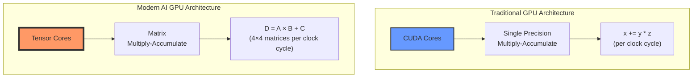
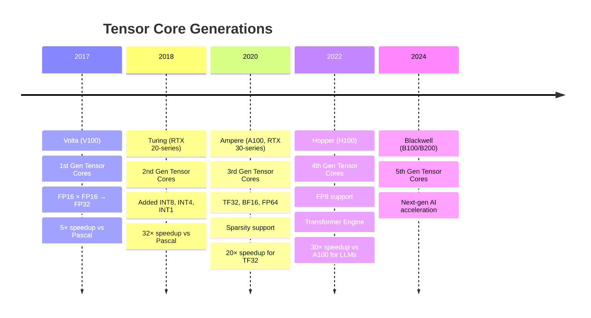
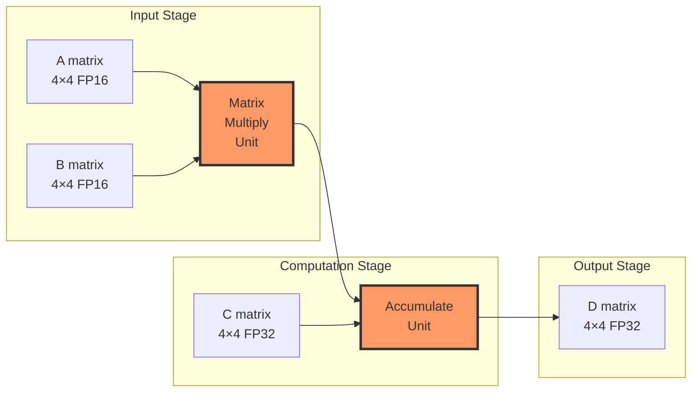

Understanding why modern AI is so fast requires understanding the hardware that powers it. This post dives deep into **Tensor Cores**—the specialized hardware that makes tensors the fundamental computational unit of modern GPUs.

> This is a companion post to [What Is a Tensor? A Practical Guide for AI Engineers](https://genmind.ch/posts/What-Is-a-Tensor-A-Practical-Guide-for-AI-Engineers/), focusing specifically on the hardware perspective.

---

## The GPU Revolution: From Graphics to AI

GPUs were originally designed for graphics rendering, which requires massive amounts of parallel matrix operations (transforming 3D coordinates, applying textures, computing lighting). This made them naturally good at the exact operations neural networks need: **matrix multiplications**.

But in 2017, NVIDIA took a revolutionary step: they introduced **Tensor Cores**—specialized hardware units designed specifically to accelerate tensor operations for AI workloads.

## CUDA Cores vs Tensor Cores: A Tale of Two Architectures



### CUDA Cores: The Generalists

Each CUDA core can perform **one** floating-point operation per clock cycle:

$$
\text{Result} = x + (y \times z) \quad \text{(1 operation/clock)}
$$

- Designed for general-purpose parallel computing
- Thousands of cores per GPU (e.g., RTX 4090 has 16,384 CUDA cores)
- Flexible but not optimized for matrix operations

### Tensor Cores: The AI Specialists

Each Tensor Core performs an entire **4×4 matrix multiply-accumulate** operation per clock cycle:

$$
\mathbf{D}_{4×4} = \mathbf{A}_{4×4} \times \mathbf{B}_{4×4} + \mathbf{C}_{4×4}
$$

This single operation replaces **64 multiply operations + 64 add operations** = **128 operations per clock cycle**!

## The Power of Mixed Precision

Here's where it gets clever. Tensor Cores use **mixed precision** arithmetic:

$$
\underbrace{\text{FP16}}_{\text{inputs A, B}} \times \underbrace{\text{FP16}}_{\text{inputs}} \rightarrow \underbrace{\text{FP32}}_{\text{accumulator D}}
$$

**Why this matters:**
- **FP16** (half precision): Uses half the memory, 2× faster to move around
- **FP32** (full precision): Maintains accuracy in the final result
- **Result**: Speed of FP16 with accuracy close to FP32

## Evolution of Tensor Cores



## How Tensor Cores Accelerate Deep Learning

Let's break down what happens during a single layer of a neural network:

### Matrix Multiplication is Everywhere

```python
# Forward pass of a linear layer
output = input @ weights.T + bias
#        ↑ This @ is the key!
```

This seemingly simple operation involves:
- Input: `[batch_size, in_features]` = `[32, 512]`
- Weights: `[out_features, in_features]` = `[256, 512]`
- Output: `[32, 256]`

**Total operations:** 32 × 256 × 512 = **4,194,304 multiply-adds**

## CUDA Cores vs Tensor Cores: Performance Comparison

**On CUDA Cores:**
- Each core: 1 operation per clock
- With 10,000 CUDA cores at 1.5 GHz: 15 TFLOPS (FP32)
- Time for one layer: ~0.28 ms

**On Tensor Cores:**
- Each core: 128 operations per clock (4×4 matrix)
- With 320 Tensor Cores at 1.5 GHz: **640 TFLOPS (FP16)**
- Time for one layer: **~0.0065 ms**
- **~43× faster!**

## Real-World Impact

| Operation | CUDA Cores (FP32) | Tensor Cores (FP16) | Speedup |
|-----------|-------------------|---------------------|---------|
| **Matrix Multiply** (1024×1024) | 2.8 ms | 0.06 ms | **47×** |
| **Conv2D** (ResNet block) | 5.2 ms | 0.13 ms | **40×** |
| **Transformer Attention** | 12.4 ms | 0.31 ms | **40×** |
| **GPT-3 Training** (1 iteration) | 3.2 hours | 4.8 minutes | **40×** |

## Why "Tensor" Cores?

The name is marketing, but it's accurate! These cores are optimized for:

1. **Tensor contractions**: $C_{ij} = \sum_k A_{ik} B_{kj}$
2. **Batch matrix multiplies**: Essential for transformers
3. **Convolutions**: Can be reformulated as matrix multiplies
4. **Attention mechanisms**: All about matrix operations

## Tensor Core Architecture in Detail

Here's what happens inside a single Tensor Core during one clock cycle:



**The actual operation:**

Each Tensor Core computes: **D = A × B + C**

Where:
- **A**: 4×4 matrix (FP16)
- **B**: 4×4 matrix (FP16)  
- **C**: 4×4 accumulator matrix (FP32)
- **D**: 4×4 output matrix (FP32)

This represents 64 multiplications + 64 additions = **128 FP operations in a single clock cycle!**

## PyTorch Automatically Uses Tensor Cores

The beautiful part? PyTorch automatically leverages Tensor Cores when you use certain data types:

```python
import torch

# Automatic Tensor Core usage with FP16
model = MyModel().cuda().half()  # Convert to FP16
input = torch.randn(32, 3, 224, 224).cuda().half()

# This matrix multiply will use Tensor Cores!
output = model(input)

# Or use Automatic Mixed Precision (AMP)
from torch.cuda.amp import autocast, GradScaler

scaler = GradScaler()

for data, target in dataloader:
    with autocast():  # Automatically uses FP16 where beneficial
        output = model(data)
        loss = criterion(output, target)
    
    scaler.scale(loss).backward()
    scaler.step(optimizer)
    scaler.update()
```

## The Complete Picture: Why Tensors Are Fundamental

Now we see the full circle:

1. **Mathematics**: Tensors are multilinear maps with transformation properties
2. **Physics**: Tensors represent coordinate-independent facts
3. **Software**: Tensors are multi-dimensional arrays in NumPy/PyTorch
4. **Hardware**: Tensors are the native computational unit of modern AI accelerators

**Tensors aren't just a data structure—they're the bridge connecting mathematical theory, software implementation, and silicon reality.**

---

## Key Takeaways

- **Tensor Cores** are specialized hardware that compute 4×4 matrix operations in a single clock cycle
- **Mixed precision** (FP16 inputs, FP32 accumulation) provides ~40× speedup with minimal accuracy loss
- **PyTorch automatically uses Tensor Cores** when you use FP16 or Automatic Mixed Precision
- Modern AI's incredible speed comes from hardware designed specifically for tensor operations
- Understanding this hardware-software co-design is crucial for optimizing deep learning models

## Further Resources

- **NVIDIA Documentation**: [Tensor Cores Overview](https://www.nvidia.com/en-us/data-center/tensor-cores/)
- **PyTorch AMP Guide**: [Automatic Mixed Precision](https://pytorch.org/docs/stable/amp.html)
- **DigitalOcean**: [Understanding Tensor Cores](https://www.digitalocean.com/community/tutorials/understanding-tensor-cores)
- **Research Paper**: [NVIDIA Tensor Core Programming](https://developer.nvidia.com/blog/programming-tensor-cores-cuda-9/)

---

**Next:** Continue with [What Is a Tensor? A Practical Guide for AI Engineers](https://genmind.ch/posts/What-Is-a-Tensor-A-Practical-Guide-for-AI-Engineers/) to understand tensors from mathematical and software perspectives.
