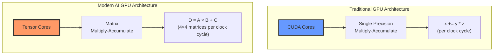
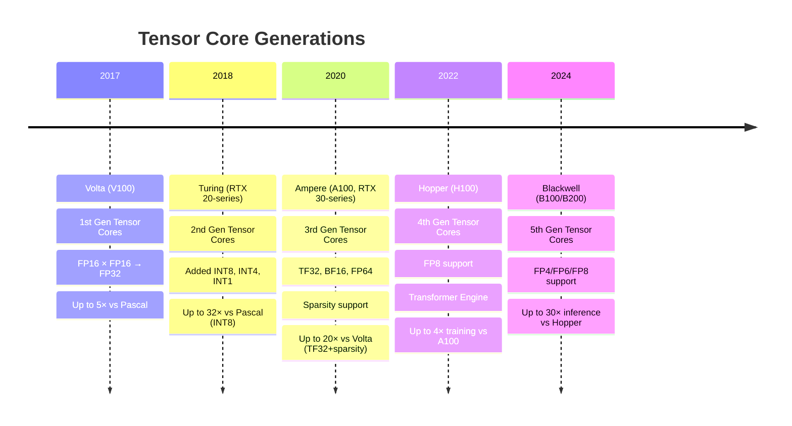
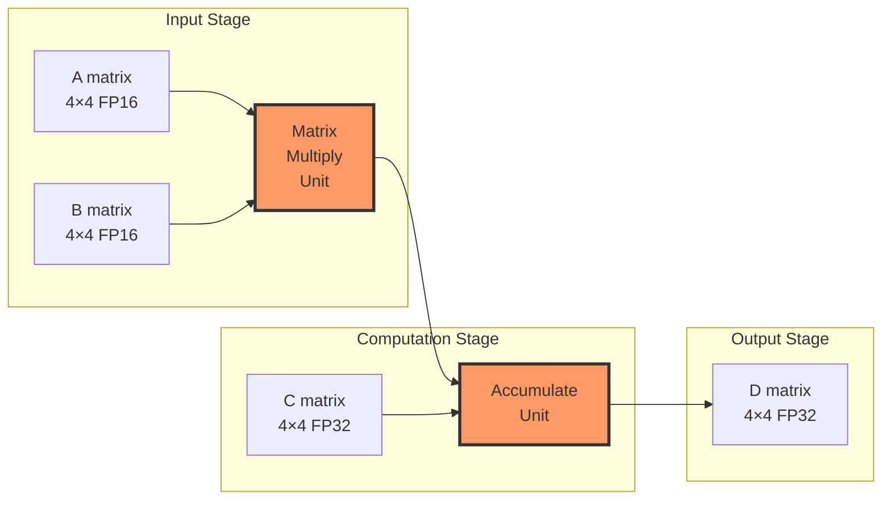

Understanding why modern AI is so fast requires understanding the hardware that powers it. 
> This is a companion post to [What Is a Tensor? A Practical Guide for AI Engineers](https://genmind.ch/posts/What-Is-a-Tensor-A-Practical-Guide-for-AI-Engineers/), focusing specifically on the hardware perspective.


GPUs were originally designed for graphics rendering, which requires massive amounts of parallel matrix operations (transforming 3D coordinates, applying textures, computing lighting). This made them naturally good at the exact operations neural networks need: **matrix multiplications**.


But in 2017, NVIDIA took a revolutionary step: they introduced **Tensor Cores**, in their Volta architecture, specialized 
hardware units designed specifically to accelerate tensor operations for AI workloads.
These accelerators excel at massive parallel matrix multiplications, and Transformers, also introduced in 2017, are designed to take full advantage of that parallelism.
## CUDA Cores vs Tensor Cores: A Tale of Two Architectures



### CUDA Cores: The Generalists

Each CUDA core can perform **one fused multiply-add (FMA)** per clock cycle:
$$
\text{Result} = x + (y \times z) \quad \text{(2 FLOPs/clock: 1 multiply + 1 add)}
$$

- Designed for general-purpose parallel computing
- Thousands of cores per GPU (e.g., RTX 4090 has 16,384 CUDA cores)
- Flexible but not optimized for matrix operations

### Tensor Cores: The AI Specialists

Each Tensor Core performs an entire **4×4 matrix multiply-accumulate** operation per clock cycle:
$$
\mathbf{D}_{4×4} = \mathbf{A}_{4×4} \times \mathbf{B}_{4×4} + \mathbf{C}_{4×4}
$$

This single operation replaces **64 multiply operations + 64 add operations** = **128 operations per clock cycle**!

## The Power of Mixed Precision

Here's where it gets clever. Tensor Cores use **mixed precision** arithmetic:
$$
\underbrace{\text{FP16}}_{\text{inputs A, B}} \times \underbrace{\text{FP16}}_{\text{inputs}} \rightarrow \underbrace{\text{FP32}}_{\text{accumulator D}}
$$

**Why this matters:**
- **FP16** (half precision): Uses half the memory, 2× faster to move around
- **FP32** (full precision): Maintains accuracy in the final result
- **Result**: Speed of FP16 with accuracy close to FP32

## Evolution of Tensor Cores



## How Tensor Cores Accelerate Deep Learning

Let's break down what happens during a single layer of a neural network:

### Matrix Multiplication is Everywhere

```python
# Forward pass of a linear layer
output = input @ weights.T + bias
#        ↑ This @ is the key!
```

This seemingly simple operation involves:
- Input: `[batch_size, in_features]` = `[32, 512]`
- Weights: `[out_features, in_features]` = `[256, 512]`
- Output: `[32, 256]`

**Total operations:** 32 × 256 × 512 = **4,194,304 multiply-adds**

## CUDA Cores vs Tensor Cores: Performance Comparison

**Illustrative Example** (using our layer from above: 4.2M multiply-adds):

**On CUDA Cores:**
- Each core: 2 FLOPs per clock (FMA)
- Hypothetical GPU: 10,000 CUDA cores at 1.5 GHz = 30 TFLOPS (FP32)
- Time for one layer: ~140 µs (microseconds)

**On Tensor Cores:**
- Each core: 128 FLOPs per clock (4×4 matrix FMA)
- Hypothetical GPU: 320 Tensor Cores at 1.5 GHz ≈ **61 TFLOPS (FP16)**
- Time for one layer: **~69 µs**
- **~2× faster in this simplified example**

> **Note:** Real-world speedups are typically **20-40×** depending on model architecture, precision, sparsity, and how well the workload utilizes Tensor Cores. Modern GPUs like A100 achieve 312 TFLOPS (FP16 Tensor Core) vs 19.5 TFLOPS (FP32 CUDA).

## Real-World Performance Trends

**Typical speedups when moving from CUDA Cores (FP32) to Tensor Cores (FP16/mixed precision):**

- **Matrix Multiplication**: 20-40× faster (highly optimized for Tensor Cores)
- **Convolutional Layers**: 15-30× faster (depends on kernel size, channels)
- **Transformer Attention**: 10-25× faster (benefits from large batch matmuls)
- **End-to-End Training**: 2-5× faster (includes non-matmul overhead)

**Key factors affecting real-world performance:**
- Model architecture (transformer-heavy models benefit most)
- Batch size and tensor shapes (multiples of 8/16 optimize Tensor Core usage)
- Memory bandwidth (often the bottleneck, not compute)
- Framework optimization (PyTorch, TensorFlow with cuDNN/cuBLAS)

> See [NVIDIA's official benchmarks](https://www.nvidia.com/en-us/data-center/tensor-cores/) for architecture-specific numbers on V100, A100, and H100.

## Why "Tensor" Cores?

The name is marketing, but it's accurate! These cores are optimized for:

1. **Tensor contractions**: $C_{ij} = \sum_k A_{ik} B_{kj}$
2. **Batch matrix multiplies**: Essential for transformers
3. **Convolutions**: Can be reformulated as matrix multiplies
4. **Attention mechanisms**: All about matrix operations

## Tensor Core Architecture in Detail

Here's what happens inside a single Tensor Core during one clock cycle:



**The actual operation:**

Each Tensor Core computes: **D = A × B + C**

Where:
- **A**: 4×4 matrix (FP16)
- **B**: 4×4 matrix (FP16)  
- **C**: 4×4 accumulator matrix (FP32)
- **D**: 4×4 output matrix (FP32)

This represents 64 multiplications + 64 additions = **128 FP operations in a single clock cycle!**

## PyTorch Can Use Tensor Cores Automatically

PyTorch can leverage Tensor Cores when **data types, tensor shapes, and operations are compatible**:

**Requirements:**
- Compatible dtypes: FP16, BF16, or TF32 (enabled by default on Ampere+)
- Operations go through cuBLAS/cuDNN (matrix multiply, convolutions)
- Tensor dimensions are often best when multiples of 8 or 16

```python
import torch

# Method 1: Manual FP16 conversion
model = MyModel().cuda().half()  # Convert to FP16
input = torch.randn(32, 3, 224, 224).cuda().half()

# Matrix multiplies will use Tensor Cores!
output = model(input)

# Method 2: Automatic Mixed Precision (AMP) - Recommended
from torch.cuda.amp import autocast, GradScaler

model = MyModel().cuda()
scaler = GradScaler()

for data, target in dataloader:
    data, target = data.cuda(), target.cuda()  # Move to GPU
    
    with autocast():  # Automatically selects FP16/FP32 per operation
        output = model(data)
        loss = criterion(output, target)
    
    scaler.scale(loss).backward()
    scaler.step(optimizer)
    scaler.update()
```

> **AMP** (Automatic Mixed Precision) is the recommended approach—it automatically uses FP16 for operations that benefit (like matmuls) while keeping FP32 for operations that need precision (like loss computation).

## The Complete Picture: Why Tensors Are Fundamental

Now we see the full circle:

1. **Mathematics**: Tensors are multilinear maps with transformation properties
2. **Physics**: Tensors represent coordinate-independent facts
3. **Software**: Tensors are multi-dimensional arrays in NumPy/PyTorch
4. **Hardware**: Tensors are the native computational unit of modern AI accelerators

**Tensors aren't just a data structure—they're the bridge connecting mathematical theory, software implementation, and silicon reality.**

---

## Further Resources

- **NVIDIA Documentation**: [Tensor Cores Overview](https://www.nvidia.com/en-us/data-center/tensor-cores/)
- **PyTorch AMP Guide**: [Automatic Mixed Precision](https://pytorch.org/docs/stable/amp.html)
- **DigitalOcean**: [Understanding Tensor Cores](https://www.digitalocean.com/community/tutorials/understanding-tensor-cores)
- **Research Paper**: [NVIDIA Tensor Core Programming](https://developer.nvidia.com/blog/programming-tensor-cores-cuda-9/)

---

**Next:** Continue with [What Is a Tensor? A Practical Guide for AI Engineers](https://genmind.ch/posts/What-Is-a-Tensor-A-Practical-Guide-for-AI-Engineers/) to understand tensors from mathematical and software perspectives.
