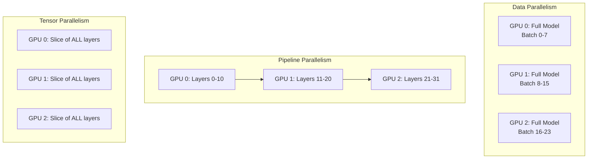
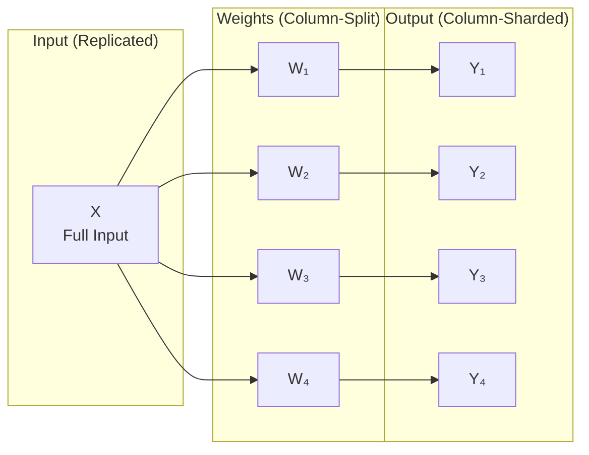
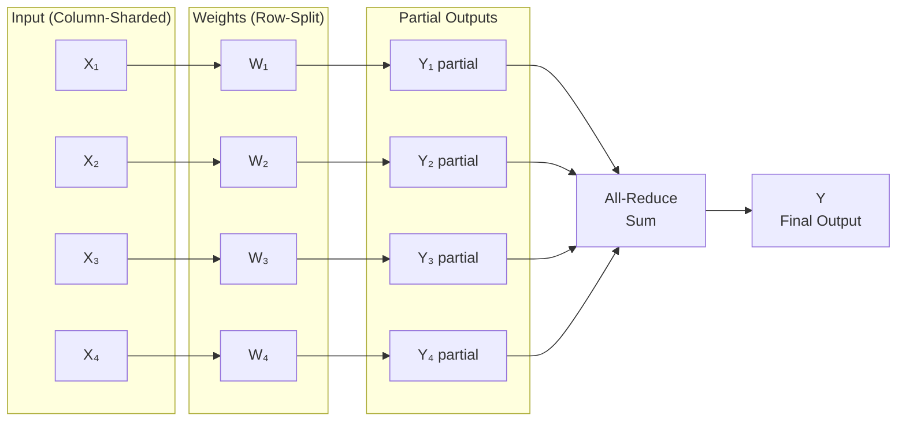
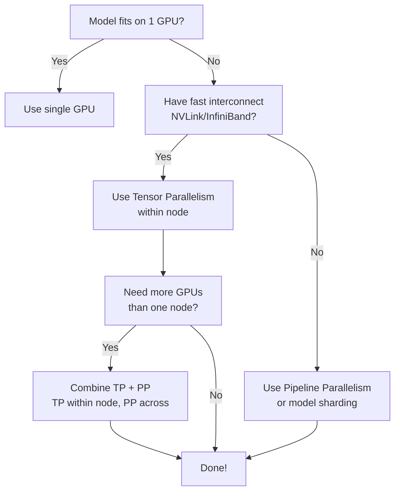

Running a 70B parameter model on a single GPU? Not happening. Even the beefiest H100 with 80GB of VRAM can't hold Llama-2-70B in full precision. 
This is where **Tensor Parallelism (TP)** comes in — it splits the model's weight matrices across multiple GPUs so you can run models that would otherwise be impossible.

This guide is hands-on. We'll cover the theory just enough to understand what's happening, then dive straight into code. 
By the end, you'll have working scripts for running tensor-parallel inference on **RunPod** and **Lambda Cloud**.

---

## Why Tensor Parallelism? The Memory Wall Problem

Modern LLMs are massive. Here's a quick reality check:

| Model | Parameters | FP16 Memory | FP32 Memory |
|-------|------------|-------------|-------------|
| Llama-3-8B | 8B | ~16 GB | ~32 GB |
| Llama-3-70B | 70B | ~140 GB | ~280 GB |
| Llama-3-405B | 405B | ~810 GB | ~1.6 TB |

A single A100 (80GB) can barely fit Llama-3-70B in FP16 — and that's before accounting for KV cache, activations, 
and batch size overhead. For anything larger, you need to split the model across GPUs.

### The Parallelism Zoo

There are several ways to distribute work across GPUs:



| Strategy | What's Split | Memory per GPU | Communication |
|----------|--------------|----------------|---------------|
| **Data Parallelism** | Data batches | Full model on each GPU | Gradient sync after backward |
| **Pipeline Parallelism** | Layers | Subset of layers | Activations between stages |
| **Tensor Parallelism** | Weight matrices | Slice of every layer | All-reduce within each layer |

**When to use Tensor Parallelism:**
- Model doesn't fit on a single GPU
- You have fast interconnects (NVLink, InfiniBand)
- You want to minimize latency for inference

---

## How Tensor Parallelism Works

The core insight is simple: **matrix multiplications can be parallelized by splitting the matrices**.

### Column-Parallel Matrix Multiplication

Suppose you need to compute $Y = XW$ where $X$ is your input and $W$ is a weight matrix. If you split $W$ into column blocks:

$$
W = [W_1 | W_2 | ... | W_n]
$$

Then each GPU computes its slice independently:

$$
Y_i = X \cdot W_i
$$

The outputs are naturally sharded by columns — no communication needed yet.



### Row-Parallel Matrix Multiplication

Now suppose you have column-sharded input $X = [X_1 | X_2 | ... | X_n]$ and you split $W$ into matching row blocks:

$$
W = \begin{bmatrix} W_1 \\ W_2 \\ ... \\ W_n \end{bmatrix}
$$

Each GPU computes a partial result:

$$
Y_i = X_i \cdot W_i
$$

Then you **sum across GPUs** (all-reduce) to get the final output:

$$
Y = \sum_i Y_i
$$



This is the key operation that requires GPU-to-GPU communication.

---

## TP in Transformer Layers

Now let's see how these primitives apply to actual Transformer components.

### Attention Layer

The attention mechanism has three projection matrices: $W_Q$, $W_K$, $W_V$ (queries, keys, values) and an output projection $W_O$.

**Step 1: Split Q, K, V Projections (Column-Parallel)**

Each GPU gets a subset of attention heads. If you have 32 heads and 4 GPUs, each GPU handles 8 heads.

```python
# Conceptually, each GPU computes:
Q_i = X @ W_Q[:, heads_for_gpu_i]  # Column slice
K_i = X @ W_K[:, heads_for_gpu_i]
V_i = X @ W_V[:, heads_for_gpu_i]
```

No communication needed — each GPU works independently.

**Step 2: Local Attention Computation**

Since attention heads are independent, each GPU computes attention for its heads locally:

```python
# Each GPU computes attention for its heads
attn_i = softmax(Q_i @ K_i.T / sqrt(d_k)) @ V_i
```

Still no communication.

**Step 3: Output Projection (Row-Parallel)**

The output projection $W_O$ is split by rows. Each GPU multiplies its attention output by its slice of $W_O$, then we all-reduce:

```python
# Each GPU computes partial output
partial_i = attn_i @ W_O[rows_for_gpu_i, :]

# All-reduce to get final output
output = all_reduce_sum(partial_i)
```

**One all-reduce per attention layer.**

### Feed-Forward Network (FFN)

The FFN typically has two linear layers with an activation in between:

$$
\text{FFN}(x) = \text{GELU}(x W_1) W_2
$$

**First Linear (Column-Parallel):**
```python
hidden_i = GELU(x @ W1[:, cols_for_gpu_i])
```

**Second Linear (Row-Parallel):**
```python
partial_i = hidden_i @ W2[rows_for_gpu_i, :]
output = all_reduce_sum(partial_i)
```

**One all-reduce per FFN layer.**

### The Full Picture

```mermaid
graph TB
    subgraph "Transformer Layer with TP"
        Input[Input X<br/>Replicated] --> QKV[Q, K, V Projections<br/>Column-Parallel]
        QKV --> Attn[Local Attention<br/>Per-GPU Heads]
        Attn --> OutProj[Output Projection<br/>Row-Parallel]
        OutProj --> AR1[All-Reduce]
        AR1 --> LN1[LayerNorm]
        LN1 --> FFN1[FFN Linear 1<br/>Column-Parallel]
        FFN1 --> Act[GELU]
        Act --> FFN2[FFN Linear 2<br/>Row-Parallel]
        FFN2 --> AR2[All-Reduce]
        AR2 --> LN2[LayerNorm]
        LN2 --> Output[Output]
    end
    
    style AR1 fill:#f96,stroke:#333,stroke-width:2px
    style AR2 fill:#f96,stroke:#333,stroke-width:2px
```



**Total communication per layer: 2 all-reduce operations.**

### Constraints

TP comes with a few practical constraints:

1. **TP size ≤ number of attention heads** — you can't split a single head across GPUs
2. **Heads must be divisible by TP size** — each GPU needs an equal share
3. **FFN hidden dimension must be divisible by TP size**

For Llama-3-70B with 64 heads, valid TP sizes are: 1, 2, 4, 8, 16, 32, 64.

---

## Tensor Parallelism with HuggingFace Transformers

The good news: HuggingFace Transformers now has built-in TP support. For supported models, it's a one-liner.

### The 3-Line Solution

```python
# tp_inference.py
import torch
from transformers import AutoModelForCausalLM, AutoTokenizer

model = AutoModelForCausalLM.from_pretrained(
    "meta-llama/Meta-Llama-3-8B-Instruct",
    torch_dtype=torch.bfloat16,
    tp_plan="auto"  # <-- This enables tensor parallelism
)

tokenizer = AutoTokenizer.from_pretrained("meta-llama/Meta-Llama-3-8B-Instruct")

prompt = "Explain tensor parallelism in one paragraph:"
inputs = tokenizer(prompt, return_tensors="pt").to(model.device)

outputs = model.generate(**inputs, max_new_tokens=100)
print(tokenizer.decode(outputs[0], skip_special_tokens=True))
```

### Launching with torchrun

You can't just run `python tp_inference.py`. You need to launch it with `torchrun` to spawn multiple processes:

```bash
# Run on 4 GPUs
torchrun --nproc-per-node 4 tp_inference.py
```

Each process gets assigned to one GPU, and PyTorch's distributed runtime handles the communication.

### Supported Models

As of late 2025, HuggingFace supports TP for:
- Llama (all versions)
- Mistral
- Mixtral
- Qwen
- Gemma
- And more...

Check the model's config for `_tp_plan` to see if it's supported:

```python
from transformers import AutoConfig
config = AutoConfig.from_pretrained("meta-llama/Meta-Llama-3-8B-Instruct")
print(config._tp_plan)  # Shows the default TP plan
```

### Partitioning Strategies

Under the hood, HuggingFace uses these strategies:

| Strategy | Description |
|----------|-------------|
| `colwise` | Column-parallel (for Q, K, V projections) |
| `rowwise` | Row-parallel (for output projections) |
| `sequence_parallel` | For LayerNorm, Dropout |
| `replicate` | Keep full copy on each GPU |

You can define a custom `tp_plan` if needed:

```python
tp_plan = {
    "model.layers.*.self_attn.q_proj": "colwise",
    "model.layers.*.self_attn.k_proj": "colwise",
    "model.layers.*.self_attn.v_proj": "colwise",
    "model.layers.*.self_attn.o_proj": "rowwise",
    "model.layers.*.mlp.gate_proj": "colwise",
    "model.layers.*.mlp.up_proj": "colwise",
    "model.layers.*.mlp.down_proj": "rowwise",
}

model = AutoModelForCausalLM.from_pretrained(
    "meta-llama/Meta-Llama-3-8B-Instruct",
    torch_dtype=torch.bfloat16,
    tp_plan=tp_plan
)
```

---

## Hands-On: Running TP on RunPod

[RunPod](https://runpod.io?utm_source=genmind.ch) offers on-demand GPU pods with multi-GPU configurations. Let's run Llama-3-70B with tensor parallelism.

### Step 1: Spin Up a Multi-GPU Pod

1. Go to RunPod → Pods → Deploy
2. Select a template with PyTorch (e.g., `runpod/pytorch:2.1.0-py3.10-cuda11.8.0`)
3. Choose a multi-GPU configuration:
   - **4× A100 80GB** for Llama-3-70B
   - **8× H100** for larger models or faster inference

> **Critical:** Select instances with **NVLink** interconnect (e.g., SXM variants like A100-SXM or H100-SXM), not PCIe. NVLink provides 600-900 GB/s bandwidth between GPUs, while PCIe is limited to ~64 GB/s. Without NVLink, the all-reduce operations in tensor parallelism become a severe bottleneck, negating most of the performance gains.
{: .prompt-warning }

{: width="600" }
_Selecting a 4×A100 pod on RunPod — look for SXM variants with NVLink_

### Step 2: Environment Setup

SSH into your pod and set up the environment:

```bash
# Update and install dependencies
pip install --upgrade transformers accelerate torch

# Verify GPU setup
nvidia-smi

# Check NCCL (the communication backend)
python -c "import torch; print(f'CUDA available: {torch.cuda.is_available()}'); print(f'GPU count: {torch.cuda.device_count()}')"
```

Expected output:
```
CUDA available: True
GPU count: 4
```

### Step 3: Create the Inference Script

```python
# runpod_tp_inference.py
import os
import torch
from transformers import AutoModelForCausalLM, AutoTokenizer

def main():
    model_id = "meta-llama/Meta-Llama-3-70B-Instruct"
    
    # Load model with tensor parallelism
    model = AutoModelForCausalLM.from_pretrained(
        model_id,
        torch_dtype=torch.bfloat16,
        tp_plan="auto"
    )
    
    tokenizer = AutoTokenizer.from_pretrained(model_id)
    tokenizer.pad_token = tokenizer.eos_token
    
    # Only rank 0 should print
    rank = int(os.environ.get("RANK", 0))
    
    prompts = [
        "What is tensor parallelism?",
        "Explain the difference between data and model parallelism.",
    ]
    
    for prompt in prompts:
        inputs = tokenizer(prompt, return_tensors="pt").to(model.device)
        
        with torch.no_grad():
            outputs = model.generate(
                **inputs,
                max_new_tokens=200,
                do_sample=True,
                temperature=0.7,
                top_p=0.9,
            )
        
        if rank == 0:
            response = tokenizer.decode(outputs[0], skip_special_tokens=True)
            print(f"\n{'='*50}")
            print(f"Prompt: {prompt}")
            print(f"Response: {response}")
            print(f"{'='*50}\n")

if __name__ == "__main__":
    main()
```

### Step 4: Launch with torchrun

```bash
# Set your HuggingFace token for gated models
export HF_TOKEN="your_token_here"

# Launch on 4 GPUs
torchrun --nproc-per-node 4 runpod_tp_inference.py
```

### Using vLLM with Tensor Parallelism on RunPod

For production inference, [vLLM](https://github.com/vllm-project/vllm?utm_source=genmind.ch) is often faster. RunPod has native vLLM support:

```bash
# Install vLLM
pip install vllm

# Run with tensor parallelism
python -m vllm.entrypoints.openai.api_server \
    --model meta-llama/Meta-Llama-3-70B-Instruct \
    --tensor-parallel-size 4 \
    --dtype bfloat16 \
    --port 8000
```

Or use RunPod's serverless vLLM workers which handle TP automatically:

```python
# In your RunPod serverless handler
handler_config = {
    "model_name": "meta-llama/Meta-Llama-3-70B-Instruct",
    "tensor_parallel_size": 4,
    "dtype": "bfloat16",
}
```

---

## Hands-On: Running TP on Lambda Cloud

[Lambda Cloud](https://lambdalabs.com/service/gpu-cloud?utm_source=genmind.ch) offers GPU instances with up to 8× H100s. The setup is similar but with some Lambda-specific details.

### Step 1: Launch a Multi-GPU Instance

1. Go to Lambda Cloud → Instances → Launch
2. Select instance type:
   - **gpu_8x_h100_sxm5** (8× H100 80GB) — best for large models
   - **gpu_4x_a100_80gb_sxm4** (4× A100 80GB) — good for 70B models

> **Critical:** Always choose **SXM** variants (e.g., `sxm4`, `sxm5`) over PCIe. The "SXM" designation indicates GPUs connected via **NVLink** with 600-900 GB/s inter-GPU bandwidth. PCIe-based instances share bandwidth through the CPU's PCIe lanes (~64 GB/s), creating a communication bottleneck that cripples tensor parallelism performance.
{: .prompt-warning }

{: width="600" }
_Selecting a multi-GPU instance on Lambda Cloud — SXM variants have NVLink_

### Step 2: SSH and Setup

```bash
# SSH into your instance
ssh ubuntu@<your-instance-ip>

# Lambda instances come with PyTorch pre-installed
# Just update transformers
pip install --upgrade transformers accelerate

# Verify setup
python -c "import torch; print(f'GPUs: {torch.cuda.device_count()}')"
```

### Step 3: Create the Inference Script

```python
# lambda_tp_inference.py
import os
import time
import torch
from transformers import AutoModelForCausalLM, AutoTokenizer

def main():
    model_id = "meta-llama/Meta-Llama-3-70B-Instruct"
    
    rank = int(os.environ.get("RANK", 0))
    world_size = int(os.environ.get("WORLD_SIZE", 1))
    
    if rank == 0:
        print(f"Loading {model_id} with TP across {world_size} GPUs...")
        start_time = time.time()
    
    model = AutoModelForCausalLM.from_pretrained(
        model_id,
        torch_dtype=torch.bfloat16,
        tp_plan="auto"
    )
    
    if rank == 0:
        load_time = time.time() - start_time
        print(f"Model loaded in {load_time:.2f}s")
    
    tokenizer = AutoTokenizer.from_pretrained(model_id)
    tokenizer.pad_token = tokenizer.eos_token
    
    # Benchmark inference
    prompt = "Write a short poem about distributed computing:"
    inputs = tokenizer(prompt, return_tensors="pt").to(model.device)
    
    # Warmup
    with torch.no_grad():
        _ = model.generate(**inputs, max_new_tokens=10)
    
    # Timed generation
    torch.cuda.synchronize()
    start = time.time()
    
    with torch.no_grad():
        outputs = model.generate(
            **inputs,
            max_new_tokens=100,
            do_sample=False,  # Greedy for reproducibility
        )
    
    torch.cuda.synchronize()
    gen_time = time.time() - start
    
    if rank == 0:
        response = tokenizer.decode(outputs[0], skip_special_tokens=True)
        tokens_generated = outputs.shape[1] - inputs["input_ids"].shape[1]
        tokens_per_sec = tokens_generated / gen_time
        
        print(f"\nPrompt: {prompt}")
        print(f"Response: {response}")
        print(f"\n--- Performance ---")
        print(f"Tokens generated: {tokens_generated}")
        print(f"Time: {gen_time:.2f}s")
        print(f"Throughput: {tokens_per_sec:.1f} tokens/sec")

if __name__ == "__main__":
    main()
```

### Step 4: Launch with torchrun

```bash
# For a single node with 4 GPUs
torchrun --nproc-per-node 4 lambda_tp_inference.py

# For 8 GPUs
torchrun --nproc-per-node 8 lambda_tp_inference.py
```

### Multi-Node Setup on Lambda Cloud

If you need more than 8 GPUs, you can run across multiple nodes. Lambda instances support this via `torchrun`:

```bash
# On Node 0 (master)
torchrun \
    --nproc-per-node 8 \
    --nnodes 2 \
    --node-rank 0 \
    --master-addr <master-ip> \
    --master-port 29500 \
    lambda_tp_inference.py

# On Node 1 (worker)
torchrun \
    --nproc-per-node 8 \
    --nnodes 2 \
    --node-rank 1 \
    --master-addr <master-ip> \
    --master-port 29500 \
    lambda_tp_inference.py
```

This gives you 16 GPUs with tensor parallelism across nodes.

> **Warning:** Cross-node TP requires high-bandwidth interconnects (InfiniBand). Without it, communication overhead can kill performance.
{: .prompt-warning }

---

## Performance Benchmarks

Here's what you can expect with tensor parallelism on different configurations:

### Llama-3-70B Inference Throughput

| Configuration | TP Size | Tokens/sec | Memory/GPU |
|---------------|---------|------------|------------|
| 1× H100 80GB | 1 | OOM | — |
| 2× H100 80GB | 2 | ~45 | ~38 GB |
| 4× H100 80GB | 4 | ~85 | ~20 GB |
| 8× H100 80GB | 8 | ~140 | ~12 GB |


### Key Observations

1. **Memory scales linearly** — 4× GPUs = ~4× less memory per GPU
2. **Throughput scales sub-linearly** — communication overhead increases with TP size
3. **Sweet spot is often 4-8 GPUs** — beyond that, communication dominates

---

## What TP Doesn't Solve

Tensor parallelism is powerful, but it has limitations:

### 1. Scalability is Capped by Attention Heads

If your model has 64 attention heads, TP size can't exceed 64. In practice, you want TP size much smaller than head count to maintain efficiency.

### 2. Communication Overhead Across Nodes

TP requires frequent all-reduce operations (2 per layer). Within a node with NVLink (900 GB/s), this is fast. Across nodes with InfiniBand (~400 GB/s) or worse, Ethernet (~100 Gbps), it becomes a bottleneck.

**Rule of thumb:** Keep TP within a single node. Use Pipeline Parallelism (PP) across nodes.

### 3. Doesn't Help with Activation Memory

TP reduces weight memory but not activation memory. For very long sequences, you may still need gradient checkpointing or other techniques.

### When to Combine with Pipeline Parallelism

For truly massive models (400B+), combine TP and PP:

```
Node 0: Layers 0-19  (TP=8 within node)
Node 1: Layers 20-39 (TP=8 within node)
Node 2: Layers 40-59 (TP=8 within node)
Node 3: Layers 60-79 (TP=8 within node)
```

This gives you 32 GPUs total: 8-way TP × 4-way PP.

---

## Practical Takeaways

### Decision Tree: Which Parallelism Strategy?



### Quick Reference Commands

```bash
# HuggingFace Transformers with TP
torchrun --nproc-per-node 4 inference.py

# vLLM with TP
python -m vllm.entrypoints.openai.api_server \
    --model meta-llama/Meta-Llama-3-70B-Instruct \
    --tensor-parallel-size 4

# Check GPU topology (important for TP performance)
nvidia-smi topo -m

# Monitor GPU usage during inference
watch -n 0.5 nvidia-smi
```

### Key Constraints Checklist

Before deploying with TP, verify:

- [ ] TP size ≤ number of attention heads
- [ ] Attention heads divisible by TP size
- [ ] FFN hidden dim divisible by TP size
- [ ] All GPUs have NVLink or fast interconnect
- [ ] Using `torchrun` or equivalent launcher

---

## Wrapping Up

Tensor parallelism is the go-to technique for running models that don't fit on a single GPU. The key ideas:

1. **Split weight matrices** across GPUs (column-wise for projections, row-wise for outputs)
2. **All-reduce** to aggregate partial results (2× per transformer layer)
3. **Keep TP within a node** for best performance
4. **Use `tp_plan="auto"`** in HuggingFace for the easy path

For production inference, consider vLLM which has highly optimized TP implementations. For training, look into FSDP (Fully Sharded Data Parallel) which combines aspects of TP and data parallelism.

---

## References

- [HuggingFace Distributed Inference Documentation](https://huggingface.co/docs/transformers/main/perf_infer_gpu_multi?utm_source=genmind.ch)
- [Megatron-LM: Training Multi-Billion Parameter Language Models](https://arxiv.org/abs/1909.08053?utm_source=genmind.ch)
- [RunPod Multi-GPU Training Guide](https://www.runpod.io/articles/guides/the-complete-guide-to-multi-gpu-training-scaling-ai-models-beyond-single-card-limitations?utm_source=genmind.ch)
- [Lambda Labs Multi-Node PyTorch Guide](https://lambda.ai/blog/multi-node-pytorch-distributed-training-guide?utm_source=genmind.ch)
- [vLLM Documentation](https://docs.vllm.ai/?utm_source=genmind.ch)
- [PyTorch Distributed Overview](https://pytorch.org/tutorials/beginner/dist_overview.html?utm_source=genmind.ch)

