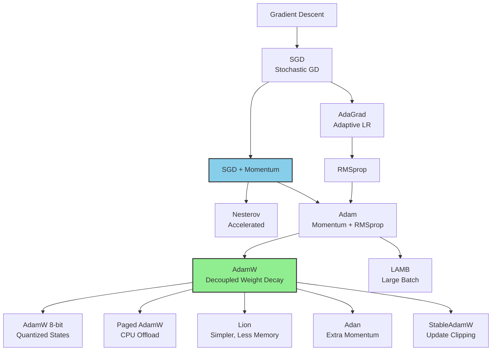
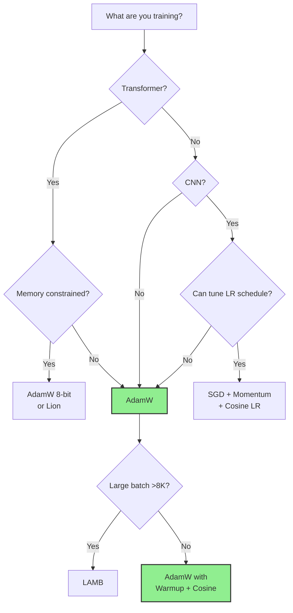

If the loss function tells your model *what* to minimize, the optimizer tells it *how* to get there. 
Pick the wrong optimizer and your model might converge slowly, get stuck in bad minima, or blow up entirely. 
Pick the right one and training becomes smooth, fast, and stable.

The good news: for most tasks, you only need to know a handful of optimizers. 
This guide covers them all — from the classics (SGD, Adam) to modern LLM-focused variants (AdamW 8-bit, Lion) — with PyTorch code you can use immediately.

---

## Quick Decision Guide

Before diving into the details, here's the cheat sheet:

### General Deep Learning

| Scenario | Optimizer | Notes |
|----------|-----------|-------|
| Default starting point | AdamW | Works well out of the box |
| Best generalization (if you can tune) | SGD + Momentum | Requires good LR schedule |
| CNNs on ImageNet-scale | SGD + Momentum + Nesterov | Still the gold standard |
| Transformers (NLP, Vision) | AdamW | De facto standard |
| Quick experiments, limited tuning time | Adam or AdamW | Minimal hyperparameter sensitivity |

### LLM Training & Fine-tuning

| Scenario | Optimizer | Notes |
|----------|-----------|-------|
| Standard LLM training | AdamW | Default for GPT, Llama, etc. |
| Memory-constrained fine-tuning | AdamW 8-bit | 4× less optimizer memory |
| GPU OOM during training | Paged AdamW | Offloads to CPU when needed |
| Maximum memory efficiency | Lion | 50% less memory than AdamW |
| Large batch training (>8K) | LAMB | Layerwise adaptation |

### By Constraint

| Constraint | Optimizer |
|------------|-----------|
| Limited GPU memory | SGD, Lion, or 8-bit AdamW |
| Limited tuning time | AdamW (works out of the box) |
| Need best final accuracy | SGD + Momentum (with tuning) |
| Training instability / loss spikes | StableAdamW or reduce β₂ |
| Small batch CNNs | Ranger |

---

## The Optimizer Family Tree

Understanding where optimizers come from helps you pick the right one:



**Two main branches:**
- **SGD family** — simple updates, good generalization, needs LR tuning
- **Adaptive family** — per-parameter learning rates, less tuning, more memory

---

## SGD: The Classic That Still Wins

Stochastic Gradient Descent is the simplest optimizer: move in the direction opposite to the gradient.

$$
\theta_{t+1} = \theta_t - \eta \nabla L(\theta_t)
$$

Where $\eta$ is the learning rate and $\nabla L$ is the gradient of the loss.

### SGD with Momentum

Plain SGD can oscillate. Momentum smooths the updates by accumulating a velocity:

$$
v_t = \gamma v_{t-1} + \eta \nabla L(\theta_t)
$$

$$
\theta_{t+1} = \theta_t - v_t
$$

The momentum term $\gamma$ (typically 0.9) keeps the optimizer moving in consistent directions.

### PyTorch Implementation

```python
import torch
import torch.nn as nn
from torch.optim import SGD

model = nn.Linear(784, 10)

# Basic SGD
optimizer = SGD(model.parameters(), lr=0.01)

# SGD with Momentum (recommended)
optimizer = SGD(model.parameters(), lr=0.01, momentum=0.9)

# SGD with Momentum + Nesterov (often better)
optimizer = SGD(model.parameters(), lr=0.01, momentum=0.9, nesterov=True)

# SGD with weight decay (L2 regularization)
optimizer = SGD(model.parameters(), lr=0.01, momentum=0.9, weight_decay=1e-4)
```

### When to Use SGD

- **CNNs on image classification** — still the gold standard for ImageNet
- **When you need best generalization** — SGD often finds flatter minima
- **When you have time to tune** — requires careful LR scheduling
- **Memory-constrained** — only stores momentum buffer (1× model size)

### When to Avoid SGD

- **Transformers** — Adam/AdamW typically works better
- **Quick experiments** — too sensitive to learning rate
- **Sparse gradients** — adaptive methods handle these better

---

## Adam: Momentum Meets Adaptive Learning Rates

Adam combines the best of two worlds:
1. **Momentum** (first moment) — smooths gradient direction
2. **RMSprop** (second moment) — adapts learning rate per parameter

$$
m_t = \beta_1 m_{t-1} + (1 - \beta_1) g_t \quad \text{(momentum)}
$$

$$
v_t = \beta_2 v_{t-1} + (1 - \beta_2) g_t^2 \quad \text{(squared gradients)}
$$

$$
\hat{m}_t = \frac{m_t}{1 - \beta_1^t}, \quad \hat{v}_t = \frac{v_t}{1 - \beta_2^t} \quad \text{(bias correction)}
$$

$$
\theta_{t+1} = \theta_t - \frac{\eta}{\sqrt{\hat{v}_t} + \epsilon} \hat{m}_t
$$

The bias correction handles the fact that $m$ and $v$ are initialized to zero.

### PyTorch Implementation

```python
import torch
from torch.optim import Adam

model = nn.Linear(784, 10)

# Default Adam
optimizer = Adam(model.parameters(), lr=1e-3)

# Adam with custom betas
optimizer = Adam(
    model.parameters(),
    lr=1e-3,
    betas=(0.9, 0.999),  # (β₁, β₂)
    eps=1e-8,
    weight_decay=0  # Don't use this! Use AdamW instead
)
```

### The Problem with Adam's Weight Decay

Adam's `weight_decay` parameter applies L2 regularization *inside* the adaptive update, which couples it with the gradient scaling. This is mathematically different from true weight decay and often leads to suboptimal results.

**Solution: Use AdamW.**

---

## AdamW: The Modern Default

AdamW fixes Adam's weight decay problem by *decoupling* weight decay from the gradient update:

$$
\theta_{t+1} = \theta_t - \frac{\eta}{\sqrt{\hat{v}_t} + \epsilon} \hat{m}_t - \eta \lambda \theta_t
$$

The last term ($\eta \lambda \theta_t$) is applied directly to the weights, not through the adaptive mechanism.

### PyTorch Implementation

```python
import torch
from torch.optim import AdamW

model = nn.Linear(784, 10)

# AdamW (recommended for most tasks)
optimizer = AdamW(
    model.parameters(),
    lr=1e-3,
    betas=(0.9, 0.999),
    eps=1e-8,
    weight_decay=0.01  # Now this works correctly!
)
```

### Typical Hyperparameters

| Hyperparameter | Typical Value | Notes |
|----------------|---------------|-------|
| `lr` | 1e-4 to 1e-3 | Lower for fine-tuning, higher for training from scratch |
| `betas` | (0.9, 0.999) | Reduce β₂ to 0.95 for large batches |
| `eps` | 1e-8 | Rarely needs changing |
| `weight_decay` | 0.01 to 0.1 | Higher for larger models |

### When to Use AdamW

- **Transformers** (BERT, GPT, ViT, Llama) — the standard choice
- **Most deep learning tasks** — good default
- **When you want minimal tuning** — works well out of the box
- **Fine-tuning pretrained models** — stable and effective

---

## Memory-Efficient Optimizers for LLMs

Training large language models is memory-intensive. AdamW stores two buffers per parameter (momentum and variance), consuming **2× the model size** in optimizer states.

For a 7B parameter model in FP32:
- Model weights: 28 GB
- AdamW states: 56 GB
- **Total optimizer memory: 56 GB**

Here's how to reduce that:

### AdamW 8-bit (bitsandbytes)

Quantizes optimizer states from FP32 to INT8, reducing memory by 4×:

```python
import torch
import bitsandbytes as bnb

model = ...  # Your model

# 8-bit AdamW
optimizer = bnb.optim.AdamW8bit(
    model.parameters(),
    lr=1e-4,
    betas=(0.9, 0.999),
    weight_decay=0.01
)
```

**Memory savings for 7B model:**
- Standard AdamW: 56 GB
- AdamW 8-bit: ~14 GB

The quantization is accurate enough that training loss curves are nearly identical to FP32.

### Paged AdamW

When GPU memory runs out, paged optimizers automatically offload optimizer states to CPU:

```python
import bitsandbytes as bnb

# Paged AdamW 32-bit
optimizer = bnb.optim.PagedAdamW32bit(
    model.parameters(),
    lr=1e-4,
    weight_decay=0.01
)

# Paged AdamW 8-bit (maximum memory efficiency)
optimizer = bnb.optim.PagedAdamW8bit(
    model.parameters(),
    lr=1e-4,
    weight_decay=0.01
)
```

**Key insight:** If everything fits in GPU memory, there's zero overhead. Paging only activates when needed.

### Using with HuggingFace Trainer

```python
from transformers import TrainingArguments

# Standard AdamW
args = TrainingArguments(optim="adamw_torch", ...)

# 8-bit AdamW
args = TrainingArguments(optim="adamw_8bit", ...)

# Paged AdamW 32-bit
args = TrainingArguments(optim="paged_adamw_32bit", ...)

# Paged AdamW 8-bit (most memory efficient)
args = TrainingArguments(optim="paged_adamw_8bit", ...)
```

### Memory Comparison

| Optimizer | Memory (7B model) | Speed | Accuracy |
|-----------|-------------------|-------|----------|
| AdamW 32-bit | 56 GB | Baseline | Baseline |
| AdamW 8-bit | ~14 GB | ~Same | ~Same |
| Paged AdamW 32-bit | Fits in VRAM | Slight overhead if paging | Same |
| Paged AdamW 8-bit | Fits in VRAM | Slight overhead if paging | ~Same |

---

## Lion: The Memory-Efficient Alternative

Lion (EvoLved Sign Momentum) was discovered by Google through AutoML search. It's simpler than Adam and uses less memory:

$$
\theta_{t+1} = \theta_t - \eta \cdot \text{sign}(\beta_1 m_t + (1-\beta_1) g_t) - \eta \lambda \theta_t
$$

$$
m_{t+1} = \beta_2 m_t + (1-\beta_2) g_t
$$

**Key differences from AdamW:**
- Uses `sign()` of the update (always ±1)
- Single momentum buffer (not two)
- **50% less memory** than AdamW

### PyTorch Implementation

```python
# Using lucidrains implementation
# pip install lion-pytorch
from lion_pytorch import Lion

model = ...

optimizer = Lion(
    model.parameters(),
    lr=1e-4,  # Use 3-10x smaller LR than AdamW!
    betas=(0.9, 0.99),
    weight_decay=0.1  # Use 3-10x larger weight decay than AdamW!
)
```

> **Critical:** Lion requires different hyperparameters than AdamW. Learning rate should be 3-10× smaller, weight decay 3-10× larger.
{: .prompt-warning }

### When to Use Lion

- **Memory-constrained training** — 50% less optimizer memory
- **When AdamW hyperparameters are already tuned** — scale LR and WD accordingly
- **Experimental** — results are mixed; test on your task

---

## Large Batch Optimizers: LAMB and LARS

When training with very large batches (8K+), standard optimizers can diverge. LAMB (Layer-wise Adaptive Moments) and LARS (Layer-wise Adaptive Rate Scaling) fix this by normalizing updates per layer.

### LAMB

Used to train BERT in 76 minutes with batch size 32K:

```python
# Using apex or transformers
from torch.optim import AdamW
from transformers import get_scheduler

# LAMB is available in apex
# pip install apex
from apex.optimizers import FusedLAMB

optimizer = FusedLAMB(
    model.parameters(),
    lr=1e-3,
    betas=(0.9, 0.999),
    weight_decay=0.01
)
```

### When to Use LAMB/LARS

- **Batch size > 8K** — standard optimizers may diverge
- **Distributed training across many GPUs** — large effective batch size
- **BERT-scale pretraining** — proven at scale

---

## Learning Rate Schedulers

The optimizer is only half the story. The learning rate schedule often matters more than the optimizer choice.

### Warmup: Essential for Transformers

Start with a small learning rate and ramp up:

```python
from torch.optim.lr_scheduler import LinearLR

optimizer = AdamW(model.parameters(), lr=1e-4)

# Linear warmup over 1000 steps
warmup_scheduler = LinearLR(
    optimizer,
    start_factor=0.01,  # Start at 1% of target LR
    end_factor=1.0,
    total_iters=1000
)
```

### Cosine Annealing: Smooth Decay

The most popular decay schedule for modern training:

```python
from torch.optim.lr_scheduler import CosineAnnealingLR

# Decay to near-zero over total_steps
scheduler = CosineAnnealingLR(
    optimizer,
    T_max=total_steps,
    eta_min=1e-6
)
```

### Warmup + Cosine Decay (The Transformer Standard)

```python
from torch.optim.lr_scheduler import SequentialLR, LinearLR, CosineAnnealingLR

optimizer = AdamW(model.parameters(), lr=1e-4)

warmup_steps = 1000
total_steps = 100000

# Warmup phase
warmup = LinearLR(
    optimizer,
    start_factor=0.01,
    end_factor=1.0,
    total_iters=warmup_steps
)

# Cosine decay phase
cosine = CosineAnnealingLR(
    optimizer,
    T_max=total_steps - warmup_steps,
    eta_min=1e-6
)

# Combine them
scheduler = SequentialLR(
    optimizer,
    schedulers=[warmup, cosine],
    milestones=[warmup_steps]
)
```

### OneCycleLR: Fast Training

Ramps up then down in a single cycle — often trains faster:

```python
from torch.optim.lr_scheduler import OneCycleLR

scheduler = OneCycleLR(
    optimizer,
    max_lr=1e-3,
    total_steps=total_steps,
    pct_start=0.1,  # 10% warmup
    anneal_strategy='cos'
)
```

### Learning Rate Schedule Comparison

| Schedule | Shape | Description | Best For |
|----------|-------|-------------|----------|
| **Constant** | `────────` | Fixed LR throughout | Quick experiments |
| **Step Decay** | `──┐ └──┐ └──` | Drops at milestones | CNNs (traditional) |
| **Cosine Annealing** | `╲  ╲  ─` | Smooth decay to minimum | Most modern training |
| **Warmup + Cosine** | `╱╲  ╲  ─` | Ramp up, then decay | Transformers |
| **OneCycleLR** | `╱ ╲` | Up then down in one cycle | Fast training, super-convergence |

---

## Emerging Optimizers

### StableAdamW

AdamW with update clipping — removes the need for gradient clipping:

```python
# Available in optimi library
# pip install optimi
from optimi import StableAdamW

optimizer = StableAdamW(
    model.parameters(),
    lr=1e-4,
    weight_decay=0.01
)
# No need for torch.nn.utils.clip_grad_norm_() !
```

**Use when:** Training is unstable or you're seeing loss spikes.

### Adan

Can outperform AdamW but uses more memory (3 buffers instead of 2):

```python
# pip install optimi
from optimi import Adan

optimizer = Adan(
    model.parameters(),
    lr=1e-3,
    betas=(0.98, 0.92, 0.99),
    weight_decay=0.02
)
```

**Use when:** Memory isn't a constraint and you want to try something new.

### Ranger

Good for small batch CNN training:

```python
# pip install optimi
from optimi import Ranger

optimizer = Ranger(
    model.parameters(),
    lr=1e-3,
    weight_decay=0.01
)
```

**Use when:** Training CNNs with batch size ≤512.

---

## Common Gotchas

A few mistakes I see repeatedly:

> **Don't use Adam's weight_decay.** Use AdamW instead. Adam's weight decay is coupled with the adaptive learning rate, which is mathematically wrong.

> **Match learning rate to optimizer.** Lion needs 3-10× smaller LR than AdamW. LAMB can handle higher LR than Adam.

> **Reduce β₂ for large batches.** If training with batch size >4K or seeing loss spikes, try `betas=(0.9, 0.95)` instead of the default `(0.9, 0.999)`.

> **Always use warmup for Transformers.** Starting with a high learning rate can destabilize attention weights early in training.

> **Don't forget the scheduler.** A good learning rate schedule often matters more than the optimizer choice.

---

## Decision Flowchart



---

## Quick Reference

| Optimizer | Memory | Tuning Effort | Best For |
|-----------|--------|---------------|----------|
| SGD + Momentum | 1× | High | CNNs, best generalization |
| Adam | 2× | Low | Quick experiments |
| AdamW | 2× | Low | **Transformers, default choice** |
| AdamW 8-bit | 0.5× | Low | LLM fine-tuning |
| Paged AdamW | Variable | Low | GPU OOM situations |
| Lion | 1× | Medium | Memory-constrained |
| LAMB | 2× | Medium | Large batch (>8K) |
| StableAdamW | 2× | Low | Unstable training |

**Memory notation:** 1× = one buffer per parameter, 2× = two buffers (like Adam's m and v)

---

## Wrapping Up

Optimizer selection doesn't have to be complicated:

1. **Start with AdamW** — it works for almost everything
2. **Add warmup + cosine decay** — especially for Transformers
3. **If memory-constrained** → try AdamW 8-bit or Lion
4. **If training CNNs and have time to tune** → SGD + Momentum often generalizes better
5. **If training is unstable** → try StableAdamW or reduce β₂

The optimizer is important, but don't overthink it. A well-tuned learning rate schedule with AdamW will beat a poorly-tuned exotic optimizer every time.

---

## Bonus: Visualizing Optimizer Trajectories

The hero image for this post was generated with the following script, which visualizes how different optimizers navigate a saddle point surface — a challenging loss landscape that reveals their distinct behaviors:

```python
"""
Optimizer Trajectory Visualization on a Saddle Point Surface

This script visualizes how different optimizers navigate a saddle point,
showing their distinct behaviors on a challenging loss landscape.

Output: optimizer_saddle_point.png
"""

import numpy as np
import matplotlib.pyplot as plt
from mpl_toolkits.mplot3d import Axes3D
import torch
import torch.optim as optim


def saddle_function(x, y):
    """Saddle point function: f(x,y) = x^2 - y^2"""
    return x**2 - y**2


def saddle_function_torch(params):
    """Saddle point function for torch tensors"""
    x, y = params[0], params[1]
    return x**2 - y**2


def run_optimizer(optimizer_class, optimizer_kwargs, start_point, n_steps=100):
    """
    Run an optimizer on the saddle function and record the trajectory.
    
    Args:
        optimizer_class: The optimizer class (e.g., torch.optim.SGD)
        optimizer_kwargs: Dict of kwargs for the optimizer
        start_point: Tuple (x, y) starting coordinates
        n_steps: Number of optimization steps
    
    Returns:
        List of (x, y, z) coordinates along the trajectory
    """
    # Initialize parameters
    params = torch.tensor(start_point, dtype=torch.float32, requires_grad=True)
    
    # Create optimizer
    optimizer = optimizer_class([params], **optimizer_kwargs)
    
    trajectory = []
    
    for _ in range(n_steps):
        x, y = params[0].item(), params[1].item()
        z = saddle_function(x, y)
        trajectory.append((x, y, z))
        
        optimizer.zero_grad()
        loss = saddle_function_torch(params)
        loss.backward()
        optimizer.step()
    
    # Add final point
    x, y = params[0].item(), params[1].item()
    z = saddle_function(x, y)
    trajectory.append((x, y, z))
    
    return trajectory


def main():
    # Starting point (on the saddle)
    start = [0.7, 0.01]  # Slightly off y=0 to break symmetry
    n_steps = 150
    
    # Define optimizers to compare
    optimizers = {
        'SGD': (optim.SGD, {'lr': 0.01}),
        'Momentum': (optim.SGD, {'lr': 0.01, 'momentum': 0.9}),
        'NAG': (optim.SGD, {'lr': 0.01, 'momentum': 0.9, 'nesterov': True}),
        'Adagrad': (optim.Adagrad, {'lr': 0.5}),
        'Adadelta': (optim.Adadelta, {'lr': 10.0}),
        'RMSprop': (optim.RMSprop, {'lr': 0.01}),
        'Adam': (optim.Adam, {'lr': 0.05}),
        'AdamW': (optim.AdamW, {'lr': 0.05}),
    }
    
    # Colors matching the reference image style
    colors = {
        'SGD': '#FF0000',        # Red
        'Momentum': '#00FF00',   # Green
        'NAG': '#FF00FF',        # Magenta
        'Adagrad': '#0000FF',    # Blue
        'Adadelta': '#FFFF00',   # Yellow
        'RMSprop': '#000000',    # Black
        'Adam': '#00FFFF',       # Cyan
        'AdamW': '#FF8C00',      # Orange
    }
    
    # Run all optimizers
    trajectories = {}
    for name, (opt_class, opt_kwargs) in optimizers.items():
        trajectories[name] = run_optimizer(opt_class, opt_kwargs, start.copy(), n_steps)
    
    # Create the 3D surface
    fig = plt.figure(figsize=(12, 10))
    ax = fig.add_subplot(111, projection='3d')
    
    # Generate surface mesh
    x_range = np.linspace(-1.5, 1.5, 100)
    y_range = np.linspace(-1.5, 1.5, 100)
    X, Y = np.meshgrid(x_range, y_range)
    Z = saddle_function(X, Y)
    
    # Plot surface with color gradient (red=high, blue=low)
    surf = ax.plot_surface(X, Y, Z, cmap='coolwarm', alpha=0.7, 
                           linewidth=0, antialiased=True,
                           rstride=2, cstride=2)
    
    # Plot optimizer trajectories
    for name, traj in trajectories.items():
        xs = [p[0] for p in traj]
        ys = [p[1] for p in traj]
        zs = [p[2] for p in traj]
        
        # Plot trajectory line
        ax.plot(xs, ys, zs, color=colors[name], linewidth=2.5, label=name)
        
        # Mark start point
        ax.scatter([xs[0]], [ys[0]], [zs[0]], color=colors[name], s=50, marker='o')
        
        # Mark end point
        ax.scatter([xs[-1]], [ys[-1]], [zs[-1]], color=colors[name], s=80, marker='*')
    
    # Labels and title
    ax.set_xlabel('X', fontsize=12)
    ax.set_ylabel('Y', fontsize=12)
    ax.set_zlabel('f(x,y) = x² - y²', fontsize=12)
    ax.set_title('Optimizer Trajectories on Saddle Point Surface', fontsize=14, fontweight='bold')
    
    # Set axis limits
    ax.set_xlim(-1.5, 1.5)
    ax.set_ylim(-1.5, 1.5)
    ax.set_zlim(-4, 4)
    
    # Adjust view angle
    ax.view_init(elev=20, azim=45)
    
    # Legend
    ax.legend(loc='upper right', fontsize=10, framealpha=0.9)
    
    plt.tight_layout()
    
    # Save the figure
    output_path = 'optimizer1.png'
    plt.savefig(output_path, dpi=150, bbox_inches='tight', facecolor='white')
    print(f"Saved: {output_path}")
    
    plt.show()


if __name__ == "__main__":
    main()
```

This visualization shows how different optimizers handle a saddle point — a common challenge in deep learning where the loss surface curves up in one direction and down in another. Notice how momentum-based methods escape the saddle faster than vanilla SGD.

---

## References

- [PyTorch Optimizers Documentation](https://pytorch.org/docs/stable/optim.html?utm_source=genmind.ch)
- [Decoupled Weight Decay Regularization (AdamW)](https://arxiv.org/abs/1711.05101?utm_source=genmind.ch)
- [Large Batch Optimization for Deep Learning: Training BERT in 76 Minutes (LAMB)](https://arxiv.org/abs/1904.00962?utm_source=genmind.ch)
- [Symbolic Discovery of Optimization Algorithms (Lion)](https://arxiv.org/abs/2302.06675?utm_source=genmind.ch)
- [bitsandbytes: 8-bit Optimizers](https://github.com/bitsandbytes-foundation/bitsandbytes?utm_source=genmind.ch)
- [Fine-tuning LLMs with 32-bit, 8-bit, and Paged AdamW](https://kaitchup.substack.com/p/fine-tuning-llms-with-32-bit-8-bit?utm_source=genmind.ch)
- [Which Optimizer Should I Use? (Lightly AI)](https://www.lightly.ai/blog/which-optimizer-should-i-use-for-my-machine-learning-project?utm_source=genmind.ch)
- [optimi: Fast PyTorch Optimizers](https://optimi.benjaminwarner.dev/?utm_source=genmind.ch)

---

## Need Help with Your AI Project?

Whether you're building a new AI solution or scaling an existing one, I can help. Book a free consultation to discuss your project.

[Book a Free Consultation](https://calendar.app.google/QuNua7HxdsSasCGu9){: .btn .btn-primary}
