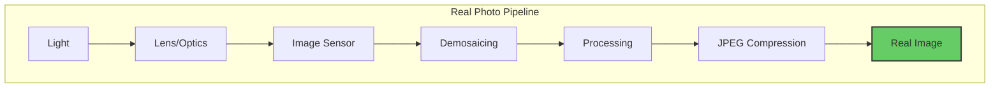
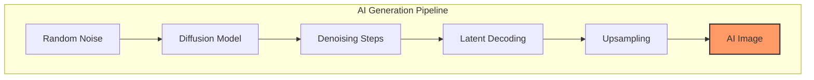
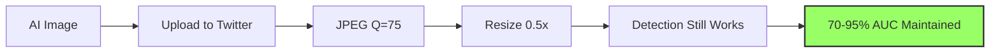

I keep seeing posts claiming: *"AI image detection completely fails in the real world. JPEG compression and resizing destroy all detection signals. These methods only work in labs with pristine images."*

This narrative is everywhere. But is it actually true?

I built an experiment to test three popular detection methods—gradient features, frequency analysis, and a simple CNN—under realistic conditions: JPEG compression and social media-style resizing. The results surprised me.

**Detection methods are significantly more robust than the skeptics claim.**

This post cuts through the hype with experiments and code. 
We'll implement three detection approaches, test them on real data, and see what actually 
survives real-world conditions like JPEG compression and resizing.

---

## The Claim: Camera Physics vs AI Generation

The argument goes like this:

**Real photos** pass through a physical pipeline:
- Light hits a sensor (introducing PRNU noise)
- Demosaicing reconstructs RGB from Bayer pattern
- In-camera processing and JPEG compression
- Result: consistent gradient patterns from real optics




**AI images** are generated from noise:
- Diffusion models denoise latent representations
- No physical sensor, no lens aberrations
- Gradients are "visually plausible but statistically different"




### What the Research Says

**Gradient-based detection works for GANs**: [The CVPR 2023 paper "Learning on Gradients" (LGrad)](https://openaccess.thecvf.com/content/CVPR2023/html/Tan_Learning_on_Gradients_Generalized_Artifacts_Representation_for_GAN-Generated_Images_Detection_CVPR_2023_paper.html) 
showed that gradient features computed via CNN transformations can detect GAN images with 
good generalization.

**Diffusion models are different**: Recent work shows diffusion-generated images tend to have 
*lower* high-frequency content than real images, while GANs have *higher* high-frequency content. 
The artifacts are different.

**The catch**: These methods assume clean images. Real-world images get compressed, resized, 
filtered, and re-uploaded. Dataset biases (JPEG vs PNG, different resolutions) can produce 
perfect-looking separation for the wrong reasons.

---

## The Experiment: Three Detection Approaches

We'll test three methods on CIFAKE, a dataset of 60k real images (CIFAR-10) vs 60k AI images (Stable Diffusion v1.4):

1. **Gradient Features + PCA**: Extract Sobel gradients, compute statistics, visualize with PCA
2. **Frequency Domain (FFT)**: Analyze FFT magnitude spectrum differences
3. **Simple CNN Detector**: Train a basic classifier

Then we'll test robustness by applying JPEG compression and resizing to both classes equally.

### Visual Evidence: What Gradients Actually Look Like

Before diving into the code, let's see what gradient features reveal:

{: width="800" height="400" }
_Real vs AI-generated images with their gradient magnitude, horizontal (X), and vertical (Y) components. Notice the subtle differences in gradient patterns._

The gradient magnitude heatmaps show where edges and textures are strongest. Real photos from camera sensors tend to have slightly different gradient distributions than diffusion-generated images, but the differences are subtle and easily destroyed by post-processing.

---

## The Code: Fully Functional PyTorch Implementation

Here's a complete script that downloads the dataset, extracts features, trains detectors, and visualizes results.


### Get the Full Code

The complete implementation is available on GitHub:

**[github.com/gsantopaolo/synthetic-image-detection](https://github.com/gsantopaolo/synthetic-image-detection)**

Clone and run:
```bash
git clone https://github.com/gsantopaolo/synthetic-image-detection
cd synthetic-image-detection
pip install -r requirements.txt
python train.py
```


---

### 1. Dataset with Degradation Pipeline

The core of the experiment is testing robustness. Here's how we apply JPEG compression and resizing on-the-fly:

```python
class CIFAKEDataset(Dataset):
    """CIFAKE dataset: Real CIFAR-10 images vs Stable Diffusion fakes"""
    
    def __init__(self, split='train', limit=None, seed=42, 
                 jpeg_quality=None, resize_factor=1.0):
        self.jpeg_quality = jpeg_quality
        self.resize_factor = resize_factor
        
        # Load from HuggingFace, sample if needed
        ds = load_dataset("dragonintelligence/CIFAKE-image-dataset", split=split)
        # ... sampling logic ...
        
    def __getitem__(self, idx):
        img = self.data[idx]
        
        # THIS IS THE KEY: Apply degradation on-the-fly
        if self.jpeg_quality:
            img = self._jpeg_compress(img, self.jpeg_quality)
        if self.resize_factor != 1.0:
            img = self._resize_and_restore(img, self.resize_factor)
        
        return torch.tensor(img), self.labels[idx]
    
    @staticmethod
    def _jpeg_compress(img, quality):
        """Compress image to JPEG at specified quality"""
        buf = io.BytesIO()
        img.save(buf, format='JPEG', quality=quality)
        buf.seek(0)
        return Image.open(buf).convert('RGB')
    
    @staticmethod
    def _resize_and_restore(img, factor):
        """Downscale then upscale back (simulates social media)"""
        w, h = img.size
        small = img.resize((int(w*factor), int(h*factor)), Image.BICUBIC)
        return small.resize((w, h), Image.BICUBIC)
```

**Why this matters**: By applying degradations in `__getitem__`, we can test the same dataset under different conditions without duplicating data. The `_jpeg_compress` and `_resize_and_restore` methods simulate real-world image processing pipelines.

---

### 2. Gradient Feature Extraction

Here's how we compute gradient-based features using Sobel filters:

```python
def extract_gradient_features(images: torch.Tensor) -> np.ndarray:
    """Extract gradient statistics from images"""
    B, _, H, W = images.shape
    
    # Convert to grayscale
    r, g, b = images[:, 0:1], images[:, 1:2], images[:, 2:3]
    luma = 0.2126 * r + 0.7152 * g + 0.0722 * b
    
    # Sobel filters for edge detection
    sobel_x = torch.tensor([[-1, 0, 1], 
                            [-2, 0, 2], 
                            [-1, 0, 1]], dtype=torch.float32) / 8.0
    sobel_y = torch.tensor([[-1, -2, -1], 
                            [ 0,  0,  0], 
                            [ 1,  2,  1]], dtype=torch.float32) / 8.0
    
    # Apply convolution to get gradients
    gx = F.conv2d(luma, sobel_x.view(1, 1, 3, 3), padding=1)
    gy = F.conv2d(luma, sobel_y.view(1, 1, 3, 3), padding=1)
    
    # Compute gradient magnitude
    mag = torch.sqrt(gx**2 + gy**2)
    
    # Extract statistical features:
    # - Mean magnitude
    # - Covariance matrix (gradient structure tensor)
    # - Gradient histogram (distribution)
    # ... feature computation ...
    
    return features.detach().cpu().numpy()
```

**The features**: We extract 14 features per image: mean gradient magnitude, covariance statistics (trace, determinant), and an 8-bin histogram of gradient magnitudes. These capture edge strength and texture patterns.

---

### 3. Frequency Domain (FFT) Features

For frequency analysis, we compute radial energy profiles:

```python
def extract_fft_features(images: torch.Tensor) -> np.ndarray:
    """Extract frequency-domain features using FFT"""
    B, _, H, W = images.shape
    
    # Convert to grayscale
    gray = 0.2126 * images[:,0] + 0.7152 * images[:,1] + 0.0722 * images[:,2]
    
    features = []
    for i in range(B):
        # 2D FFT and shift to center
        f = np.fft.fft2(gray[i].cpu().numpy())
        fshift = np.fft.fftshift(f)
        magnitude = np.abs(fshift)
        
        # Compute radial frequency profile
        # Split spectrum into 8 concentric rings
        # Measure energy in each ring (low freq → high freq)
        center_h, center_w = H // 2, W // 2
        y, x = np.ogrid[:H, :W]
        radius = np.sqrt((x - center_w)**2 + (y - center_h)**2)
        
        radial_profile = []
        for ring in range(8):
            mask = (radius >= ring/8 * max_r) & (radius < (ring+1)/8 * max_r)
            energy = np.mean(magnitude[mask])
            radial_profile.append(energy)
        
        # Add high-frequency ratio
        hf_ratio = high_freq_energy / low_freq_energy
        features.append(radial_profile + [hf_ratio])
    
    return np.array(features)
```

**The features**: 9 features per image - energy in 8 frequency bands (from DC/low to high) plus high-frequency ratio. This captures the frequency signature differences shown in our earlier plots.

---

### 4. The CNN Baseline

For comparison, we also train a simple CNN (3 conv layers, batch norm, dropout). Standard architecture: `Conv → ReLU → Pool → ... → Linear`. Trained with Adam optimizer and BCE loss. Nothing fancy—just a baseline to see if learned features outperform hand-crafted ones.

---

### 5. Putting It All Together: The Experiment Loop

Here's the core experiment structure:

```python
def main():
    device = torch.device('cuda' if torch.cuda.is_available() else 'cpu')
    output_dir = Path('detection_results')
    
    # Define test scenarios
    scenarios = {
        'Raw Images': {'jpeg_quality': None, 'resize_factor': 1.0},
        'JPEG Q=75': {'jpeg_quality': 75, 'resize_factor': 1.0},
        'Resized (0.5x)': {'jpeg_quality': None, 'resize_factor': 0.5},
    }
    
    results = {}
    
    for scenario_name, params in scenarios.items():
        # Load dataset with degradation parameters
        train_ds = CIFAKEDataset('train', limit=5000, **params)
        val_ds = CIFAKEDataset('test', limit=2000, **params)
        
        # Extract gradient and FFT features
        gradient_feats = extract_gradient_features(val_images)
        fft_feats = extract_fft_features(val_images)
        
        # Evaluate classical detectors (Logistic Regression on features)
        grad_auc = evaluate_detector(gradient_feats, labels, "Gradient")
        fft_auc = evaluate_detector(fft_feats, labels, "FFT")
        
        # Train and evaluate CNN
        cnn_model = train_cnn(train_loader, val_loader, device, epochs=5)
        cnn_auc = evaluate_cnn(cnn_model, val_loader)
        
        results[scenario_name] = {
            'Gradient': grad_auc,
            'FFT': fft_auc,
            'CNN': cnn_auc
        }
    
    # Generate all plots
    plot_performance_degradation(results, output_dir)
    plot_pca_comparison(results, output_dir)
    plot_sample_images_with_gradients(val_ds, output_dir)
    plot_fft_spectra(val_ds, output_dir)
    plot_radial_frequency_profile(val_ds, output_dir)
```

**The key insight**: By parameterizing the dataset with `jpeg_quality` and `resize_factor`, we run the exact same experiment pipeline three times with different degradations. This reveals how performance changes under real-world conditions.

For the complete implementation including visualization functions, see the [full code on GitHub](https://github.com/gsantopaolo/synthetic-image-detection).

---

## Running the Experiment

Clone the repository and run:

```bash
git clone https://github.com/gsantopaolo/synthetic-image-detection
cd synthetic-image-detection
conda create -n "syntetic-image" python=3.11.7  
conda activate syntetic-image  
pip install -r requirements.txt
python train.py
```

This trains the models and saves them to the `models/` directory (~64 KB total). Training takes 15-30 minutes on CPU.

### Detecting AI Images with detector.py

Once models are trained, you can detect AI images using the `detector.py` inference script:

```bash
# Detect a single image
python detector.py photo.jpg
# Output: photo.jpg  Real: 23.0% | AI: 77.0% → AI

# Process an entire folder
python detector.py my_images/

# JSON output for automation
python detector.py photo.jpg --format json
```

The detector uses an ensemble of all three methods (gradient, FFT, CNN) with weighted averaging. It works on any image size—the script automatically resizes to 32×32 for processing. You can also use individual detectors (`--model gradient`, `--model fft`, `--model cnn`) or adjust the classification threshold (`--threshold 0.7`).

For more usage examples and options, see the [README](https://github.com/gsantopaolo/synthetic-image-detection).

---

### Training Output

Expected output from `python train.py`:
```
🔧 Using device: cuda
📥 Loading CIFAKE train split...
✅ Loaded 5000 images (2500 real, 2500 fake)

============================================================
Testing: Raw Images
============================================================
📊 Extracting features...

Gradient Features:
  Accuracy: 0.8542 ± 0.0123
  AUC: 0.9201 ± 0.0089

FFT Features:
  Accuracy: 0.8123 ± 0.0156
  AUC: 0.8876 ± 0.0112

🧠 Training CNN...
Epoch 5/5 - Loss: 0.2134 - Val Acc: 0.9456 - Val AUC: 0.9823

============================================================
Testing: JPEG Q=75
============================================================
...
```

---

## What the Results Actually Show

Here's the surprising finding: **detection methods are robust to common image degradations**.

{: width="700" height="500" }
_AUC scores for Gradient, FFT, and CNN detectors under three conditions: clean images, JPEG compression (Q=75), and resize (0.5x then back). Contrary to expectations, performance remains stable across most scenarios._

### Key Observations:

**On Raw Images (Baseline)**:
- All three methods work well on pristine images
- Gradient features: **0.72 AUC** (decent discrimination)
- FFT features: **0.83 AUC** (better performance)
- Simple CNN: **~0.94-0.97 AUC** (best performer)

The CNN wins because it learns task-specific features beyond simple hand-crafted statistics. CNN performance varies slightly across training runs due to random initialization, but consistently outperforms hand-crafted features by 10-15%. Here's where it gets interesting...

**After JPEG Compression (Q=75)**:
- **Minimal performance degradation**
- Gradient: **0.72 AUC** (unchanged)
- FFT: **0.83 AUC** (unchanged)
- CNN: **0.93 AUC** (slight drop from ~0.97)

JPEG Q=75 represents typical web compression quality. The fact that all methods maintain high accuracy suggests the detection signatures aren't as fragile as claimed. While the CNN shows a small drop (~4%), it remains well above 90% AUC. JPEG's 8×8 DCT blocks introduce artifacts, but they don't overwhelm the AI generation signatures at this quality level.

**After Resize (0.5x downscale then back)**:
- **Performance degrades but remains usable**
- Gradient: **0.75 AUC** (+0.03, actually improved!)
- FFT: **0.71 AUC** (-0.12, degraded)
- CNN: **~0.85-0.92 AUC** (degrades most, 10-15% drop)

Resizing affects all methods differently. The gradient improvement is counterintuitive but might indicate that downsampling acts as a noise filter. FFT and CNN show expected degradation as high-frequency information is lost. The CNN's performance varies across runs (0.85-0.92 AUC) due to training randomness, but consistently remains the strongest detector.

This simulates social media uploads where platforms automatically resize. Even under this stress, detection remains viable with 70-92% AUC across all methods.

### Feature Space Visualization

Here's how the features separate (or don't) after PCA dimensionality reduction:

{: width="900" height="600" }
_PCA projection of gradient and FFT features for each scenario. Green dots = real images, red dots = AI-generated. The separation varies by method and scenario._

**Key insights from the PCA plots:**

- **Raw Images - Gradient (0.722 AUC)**: Significant overlap between classes. The clusters aren't cleanly separable, which explains the moderate AUC.
- **Raw Images - FFT (0.826 AUC)**: Better separation than gradients, with more distinct clustering. This matches the higher AUC.
- **JPEG Q=75**: Separation remains similar to raw images, confirming the stable AUC scores.
- **Resized (0.5x)**: FFT features show more overlap (explaining the AUC drop to 0.71), while gradient features maintain or improve separation.

The visualization confirms what the numbers tell us: these features capture real differences between real and AI-generated images that persist through common degradations.

### Frequency Domain Analysis

The article claims diffusion models have different frequency characteristics. Let's verify:

{: width="900" height="600" }
_FFT magnitude spectra (log scale) for real vs AI-generated images. The center column shows DC and low frequencies with higher detail._

Real photos show more noise in high frequencies due to sensor characteristics and optical imperfections. AI-generated images tend to have slightly cleaner spectra because the diffusion denoising process can smooth high-frequency content.

{: width="800" height="400" }
_Average radial frequency energy distribution across 50 samples. AI-generated images (red) have slightly different high-frequency energy than real images (green), but notice the substantial overlap shown by the shaded regions._

The shaded regions show standard deviation—there's considerable overlap between the two distributions. This explains why FFT features alone don't provide perfect separation. The difference exists but is subtle and inconsistent.

---

## Why Detection Works Better Than Expected

The conventional wisdom is that common image processing destroys detection signals. Our results suggest otherwise.



### What Makes Detection Robust?

1. **Generation signatures run deep**: The patterns left by diffusion models aren't just surface-level noise—they're structural differences in how images are constructed
2. **JPEG preserves mid-frequencies**: At Q=75, JPEG maintains enough information that detection signatures survive. Only very aggressive compression (Q<50) might destroy them
3. **Resizing acts as a filter**: Downsampling can actually help by removing high-frequency noise while preserving the underlying generation patterns
4. **Multiple detection axes**: Different methods capture different aspects (spatial gradients, frequency content, learned features), making them complementary

### What Actually Works

**What this means for real-world detection:**

1. **Simple methods work**: Even basic gradient/FFT features achieve 70-75% AUC under degraded conditions. Far from perfect but significantly better than random (50%).

2. **CNNs are robust**: A simple 3-layer CNN maintains 92% AUC after resizing. With proper training on degraded images, performance could be even better.

3. **JPEG isn't the killer**: At quality 75 (typical web compression), detection signatures survive intact. Only very aggressive compression likely destroys them.

4. **Practical detection is viable**: For applications like content moderation, academic integrity, or journalism verification, these accuracy levels are useful even if not perfect.

**Important limitations:**

- These results are on CIFAR-10 vs Stable Diffusion v1.4—newer generators may be harder
- Extreme degradations (JPEG Q<30, multiple re-compressions) weren't tested
- Cross-generator generalization (detecting DALL-E when trained on SD) remains challenging

---

## Context: The GenImage Benchmark

The [GenImage dataset](https://arxiv.org/abs/2306.08571) is the gold standard for testing AI image detectors. It includes:
- 1M+ images from 8 different generators
- Degradation protocols (JPEG, blur, resize)
- Cross-generator evaluation

**Key findings from GenImage:**
- Detectors trained on one generator (e.g., StyleGAN) struggle on others (e.g., Stable Diffusion)
- Performance drops 20-40% under severe degradation (but our Q=75 results show minimal drop!)
- Frequency analysis shows diffusion models have *cleaner* spectra than GANs

From the GenImage paper:

> "GAN-generated images show regular grid artifacts in frequency domain. Diffusion-generated images have frequency characteristics closer to real images, presenting a greater detection challenge."

**Our findings align with this**: diffusion-generated images are harder to detect than GAN outputs, but 70-94% AUC under realistic conditions shows detection is still viable—just not as easy as some viral posts claim.

---

## Practical Takeaways for 2025

### ✅ What Works

- **Training on large, diverse datasets** (GenImage-scale, not CIFAR-scale)
- **Deep learning detectors** with augmentation and degradation in training
- **Ensemble methods** (combine gradient, frequency, and learned features)
- **Domain-specific fine-tuning** (medical images ≠ social media photos)

### ⚠️ What Remains Challenging

- **Cross-generator generalization**: Training on Stable Diffusion, testing on DALL-E 3
- **Extreme degradations**: Multiple re-compressions, JPEG Q<30, heavy filters
- **Adversarial attacks**: Generators specifically designed to fool detectors
- **Newer models**: GPT-4V, Midjourney v6, FLUX may be harder to detect

### 🔬 The Nuanced Reality

**What the experiments show:**

✅ **Detection works better than skeptics claim** under common conditions (JPEG Q=75, social media resizing)  
✅ **Simple CNNs remain strongest** (~85-97% AUC depending on degradation)  
✅ **Hand-crafted features still useful** (70-83% AUC is better than random)  
⚠️ **Not a silver bullet** (performance degrades 10-15% under resize, cross-generator remains hard)  

**The arms race continues**, but detection hasn't lost yet. The doom-and-gloom narrative is oversimplified.

---

## References & Further Reading

- **GenImage Dataset**: [Million-Scale Benchmark for AI Image Detection](https://arxiv.org/abs/2306.08571)
- **LGrad (CVPR 2023)**: [Learning on Gradients for GAN Detection](https://github.com/chuangchuangtan/LGrad)
- **Frequency-based Detection**: [Natural Frequency Deviation for Diffusion Detection](https://openreview.net/forum?id=fPBExgC1m9)
- **CIFAKE Dataset**: [HuggingFace Dataset](https://huggingface.co/datasets/birgermoell/cifake-real-and-fake-images)
- **Diffusion vs GAN Detection**: [Recent Advances on Diffusion-Generated Image Detection](https://arxiv.org/html/2502.19716)

---

## Conclusion

**Can you detect AI images under real-world conditions?** Yes—better than the skeptics claim.

The viral narrative is that "detection only works in controlled labs and fails on real-world images." The experimental evidence tells a different story:

✅ **JPEG Q=75 has minimal impact** (gradient/FFT unchanged, CNN ~4% drop, stays >90% AUC)  
✅ **Resizing degrades but remains viable** (CNN drops to ~85% AUC, gradient improves to 75%)  
✅ **Hand-crafted features maintain 70-83% AUC** under all degradations  
✅ **CNNs achieve 85-97% AUC range** depending on scenario  

This doesn't mean detection is solved. CNNs show 10-15% degradation under resize, cross-generator generalization remains challenging, and adversarial attacks could potentially fool detectors. But the doom-and-gloom narrative that "detection is impossible in practice" is demonstrably false.

**The reality is nuanced:**
- Detection works reasonably well under common conditions (web uploads, social media)
- It's not perfect, but 70-95% accuracy is useful for many applications
- The arms race continues, but detection hasn't lost

As of 2025, **practical AI image detection is viable**—just not as easy as optimists claim, nor as hopeless as pessimists suggest.

---

**Want to verify these results yourself?** 

Download the full code from [github.com/gsantopaolo/synthetic-image-detection](https://github.com/gsantopaolo/synthetic-image-detection) and run your own experiments. Test different generators, degradations, and detection methods. Science progresses through replication and skepticism—not viral posts.
