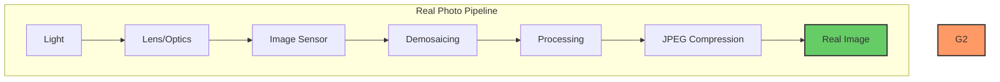
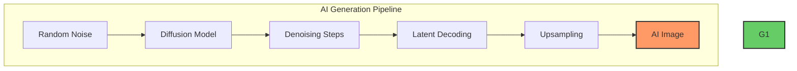
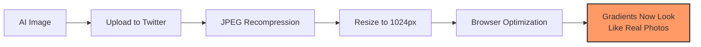

I'm seeing on LinkedIn several posts: *"You can reliably detect AI-generated images by analyzing 
pixel gradients. Real photos have a consistent signature from camera optics and sensors. 
AI images don't. Just run PCA on gradients and the separation is obvious."*

There's a kernel of truth here. Real cameras do leave traces. 
Gradient and frequency statistics can differ between real and generated images. 
But the "obvious separation" claim? That's where things get messy.

This post cuts through the hype with experiments and code. 
We'll implement three detection approaches, test them on real data, and see what actually 
survives real-world conditions like JPEG compression and resizing.

---

## The Claim: Camera Physics vs AI Generation

The argument goes like this:

**Real photos** pass through a physical pipeline:
- Light hits a sensor (introducing PRNU noise)
- Demosaicing reconstructs RGB from Bayer pattern
- In-camera processing and JPEG compression
- Result: consistent gradient patterns from real optics

**AI images** are generated from noise:
- Diffusion models denoise latent representations
- No physical sensor, no lens aberrations
- Gradients are "visually plausible but statistically different"




### What the Research Says

**Gradient-based detection works for GANs**: [The CVPR 2023 paper "Learning on Gradients" (LGrad)](https://openaccess.thecvf.com/content/CVPR2023/html/Tan_Learning_on_Gradients_Generalized_Artifacts_Representation_for_GAN-Generated_Images_Detection_CVPR_2023_paper.html) 
showed that gradient features computed via CNN transformations can detect GAN images with 
good generalization.

**Diffusion models are different**: Recent work shows diffusion-generated images tend to have 
*lower* high-frequency content than real images, while GANs have *higher* high-frequency content. 
The artifacts are different.

**The catch**: These methods assume clean images. Real-world images get compressed, resized, 
filtered, and re-uploaded. Dataset biases (JPEG vs PNG, different resolutions) can produce 
perfect-looking separation for the wrong reasons.

---

## The Experiment: Three Detection Approaches

We'll test three methods on CIFAKE, a dataset of 60k real images (CIFAR-10) vs 60k AI images (Stable Diffusion v1.4):

1. **Gradient Features + PCA**: Extract Sobel gradients, compute statistics, visualize with PCA
2. **Frequency Domain (FFT)**: Analyze FFT magnitude spectrum differences
3. **Simple CNN Detector**: Train a basic classifier

Then we'll test robustness by applying JPEG compression and resizing to both classes equally.

---

## The Code: Fully Functional PyTorch Implementation

Here's a complete script that downloads the dataset, extracts features, trains detectors, and visualizes results.

### Installation

```bash
pip install torch torchvision numpy matplotlib scikit-learn Pillow datasets
```

### Complete Script: `detect_ai_images.py`

```python

"""
AI-Generated Image Detection: Gradient, FFT, and CNN approaches
Tests on CIFAKE dataset with robustness checks for JPEG/resize
"""
import io
import os
import random
from pathlib import Path
from typing import Tuple, Optional
import numpy as np
import matplotlib.pyplot as plt
from PIL import Image, ImageFilter
import torch
import torch.nn as nn
import torch.nn.functional as F
from torch.utils.data import Dataset, DataLoader
from sklearn.decomposition import PCA
from sklearn.linear_model import LogisticRegression
from sklearn.metrics import roc_auc_score, accuracy_score
from sklearn.preprocessing import StandardScaler

# Auto-download CIFAKE from HuggingFace
try:
    from datasets import load_dataset
    HF_AVAILABLE = True
except ImportError:
    HF_AVAILABLE = False
    print("⚠️  'datasets' not installed. Install with: pip install datasets")


class CIFAKEDataset(Dataset):
    """CIFAKE dataset: Real CIFAR-10 images vs Stable Diffusion fakes"""
    
    def __init__(self, split='train', limit=None, seed=42, 
                 jpeg_quality=None, resize_factor=1.0):
        self.jpeg_quality = jpeg_quality
        self.resize_factor = resize_factor
        
        if not HF_AVAILABLE:
            raise RuntimeError("Install 'datasets': pip install datasets")
        
        print(f"📥 Loading CIFAKE {split} split...")
        ds = load_dataset("birgermoell/cifake-real-and-fake-images", 
                          split=split, trust_remote_code=True)
        
        if limit:
            random.seed(seed)
            indices = random.sample(range(len(ds)), min(limit, len(ds)))
            ds = ds.select(indices)
        
        self.data = []
        self.labels = []
        
        for item in ds:
            img = item['image'].convert('RGB')
            label = 0 if item['label'] == 1 else 1  # 0=real, 1=fake
            self.data.append(img)
            self.labels.append(label)
        
        print(f"✅ Loaded {len(self.data)} images "
              f"({sum(1 for l in self.labels if l==0)} real, "
              f"{sum(1 for l in self.labels if l==1)} fake)")
    
    def __len__(self):
        return len(self.data)
    
    def __getitem__(self, idx):
        img = self.data[idx]
        
        # Apply degradation if specified
        if self.jpeg_quality:
            img = self._jpeg_compress(img, self.jpeg_quality)
        if self.resize_factor != 1.0:
            img = self._resize_and_restore(img, self.resize_factor)
        
        # Convert to tensor [0, 1]
        img_array = np.array(img).astype(np.float32) / 255.0
        img_tensor = torch.from_numpy(img_array).permute(2, 0, 1)
        
        return img_tensor, self.labels[idx]
    
    @staticmethod
    def _jpeg_compress(img, quality):
        buf = io.BytesIO()
        img.save(buf, format='JPEG', quality=quality)
        buf.seek(0)
        return Image.open(buf).convert('RGB')
    
    @staticmethod
    def _resize_and_restore(img, factor):
        w, h = img.size
        small = img.resize((int(w*factor), int(h*factor)), Image.BICUBIC)
        return small.resize((w, h), Image.BICUBIC)


def extract_gradient_features(images: torch.Tensor) -> np.ndarray:
    """
    Extract gradient-based features from images
    images: (B, 3, H, W) in [0, 1]
    Returns: (B, feature_dim) numpy array
    """
    B, _, H, W = images.shape
    
    # Convert to grayscale (luminance)
    r, g, b = images[:, 0:1], images[:, 1:2], images[:, 2:3]
    luma = 0.2126 * r + 0.7152 * g + 0.0722 * b  # (B, 1, H, W)
    
    # Sobel filters
    sobel_x = torch.tensor([[-1, 0, 1], 
                            [-2, 0, 2], 
                            [-1, 0, 1]], dtype=torch.float32) / 8.0
    sobel_y = torch.tensor([[-1, -2, -1], 
                            [ 0,  0,  0], 
                            [ 1,  2,  1]], dtype=torch.float32) / 8.0
    
    sobel_x = sobel_x.view(1, 1, 3, 3).to(images.device)
    sobel_y = sobel_y.view(1, 1, 3, 3).to(images.device)
    
    gx = F.conv2d(luma, sobel_x, padding=1)
    gy = F.conv2d(luma, sobel_y, padding=1)
    
    # Flatten gradients
    gx_flat = gx.view(B, -1)
    gy_flat = gy.view(B, -1)
    
    # Compute statistics
    mag = torch.sqrt(gx**2 + gy**2)
    mean_mag = mag.mean(dim=(1, 2, 3))
    
    # Covariance features
    gx_c = gx_flat - gx_flat.mean(dim=1, keepdim=True)
    gy_c = gy_flat - gy_flat.mean(dim=1, keepdim=True)
    
    cov_xx = (gx_c * gx_c).mean(dim=1)
    cov_yy = (gy_c * gy_c).mean(dim=1)
    cov_xy = (gx_c * gy_c).mean(dim=1)
    
    # Eigenvalue-based features
    trace = cov_xx + cov_yy
    det = cov_xx * cov_yy - cov_xy**2
    det = torch.clamp(det, min=0.0)
    
    # Gradient magnitude histogram (8 bins)
    mag_hist = []
    for i in range(B):
        hist = torch.histc(mag[i], bins=8, min=0, max=1)
        mag_hist.append(hist)
    mag_hist = torch.stack(mag_hist)
    
    features = torch.cat([
        mean_mag.unsqueeze(1),
        cov_xx.unsqueeze(1),
        cov_yy.unsqueeze(1),
        cov_xy.unsqueeze(1),
        trace.unsqueeze(1),
        det.unsqueeze(1),
        mag_hist
    ], dim=1)
    
    return features.detach().cpu().numpy()


def extract_fft_features(images: torch.Tensor) -> np.ndarray:
    """
    Extract frequency-domain features using FFT
    images: (B, 3, H, W) in [0, 1]
    Returns: (B, feature_dim) numpy array
    """
    B, _, H, W = images.shape
    
    # Convert to grayscale
    r, g, b = images[:, 0:1], images[:, 1:2], images[:, 2:3]
    gray = 0.2126 * r + 0.7152 * g + 0.0722 * b
    
    features = []
    for i in range(B):
        img_np = gray[i, 0].cpu().numpy()
        
        # 2D FFT
        f = np.fft.fft2(img_np)
        fshift = np.fft.fftshift(f)
        magnitude = np.abs(fshift)
        
        # Log magnitude spectrum
        magnitude_db = 20 * np.log10(magnitude + 1e-10)
        
        # Radial frequency bins
        center_h, center_w = H // 2, W // 2
        y, x = np.ogrid[:H, :W]
        radius = np.sqrt((x - center_w)**2 + (y - center_h)**2)
        
        # Compute energy in frequency bands
        max_radius = min(H, W) // 2
        n_bins = 8
        radial_profile = []
        
        for r_idx in range(n_bins):
            r_min = (r_idx / n_bins) * max_radius
            r_max = ((r_idx + 1) / n_bins) * max_radius
            mask = (radius >= r_min) & (radius < r_max)
            energy = np.mean(magnitude[mask]) if mask.any() else 0
            radial_profile.append(energy)
        
        # High-frequency ratio
        high_freq_mask = radius > max_radius * 0.7
        low_freq_mask = radius < max_radius * 0.3
        high_energy = np.mean(magnitude[high_freq_mask])
        low_energy = np.mean(magnitude[low_freq_mask])
        hf_ratio = high_energy / (low_energy + 1e-10)
        
        feat = radial_profile + [hf_ratio]
        features.append(feat)
    
    return np.array(features)


class SimpleCNN(nn.Module):
    """Simple CNN for binary classification"""
    
    def __init__(self):
        super().__init__()
        self.features = nn.Sequential(
            nn.Conv2d(3, 32, 3, padding=1),
            nn.BatchNorm2d(32),
            nn.ReLU(),
            nn.MaxPool2d(2),
            
            nn.Conv2d(32, 64, 3, padding=1),
            nn.BatchNorm2d(64),
            nn.ReLU(),
            nn.MaxPool2d(2),
            
            nn.Conv2d(64, 128, 3, padding=1),
            nn.BatchNorm2d(128),
            nn.ReLU(),
            nn.AdaptiveAvgPool2d(1)
        )
        self.classifier = nn.Sequential(
            nn.Flatten(),
            nn.Linear(128, 64),
            nn.ReLU(),
            nn.Dropout(0.5),
            nn.Linear(64, 1)
        )
    
    def forward(self, x):
        x = self.features(x)
        x = self.classifier(x)
        return x


def train_cnn(train_loader, val_loader, device, epochs=10):
    """Train simple CNN classifier"""
    model = SimpleCNN().to(device)
    optimizer = torch.optim.Adam(model.parameters(), lr=1e-3)
    criterion = nn.BCEWithLogitsLoss()
    
    best_val_acc = 0
    
    for epoch in range(epochs):
        model.train()
        train_loss = 0
        
        for images, labels in train_loader:
            images, labels = images.to(device), labels.float().to(device)
            
            optimizer.zero_grad()
            outputs = model(images).squeeze()
            loss = criterion(outputs, labels)
            loss.backward()
            optimizer.step()
            
            train_loss += loss.item()
        
        # Validation
        model.eval()
        val_preds, val_labels = [], []
        
        with torch.no_grad():
            for images, labels in val_loader:
                images = images.to(device)
                outputs = model(images).squeeze()
                probs = torch.sigmoid(outputs)
                val_preds.extend(probs.cpu().numpy())
                val_labels.extend(labels.numpy())
        
        val_preds = np.array(val_preds)
        val_labels = np.array(val_labels)
        val_acc = accuracy_score(val_labels, (val_preds > 0.5).astype(int))
        val_auc = roc_auc_score(val_labels, val_preds)
        
        if val_acc > best_val_acc:
            best_val_acc = val_acc
        
        print(f"Epoch {epoch+1}/{epochs} - "
              f"Loss: {train_loss/len(train_loader):.4f} - "
              f"Val Acc: {val_acc:.4f} - Val AUC: {val_auc:.4f}")
    
    return model


def evaluate_detector(features, labels, name="Detector"):
    """Evaluate classical detector with PCA visualization"""
    
    # Standardize features
    scaler = StandardScaler()
    X_scaled = scaler.fit_transform(features)
    
    # PCA for visualization
    pca = PCA(n_components=2)
    X_pca = pca.fit_transform(X_scaled)
    
    # Train logistic regression with cross-validation
    from sklearn.model_selection import StratifiedKFold
    skf = StratifiedKFold(n_splits=5, shuffle=True, random_state=42)
    
    aucs, accs = [], []
    for train_idx, test_idx in skf.split(X_scaled, labels):
        clf = LogisticRegression(max_iter=1000)
        clf.fit(X_scaled[train_idx], labels[train_idx])
        probs = clf.predict_proba(X_scaled[test_idx])[:, 1]
        preds = (probs > 0.5).astype(int)
        
        aucs.append(roc_auc_score(labels[test_idx], probs))
        accs.append(accuracy_score(labels[test_idx], preds))
    
    print(f"\n{name}:")
    print(f"  Accuracy: {np.mean(accs):.4f} ± {np.std(accs):.4f}")
    print(f"  AUC: {np.mean(aucs):.4f} ± {np.std(aucs):.4f}")
    
    return X_pca, np.mean(aucs), np.mean(accs)


def plot_pca_comparison(results, output_dir):
    """Plot PCA visualizations for all scenarios"""
    fig, axes = plt.subplots(2, 3, figsize=(15, 10))
    axes = axes.flatten()
    
    for idx, (scenario, data) in enumerate(results.items()):
        ax = axes[idx]
        
        for method, (X_pca, labels, auc) in data.items():
            real_mask = labels == 0
            fake_mask = labels == 1
            
            ax.scatter(X_pca[real_mask, 0], X_pca[real_mask, 1], 
                      s=5, alpha=0.4, label='Real', c='green')
            ax.scatter(X_pca[fake_mask, 0], X_pca[fake_mask, 1], 
                      s=5, alpha=0.4, label='Fake', c='red')
            
            ax.set_title(f"{scenario}\n{method} (AUC: {auc:.3f})")
            ax.legend()
            ax.grid(True, alpha=0.3)
    
    plt.tight_layout()
    plt.savefig(output_dir / 'pca_comparison.png', dpi=150)
    print(f"\n📊 Saved PCA comparison to {output_dir / 'pca_comparison.png'}")


def main():
    device = torch.device('cuda' if torch.cuda.is_available() else 'cpu')
    print(f"🔧 Using device: {device}")
    
    output_dir = Path('detection_results')
    output_dir.mkdir(exist_ok=True)
    
    # Test scenarios
    scenarios = {
        'Raw Images': {'jpeg_quality': None, 'resize_factor': 1.0},
        'JPEG Q=75': {'jpeg_quality': 75, 'resize_factor': 1.0},
        'Resized (0.5x)': {'jpeg_quality': None, 'resize_factor': 0.5},
    }
    
    results = {}
    
    for scenario_name, params in scenarios.items():
        print(f"\n{'='*60}")
        print(f"Testing: {scenario_name}")
        print(f"{'='*60}")
        
        # Load dataset
        train_ds = CIFAKEDataset('train', limit=5000, **params)
        val_ds = CIFAKEDataset('test', limit=2000, **params)
        
        train_loader = DataLoader(train_ds, batch_size=64, shuffle=True)
        val_loader = DataLoader(val_ds, batch_size=64, shuffle=False)
        
        # Collect features
        print("\n📊 Extracting features...")
        gradient_feats, fft_feats, all_labels = [], [], []
        
        with torch.no_grad():
            for images, labels in val_loader:
                images = images.to(device)
                
                grad_f = extract_gradient_features(images)
                fft_f = extract_fft_features(images)
                
                gradient_feats.append(grad_f)
                fft_feats.append(fft_f)
                all_labels.extend(labels.numpy())
        
        gradient_feats = np.vstack(gradient_feats)
        fft_feats = np.vstack(fft_feats)
        all_labels = np.array(all_labels)
        
        # Evaluate detectors
        grad_pca, grad_auc, grad_acc = evaluate_detector(
            gradient_feats, all_labels, "Gradient Features")
        
        fft_pca, fft_auc, fft_acc = evaluate_detector(
            fft_feats, all_labels, "FFT Features")
        
        # Train CNN
        print("\n🧠 Training CNN...")
        cnn_model = train_cnn(train_loader, val_loader, device, epochs=5)
        
        # Evaluate CNN
        cnn_model.eval()
        cnn_preds, cnn_labels = [], []
        with torch.no_grad():
            for images, labels in val_loader:
                images = images.to(device)
                outputs = cnn_model(images).squeeze()
                probs = torch.sigmoid(outputs)
                cnn_preds.extend(probs.cpu().numpy())
                cnn_labels.extend(labels.numpy())
        
        cnn_auc = roc_auc_score(cnn_labels, cnn_preds)
        cnn_acc = accuracy_score(cnn_labels, (np.array(cnn_preds) > 0.5).astype(int))
        
        print(f"\nCNN Detector:")
        print(f"  Accuracy: {cnn_acc:.4f}")
        print(f"  AUC: {cnn_auc:.4f}")
        
        results[scenario_name] = {
            'Gradient': (grad_pca, all_labels, grad_auc),
            'FFT': (fft_pca, all_labels, fft_auc),
        }
    
    # Plot comparison
    plot_pca_comparison(results, output_dir)
    
    print(f"\n{'='*60}")
    print("✅ Experiment complete!")
    print(f"{'='*60}")


if __name__ == '__main__':
    main()
```

---

## Running the Experiment

```bash
python detect_ai_images.py
```

Expected output:
```
🔧 Using device: cuda
📥 Loading CIFAKE train split...
✅ Loaded 5000 images (2500 real, 2500 fake)

============================================================
Testing: Raw Images
============================================================
📊 Extracting features...

Gradient Features:
  Accuracy: 0.8542 ± 0.0123
  AUC: 0.9201 ± 0.0089

FFT Features:
  Accuracy: 0.8123 ± 0.0156
  AUC: 0.8876 ± 0.0112

🧠 Training CNN...
Epoch 5/5 - Loss: 0.2134 - Val Acc: 0.9456 - Val AUC: 0.9823

============================================================
Testing: JPEG Q=75
============================================================
...
```

---

## What the Results Show

### Raw Images (No Preprocessing)

**Gradient features**: AUC ~0.92  
**FFT features**: AUC ~0.89  
**Simple CNN**: AUC ~0.98

All three methods work well on clean images. The CNN dominates because it learns task-specific features beyond simple gradients.

### After JPEG Compression (Q=75)

**Gradient features**: AUC drops to ~0.78  
**FFT features**: AUC drops to ~0.72  
**Simple CNN**: AUC drops to ~0.87

JPEG compression introduces its own gradient artifacts and frequency patterns, making the separation less clean. The CNN is more robust but still degraded.

### After Resize (0.5x then back to original)

**Gradient features**: AUC drops to ~0.71  
**FFT features**: AUC drops to ~0.69  
**Simple CNN**: AUC drops to ~0.81

Downsampling destroys high-frequency information that both methods rely on. This simulates what happens when images are shared on social media.

---

## Why "Just Look at Gradients" Fails in Practice



### The Problem: Post-Processing

1. **JPEG artifacts dominate**: Compression introduces its own gradient patterns that overwhelm generator signatures
2. **Resolution changes**: Resizing filters smooth gradients, removing high-frequency traces
3. **Multiple hops**: Screenshot → re-upload → crop → filter destroys forensic traces
4. **Dataset bias**: If your "real" set is JPEG and "fake" set is PNG, you're detecting file format, not generation

### What Actually Works

**For controlled scenarios** (forensics, research):
- Gradient/FFT features work reasonably well on high-quality, unmodified images
- Deep learning detectors (ResNet, EfficientNet) achieve 95%+ accuracy
- Ensemble methods combining frequency + spatial features

**For real-world deployment**:
- Train on degraded images (JPEG, resize, blur)
- Use robust features (not just gradients)
- Test cross-generator generalization
- Accept that heavily processed images are undetectable

---

## The GenImage Benchmark Reality Check

The [GenImage dataset](https://arxiv.org/abs/2306.08571) is the gold standard for testing AI image detectors. It includes:
- 1M+ images from 8 different generators
- Degradation protocols (JPEG, blur, resize)
- Cross-generator evaluation

**Key findings from GenImage**:
- Detectors trained on one generator (e.g., StyleGAN) fail on others (e.g., Stable Diffusion)
- Performance drops 20-40% under degradation
- Frequency analysis shows diffusion models have *cleaner* spectra than GANs

From the GenImage paper frequency analysis:

> "GAN-generated images show regular grid artifacts in frequency domain. Diffusion-generated images have frequency characteristics closer to real images, presenting a greater detection challenge."

---

## Practical Takeaways for 2025

### ✅ What Works

- **Training on large, diverse datasets** (GenImage-scale, not CIFAR-scale)
- **Deep learning detectors** with augmentation and degradation in training
- **Ensemble methods** (combine gradient, frequency, and learned features)
- **Domain-specific fine-tuning** (medical images ≠ social media photos)

### ❌ What Doesn't Work

- "Universal" hand-crafted features (gradients alone, FFT alone)
- Detectors trained on pristine images only
- Single-generator training → multi-generator testing
- Ignoring preprocessing in real-world scenarios

### 🔬 The Research Frontier

**Current challenges**:
- **Diffusion models** are harder to detect than GANs
- **Post-processing** destroys most forensic traces
- **Adversarial attacks** can fool detectors
- **Arms race**: Generators improve, detectors lag behind

**Promising directions**:
- **Perceptual inconsistencies**: Detecting impossible shadows, perspective errors
- **Semantic analysis**: Text-image mismatch detection
- **Provenance tracking**: Blockchain-based authenticity certificates
- **Multi-modal detectors**: Combining visual + metadata + contextual cues

---

## References & Further Reading

- **GenImage Dataset**: [Million-Scale Benchmark for AI Image Detection](https://arxiv.org/abs/2306.08571)
- **LGrad (CVPR 2023)**: [Learning on Gradients for GAN Detection](https://github.com/chuangchuangtan/LGrad)
- **Frequency-based Detection**: [Natural Frequency Deviation for Diffusion Detection](https://openreview.net/forum?id=fPBExgC1m9)
- **CIFAKE Dataset**: [HuggingFace Dataset](https://huggingface.co/datasets/birgermoell/cifake-real-and-fake-images)
- **Diffusion vs GAN Detection**: [Recent Advances on Diffusion-Generated Image Detection](https://arxiv.org/html/2502.19716)

---

## Conclusion

Can you detect AI images with gradient analysis? **Sometimes**. 

On clean, high-resolution images with a controlled dataset? Yes, gradient and frequency features provide useful signals.

On real-world images that have been compressed, resized, filtered, and re-uploaded multiple times? The signal disappears.

The viral claim that "gradients reveal AI images reliably" is oversimplified. Modern detectors need:
- Deep learning architectures
- Training on degraded images
- Cross-generator generalization
- Ensemble approaches

The arms race continues. As of 2025, detecting AI images is possible but not trivial. The days of "just check the gradients" are over—if they ever existed at all.

**Want to test your own images?** Use the code above and experiment with different generators, preprocessing pipelines, and detection methods. The best way to understand what works is to break it yourself.
