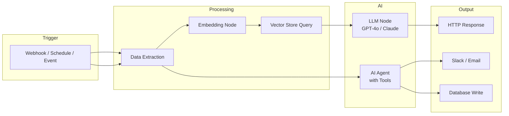
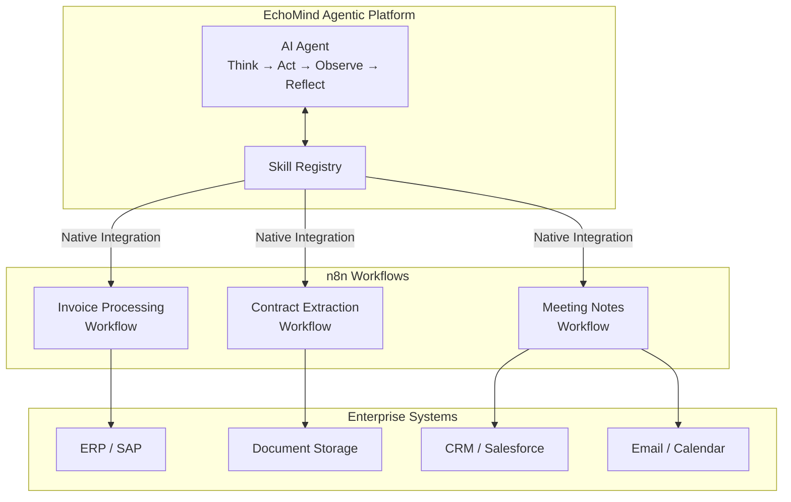

Building AI pipelines doesn't have to start with code. Tools like n8n let you visually wire together LLM calls, vector stores, and business logic in hours instead of days. But low-code has limits—and knowing when to graduate to production-grade infrastructure is the difference between a demo and a deployed solution.

In this post, I'll break down what it means to build AI pipelines in n8n, where it shines, where it breaks down, and how n8n workflows can become **skills** inside agentic platforms like [EchoMind](https://github.com/gen-mind/EchoMind)—bridging the gap between rapid prototyping and enterprise deployment.

---

## What Is n8n?

[n8n](https://n8n.io/) is an open-source workflow automation platform with a visual, node-based editor. Think of it as "Zapier you can self-host"—but with a key difference: **native AI and LangChain integration**.

Since [version 1.74.0](https://community.n8n.io/t/building-rag-in-2025-vector-stores-as-tools-is-here/75166) (January 2025), n8n has supported:

- **AI Agent nodes** powered by LangChain
- **LLM integrations** (OpenAI GPT-4o/4.1, Claude, Gemini, Ollama for local models)
- **Vector store nodes** (Qdrant, Pinecone, Weaviate, in-memory)
- **Embedding nodes** (OpenAI, HuggingFace)
- **Tool nodes** that let agents call APIs, query databases, or execute code

This means you can build a working RAG pipeline, an AI-powered support bot, or a document processing workflow—**without writing a single line of code**.

---

## What Does an AI Pipeline in n8n Look Like?

A typical n8n AI pipeline connects these components visually:

For example, a **customer support RAG pipeline** might:

1. **Trigger** on incoming Slack messages or form submissions
2. **Embed** the user query using OpenAI embeddings
3. **Query** a Qdrant vector store for relevant documentation
4. **Generate** a response using GPT-4o with retrieved context
5. **Post** the answer back to Slack

All of this is drag-and-drop. No FastAPI, no async handlers, no deployment scripts. You click "Activate" and it's live.

---

## The Pros: Why n8n Delivers Quick AI Wins

### 1. Speed to First Result

Building a functional AI pipeline in n8n takes **hours, not days**. The visual interface eliminates boilerplate—no serialization code, no HTTP client setup, no credential management scaffolding. You connect nodes, configure parameters, and test inline.

For teams evaluating whether AI can solve a business problem, this speed is invaluable. You can validate an idea before committing engineering resources.

### 2. Non-Developers Can Build

Product managers, operations teams, and business analysts can create AI workflows without engineering support. This democratizes AI adoption—the people closest to the problem can prototype solutions directly.

### 3. Visual Debugging

Each node shows its input/output data. You can step through executions, see exactly where a pipeline failed, and replay with modified inputs. For simple workflows, this beats console.log debugging.

### 4. Self-Hosted and Open Source

Unlike Zapier or Make, n8n can run entirely on your infrastructure. Sensitive data never leaves your network. You can connect to internal APIs, local Ollama instances, or air-gapped vector databases.

### 5. Native LangChain Integration

n8n isn't just "LLM as a node." It implements [LangChain's agent architecture](https://docs.n8n.io/advanced-ai/langchain/langchain-n8n/) directly—chains, agents, tools, memory, retrievers. This means you can build agentic workflows with tool-use patterns, not just simple prompt-response pipelines.

---

## The Cons: Where Low-Code AI Breaks Down

Here's where the "quick win" narrative hits reality. Production AI systems need capabilities that low-code platforms struggle to provide.

### 1. Token Limits and Context Management

Complex AI workflows hit token limits fast. n8n doesn't have sophisticated context windowing, conversation summarization, or intelligent truncation. When your pipeline processes long documents or multi-turn conversations, you'll encounter [timeouts, context loss, and inconsistent results](https://latenode.com/blog/low-code-no-code-platforms/n8n-setup-workflows-self-hosting-templates/n8n-ai-agents-2025-complete-capabilities-review-implementation-reality-check).

**In code**, you can implement sliding windows, hierarchical summarization, or semantic chunking. In n8n, you're limited to what the nodes expose.

### 2. Error Handling Is Primitive

n8n has Try/Catch nodes, but production AI systems need:

- Automatic retries with exponential backoff
- Dead letter queues for failed messages
- Graceful degradation when LLMs time out
- Circuit breakers for rate-limited APIs

Building robust error handling in n8n requires chaining multiple error-handling nodes—quickly becoming more complex than writing code.

### 3. Debugging at Scale Is Painful

Visual debugging works for simple workflows. When you have 30 nodes, conditional branches, and loops, the canvas becomes unmanageable. You lose the ability to:

- Search across workflow logic
- Refactor with confidence
- Write unit tests
- Use version control meaningfully (n8n exports JSON, but diffs are unreadable)

### 4. Performance and Concurrency

n8n workflows run sequentially by default. High-throughput scenarios—processing thousands of documents, handling concurrent user requests—require infrastructure n8n wasn't designed for:

- No native horizontal scaling
- Limited connection pooling
- No async batch processing
- Memory pressure under load

### 5. Breaking Changes and Update Risk

n8n's [rapid release cycle](https://latenode.com/blog/low-code-no-code-platforms/n8n-setup-workflows-self-hosting-templates/n8n-latest-version-2025-release-notes-changelog-update-analysis) means frequent updates—sometimes with breaking changes to authentication methods, data parsing, or node behavior. Production workflows require careful version pinning and staging environments, which adds operational overhead.

### 6. Vendor Lock-In (to n8n)

Your workflows are stored in n8n's JSON format. There's no "export to Python" button. If you outgrow n8n, you're rewriting from scratch.

---

## When to Use n8n vs. When to Code

| Scenario | n8n | Custom Code |
|----------|-----|-------------|
| Validating an AI use case | **Yes** | Overkill |
| Internal tool for small team | **Yes** | Optional |
| Customer-facing production system | Risky | **Yes** |
| High-throughput processing | No | **Yes** |
| Complex multi-agent orchestration | Limited | **Yes** |
| Air-gapped / compliance-heavy | **Yes** (self-hosted) | **Yes** |
| Non-technical team building | **Yes** | No |

**The sweet spot for n8n**: Internal workflows, proof-of-concepts, and scenarios where speed-to-value outweighs long-term maintainability.

---

## n8n Pipelines as EchoMind Skills

Here's where n8n becomes more than a prototyping tool.

[EchoMind](https://github.com/gen-mind/EchoMind) is an MIT-licensed agentic AI platform that automates workflows through a **Think → Act → Observe → Reflect → Evaluate → Answer** loop. It's designed for real work: support automation, IT deflection, contract review, AP/invoice handling, and any process where the bottleneck is "finding the right info + doing the next step."

EchoMind's agent needs **skills**—discrete capabilities it can invoke to accomplish tasks. And here's the key insight:

**n8n workflows can become EchoMind skills via native integration.**

### How It Works

1. **Build quickly in n8n**: Create workflows for specific tasks—invoice data extraction, contract clause identification, meeting action item generation
2. **Register as skills**: EchoMind's native n8n integration exposes these workflows as callable skills
3. **Agent orchestration**: EchoMind's agent reasons about which skills to invoke, passes context, and interprets results
4. **Production infrastructure**: EchoMind handles the hard parts—scalability, error recovery, audit trails, permission-aware answers

### Why This Architecture Makes Sense

- **Speed**: Business teams can build skills in n8n without waiting for engineering
- **Governance**: EchoMind provides enterprise-grade controls around skill execution
- **Flexibility**: Swap skill implementations without changing agent logic
- **Gradual migration**: Start with n8n skills, migrate critical paths to code when needed

The n8n workflow handles the "how"—the specific integration logic, API calls, and data transformation. EchoMind handles the "when" and "why"—reasoning about context, managing conversations, and ensuring answers are grounded in sources.

---

## A Practical Example: AP/Invoice Automation

Let's trace a concrete use case through this architecture.

**The problem**: Accounts payable receives hundreds of invoices daily. Staff manually extract vendor, amount, line items, and PO numbers, then route for approval.

**n8n skill** (built in hours):
1. Trigger: Receive invoice PDF via webhook
2. Extract text using OCR node
3. Call GPT-4o to extract structured fields (vendor, amount, line items, PO)
4. Query ERP API to match PO
5. Return structured JSON with confidence scores

**EchoMind orchestration**:
- User asks: "Process the invoices from today"
- Agent invokes invoice processing skill for each document
- Agent flags discrepancies ("Invoice #4521 has no matching PO")
- Agent routes approvals based on amount thresholds
- Agent provides audit-ready explanations for each decision

The n8n workflow is simple—maybe 8-10 nodes. EchoMind handles the agentic reasoning, human-in-the-loop escalation, and enterprise integration.

---

## Key Takeaways

1. **n8n is excellent for quick AI wins**: Visual building, fast iteration, self-hosted. Perfect for validation and internal tools.

2. **Low-code has limits**: Token management, error handling, debugging at scale, and performance become blockers for production systems.

3. **Know when to graduate**: Customer-facing systems, high-throughput pipelines, and complex multi-agent orchestration need code.

4. **n8n + EchoMind is a powerful combination**: Use n8n's speed for skill creation, EchoMind's infrastructure for production deployment.

5. **Start fast, migrate strategically**: Build the first version in n8n. When a skill becomes critical, migrate it to code without changing the agent.

---

## Getting Started

- **Try n8n**: [n8n.io](https://n8n.io/) or self-host with Docker
- **Explore EchoMind**: [github.com/gen-mind/EchoMind](https://github.com/gen-mind/EchoMind) (MIT licensed, $0 forever)
- **n8n AI Starter Kit**: Self-hosted bundle with Ollama, Qdrant, and PostgreSQL

Have questions about building AI pipelines or deploying agentic systems? Let's talk.

---

## Need Help with Your AI Project?

Whether you're building a new AI solution or scaling an existing one, I can help. Book a free consultation to discuss your project.

[Book a Free Consultation](https://calendar.app.google/QuNua7HxdsSasCGu9){: .btn .btn-primary}
