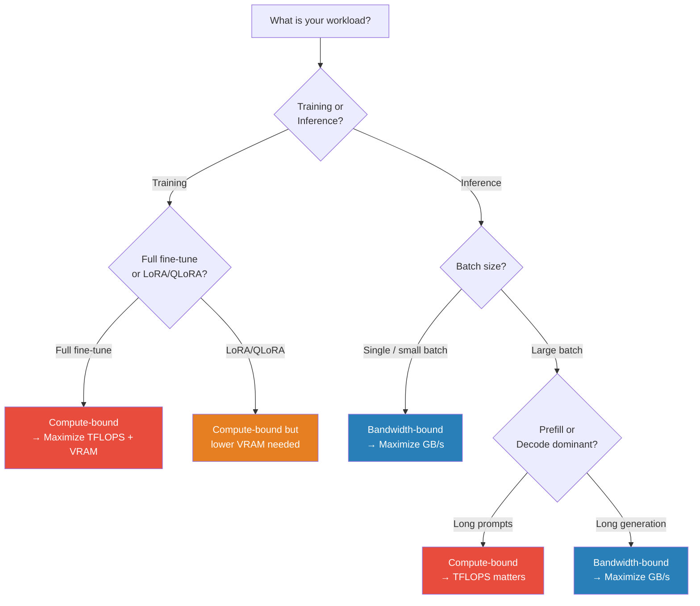
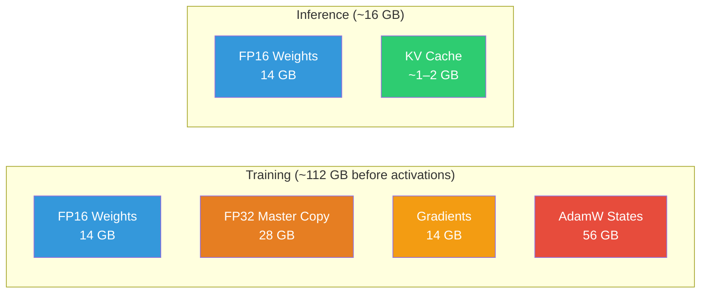
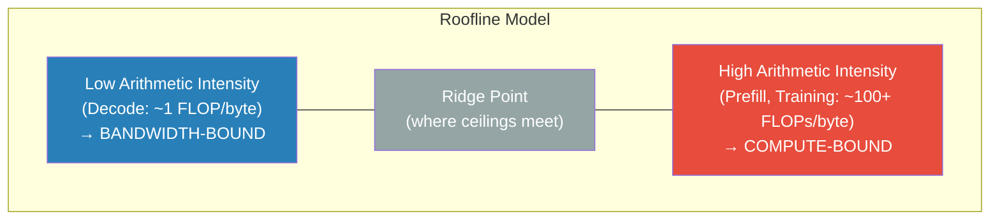
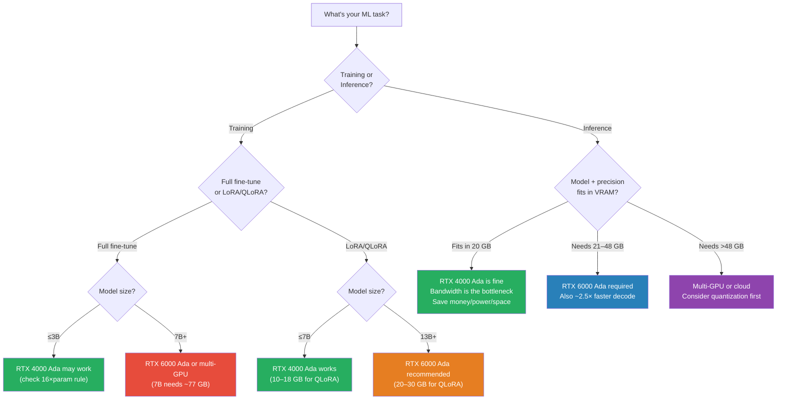

Your RTX 6000 Ada has 91 TFLOPS of FP32 compute. During inference, almost none of it matters.

Training and inference stress completely different parts of the GPU. Understanding *which* bottleneck dominates *when* is the difference between buying the right hardware and wasting thousands on specs that don't matter for your workload.

This post fills the gap between two earlier deep-dives:
- [Predict Peak VRAM Before Downloading a Model](/posts/Predict-Peak-VRAM-Before-Downloading-A-Model/) — exact VRAM estimation from Safetensors metadata
- [Why GPUs Love Tensors: Understanding Tensor Cores](/posts/Why-GPUs-Love-Tensors-Understanding-Tensor-Cores/) — CUDA cores vs Tensor Cores explained

Here, we cover **why the same GPU behaves completely differently during training vs inference**, and **how to choose the right GPU for each scenario** — with the NVIDIA RTX 4000 Ada and RTX 6000 Ada as concrete examples.

---

## 1. Bottom Line First

- **Training** is **compute-bound**: Tensor Core TFLOPS and VRAM capacity are the gates.
- **Inference decode** is **memory-bandwidth-bound**: VRAM bandwidth is the gate; TFLOPS barely matter.

### What Actually Matters

| GPU Spec | Training | Prefill (Prompt Processing) | Decode (Token Generation) |
|----------|----------|----------------------------|---------------------------|
| **VRAM Capacity** | Critical | Moderate | Moderate |
| **Memory Bandwidth** | Moderate | Moderate | **Critical** |
| **Tensor Core TFLOPS** | **Critical** | **Critical** | Low |
| **CUDA Core TFLOPS** | Low | Low | Low |

### Should I Optimize for Compute or Bandwidth?

---

## 2. Where Does VRAM Go? Training vs Inference

The same 7B-parameter model can need **~77 GB** during training or **~16 GB** during inference. The difference comes down to what each phase needs to keep in memory.

### Training VRAM Stack

Mixed-precision training with AdamW stores **five copies** of your model's parameters, plus activations:

| Component | Bytes per Parameter | 7B Model |
|-----------|--------------------:|----------:|
| FP16 model weights | 2 | 14 GB |
| FP32 master copy | 4 | 28 GB |
| FP16 gradients | 2 | 14 GB |
| AdamW first moment (FP32) | 4 | 28 GB |
| AdamW second moment (FP32) | 4 | 28 GB |
| **Subtotal (parameters)** | **16** | **~112 GB** |
| Activations (batch × seq × layers) | variable | varies |

> The 16 bytes/param figure comes from [HuggingFace's Efficient Training guide](https://huggingface.co/docs/transformers/perf_train_gpu_one) and [PyTorch AdamW documentation](https://pytorch.org/docs/stable/generated/torch.optim.AdamW.html). With activation checkpointing and a modest batch size, a 7B model needs roughly **70–80 GB** for full fine-tuning.

### Inference VRAM Stack

Inference only needs the model weights and a KV cache:

| Component | Bytes per Parameter | 7B Model |
|-----------|--------------------:|----------:|
| FP16 model weights | 2 | 14 GB |
| KV cache (context-dependent) | — | ~1–2 GB |
| Current-layer activations | — | ~0.1 GB |
| **Total** | **~2 + KV** | **~16 GB** |

> For exact KV cache formulas and the Safetensors metadata technique, see [Predict Peak VRAM Before Downloading a Model](/posts/Predict-Peak-VRAM-Before-Downloading-A-Model/).

### VRAM Breakdown: 7B Model

### What Fits on Real Hardware?

| Scenario | VRAM Needed | RTX 4000 Ada (20 GB) | RTX 6000 Ada (48 GB) |
|----------|:-----------:|:--------------------:|:--------------------:|
| 7B inference (FP16) | ~16 GB | Tight fit | Comfortable |
| 7B inference (INT4) | ~5 GB | Easy | Easy |
| 13B inference (FP16) | ~28 GB | No | Fits |
| 7B full fine-tune | ~77 GB | No | No (need multi-GPU) |
| 7B QLoRA fine-tune | ~10–18 GB | Possible | Comfortable |
| 13B QLoRA fine-tune | ~20–30 GB | No | Fits |

---

## 3. The Spec Sheet Trap: Why TFLOPS Don't Predict Inference Speed

This is the most common mistake when choosing a GPU for inference: assuming more TFLOPS = faster token generation. It doesn't, and the reason is the **roofline model**.

### Arithmetic Intensity and the Roofline Model

Every operation has an **arithmetic intensity**: the ratio of compute (FLOPs) to data movement (bytes read from memory).

$$
\text{Arithmetic Intensity} = \frac{\text{FLOPs}}{\text{Bytes Accessed}}
$$

The GPU has two ceilings:
1. **Compute ceiling**: peak TFLOPS
2. **Bandwidth ceiling**: peak GB/s

The **roofline** is the lower of the two. Operations with low arithmetic intensity hit the bandwidth ceiling — no matter how many TFLOPS you have.

### Prefill vs Decode: Two Completely Different Workloads

**Prefill** processes all input tokens in parallel. It's a large matrix multiplication:

$$
\text{Attention}(Q, K, V) = \text{softmax}\left(\frac{QK^T}{\sqrt{d_k}}\right)V
$$

With thousands of tokens processed simultaneously, the arithmetic intensity is high. Prefill is **compute-bound** — more TFLOPS means faster prefill.

**Decode** generates one token at a time. Each token requires reading the **entire model's weights** from VRAM, but performs only a tiny vector-matrix multiply. The arithmetic intensity is approximately:

$$
\text{AI}_{\text{decode}} \approx \frac{2 \text{ FLOPs/param}}{2 \text{ bytes/param (FP16)}} = 1 \text{ FLOP/byte}
$$

This is far below the ridge point of any modern GPU. Decode is **bandwidth-bound**.

### The Formula That Actually Predicts Inference Speed

For single-batch decode, the time per token is approximately:

$$
t_{\text{token}} \approx \frac{\text{Model Size (bytes)}}{\text{Memory Bandwidth (bytes/s)}}
$$

This is the [transformer inference arithmetic](https://kipp.ly/transformer-inference-arithmetic/) that matters. Let's apply it:

**7B model in FP16 (14 GB weights):**

| GPU | Bandwidth | Predicted tok/s | TFLOPS (FP32) |
|-----|----------:|----------------:|--------------:|
| RTX 4000 Ada | 360 GB/s | ~26 tok/s | 26.7 |
| RTX 6000 Ada | 960 GB/s | ~69 tok/s | 91.1 |
| **Ratio (6000/4000)** | **2.67×** | **~2.65×** | **3.41×** |

The throughput ratio (~2.65×) tracks the **bandwidth ratio** (2.67×), NOT the TFLOPS ratio (3.41×). This is direct evidence that decode is bandwidth-bound.

> These are theoretical upper bounds assuming perfect bandwidth utilization. Real-world numbers will be somewhat lower due to overhead, but the *ratios* hold. See [NVIDIA's LLM Inference Benchmarking guide](https://developer.nvidia.com/blog/llm-benchmarking-fundamental-concepts/) for the canonical explanation of this effect.

---

## 4. RTX 4000 Ada vs RTX 6000 Ada: Head-to-Head

Both are professional Ada Lovelace GPUs, but they target different workloads. Here's the full spec comparison:

### Specifications

| Spec | RTX 4000 Ada | RTX 6000 Ada | Ratio (6000/4000) |
|------|:------------:|:------------:|:-----------------:|
| **CUDA Cores** | 6,144 | 18,176 | 2.96× |
| **Tensor Cores (4th gen)** | 192 | 568 | 2.96× |
| **FP32 TFLOPS** | 26.7 | 91.1 | 3.41× |
| **FP16 Tensor TFLOPS** | 53.4 | 182.2 | 3.41× |
| **FP8 Tensor TFLOPS** | 106.8 | 364.4 | 3.41× |
| **VRAM** | 20 GB GDDR6 | 48 GB GDDR6 | 2.40× |
| **Memory Bandwidth** | 360 GB/s | 960 GB/s | 2.67× |
| **Memory Bus** | 160-bit | 384-bit | 2.40× |
| **TDP** | 130 W | 300 W | 2.31× |
| **Form Factor** | Single-slot | Dual-slot | — |

> Specs sourced from [NVIDIA RTX 4000 Ada](https://www.nvidia.com/en-us/design-visualization/rtx-4000/) and [RTX 6000 Ada](https://www.nvidia.com/en-us/design-visualization/rtx-6000/) product pages, and the [Ada Lovelace Architecture Whitepaper v1.1](https://images.nvidia.com/aem-dam/en-zz/Solutions/technologies/NVIDIA-ADA-GPU-PROVIZ-Architecture-Whitepaper_1.1.pdf).

### Where the Gap Matters Most

| What you're doing | Key spec | Gap | Impact |
|-------------------|----------|:---:|--------|
| Inference decode speed | Bandwidth | 2.67× | RTX 6000 generates tokens ~2.5× faster |
| Fitting large models | VRAM | 2.40× | 48 GB fits 13B FP16; 20 GB can't |
| Training throughput | TFLOPS | 3.41× | RTX 6000 trains ~3× faster per GPU |
| Long-context inference | VRAM + BW | 2.4–2.7× | More KV cache capacity + faster access |
| Power/space constrained | TDP | 2.31× | RTX 4000 at 130 W, single-slot |

**Key insight:** The VRAM (2.4×) and bandwidth (2.67×) gaps matter more than the compute gap (3.41×) for most ML workloads. Training is the one scenario where the TFLOPS advantage fully applies.

---

## 5. Benchmarks: What the Numbers Actually Say

### Inference Benchmarks (llama.cpp)

[Puget Systems' professional GPU benchmarks](https://www.pugetsystems.com/labs/articles/llm-inference-professional-gpu-performance/) provide independent measurements using llama.cpp on professional GPUs:

| Metric | RTX 4000 Ada | RTX 6000 Ada | Ratio | Bottleneck |
|--------|:------------:|:------------:|:-----:|------------|
| Prompt processing (tok/s) | ~1,500 | ~4,400 | ~2.9× | Compute-bound |
| Token generation (tok/s) | ~45 | ~105 | ~2.3× | Bandwidth-bound |

> **Note:** Exact numbers vary by model, quantization, and llama.cpp version. The values above are representative of Q4_K_M quantized 7B models from the Puget Systems August 2024 dataset. Confidence: **Medium-High** — independent lab, but specific to llama.cpp backend.

The pattern is clear:
- **Prompt processing** ratio (~2.9×) is closer to the TFLOPS ratio (3.41×) — compute-bound
- **Token generation** ratio (~2.3×) is closer to the bandwidth ratio (2.67×) — bandwidth-bound

### Training Throughput

Training benchmarks on professional Ada GPUs are less commonly published. Based on the compute ratio and memory subsystem differences:

| Scenario | Estimated RTX 6000 Ada Advantage | Confidence |
|----------|:--------------------------------:|:----------:|
| Full fine-tuning (FP16 mixed precision) | ~2.5–3.0× | Medium |
| LoRA fine-tuning | ~2.5–3.0× | Medium |
| QLoRA fine-tuning (7B fits on both) | ~2.0–2.5× | Medium |

> Training throughput estimates are derived from the TFLOPS and bandwidth ratios. Real-world numbers depend heavily on batch size, model architecture, and framework optimizations. For verified training benchmarks, check workstation vendors like [BIZON](https://bizon-tech.com/) and [Puget Systems](https://www.pugetsystems.com/) for updated results.

---

## 6. Quantization Changes Everything

Quantization doesn't just save VRAM — it changes which GPU you need.

### How Quantization Helps Inference

Quantized weights are smaller, which means:
1. **Less VRAM** → larger models fit on smaller GPUs
2. **Less bandwidth consumed per token** → faster decode (since decode is bandwidth-bound)
3. **Same TFLOPS** → compute ceiling doesn't change, but you hit it less often

For bandwidth-bound decode:

$$
t_{\text{token}}^{\text{INT4}} \approx \frac{\text{Model Size}_{\text{INT4}}}{\text{Bandwidth}} \approx \frac{1}{4} \times t_{\text{token}}^{\text{FP16}}
$$

In practice, the speedup is closer to **1.5–2× over FP16** rather than the theoretical 4×, because quantization adds dequantization overhead and some layers remain in higher precision. See the [NVIDIA quantization guide](https://developer.nvidia.com/blog/achieving-fp32-accuracy-for-int8-inference-using-quantization-aware-training-with-tensorrt/) for details on the compute overhead of dequantization.

### QLoRA for Training

[QLoRA](https://huggingface.co/docs/peft/en/package_reference/qlora) makes fine-tuning accessible on smaller GPUs by:
- Quantizing the base model to 4-bit (NF4)
- Training only small LoRA adapter weights in FP16/BF16
- Using paged optimizers to handle memory spikes

VRAM requirement drops from ~16 bytes/param (full fine-tune) to roughly **1.5–2.5 bytes/param** for the frozen quantized base, plus a small overhead for the trainable adapters.

> From the [Modal VRAM fine-tuning guide](https://modal.com/blog/how-much-vram-need-fine-tuning): a 7B model can be QLoRA fine-tuned in ~10–18 GB depending on batch size and sequence length.

### What Fits Where: Model Size × Precision × GPU

| Model | Precision | VRAM (est.) | RTX 4000 Ada (20 GB) | RTX 6000 Ada (48 GB) |
|-------|-----------|:-----------:|:--------------------:|:--------------------:|
| 7B | FP16 | ~14 GB | Yes (tight) | Yes |
| 7B | INT8 | ~7 GB | Yes | Yes |
| 7B | INT4 | ~4 GB | Yes | Yes |
| 13B | FP16 | ~26 GB | No | Yes |
| 13B | INT8 | ~13 GB | Yes | Yes |
| 13B | INT4 | ~7 GB | Yes | Yes |
| 30B | FP16 | ~60 GB | No | No |
| 30B | INT4 | ~17 GB | Yes (tight) | Yes |
| 70B | FP16 | ~140 GB | No | No |
| 70B | INT4 | ~35 GB | No | Yes (tight) |

> VRAM estimates are for **weights only** — add KV cache overhead for long contexts. Estimates include ~5% overhead for quantization scales. For exact per-model numbers, use the [VRAM estimation script](/posts/Predict-Peak-VRAM-Before-Downloading-A-Model/) with safetensors metadata.

---

## 7. Decision Framework: Which GPU for Which Job?

### Summary: Task × GPU Recommendation

| Task | RTX 4000 Ada (20 GB) | RTX 6000 Ada (48 GB) |
|------|----------------------|----------------------|
| **Inference: 7B FP16** | Works, ~26 tok/s | Faster, ~69 tok/s |
| **Inference: 7B INT4** | Comfortable, ~40+ tok/s | Overkill unless batching |
| **Inference: 13B FP16** | Won't fit | Works, ~35 tok/s |
| **Inference: 70B INT4** | Won't fit | Tight fit, works |
| **QLoRA fine-tune: 7B** | Works (10–18 GB) | Comfortable, faster |
| **QLoRA fine-tune: 13B** | Borderline | Recommended |
| **Full fine-tune: 7B** | Won't fit | Won't fit (need multi-GPU) |
| **Prototyping / dev** | Great — low power, single-slot | More capability per node |

### When the RTX 4000 Ada Is Enough

- Inference on quantized models up to ~13B (INT4) or ~7B (FP16)
- QLoRA fine-tuning of 7B models
- Development and prototyping where iteration speed matters more than throughput
- Power-constrained or space-constrained deployments (130W, single-slot)
- Multiple GPUs: two RTX 4000 Adas (40 GB total, 720 GB/s aggregate) can sometimes beat one RTX 6000 Ada, depending on the framework's multi-GPU support

### When You Need the RTX 6000 Ada

- Inference on models that don't fit in 20 GB (13B FP16, 70B INT4)
- Maximum single-GPU decode throughput (2.67× bandwidth advantage)
- QLoRA fine-tuning of 13B+ models
- Long-context inference where KV cache grows large
- Serving multiple concurrent requests (batched inference needs more VRAM)

---

## 8. Key Takeaways

- **Training is compute-bound** — maximize Tensor Core TFLOPS and VRAM capacity. The RTX 6000 Ada's 3.41× TFLOPS advantage fully applies here.
- **Inference decode is bandwidth-bound** — VRAM bandwidth (GB/s) predicts token generation speed, not TFLOPS. The RTX 6000 Ada is ~2.5× faster for decode, matching its bandwidth ratio.
- **VRAM determines what fits**, not how fast it runs. Training a 7B model needs ~16 bytes/param (~77 GB with activations); inference needs ~2 bytes/param (~16 GB).
- **Quantization changes the equation** — INT4 models need ~4× less VRAM and get ~1.5–2× faster decode. A 70B model in INT4 fits on a single RTX 6000 Ada.
- **QLoRA makes training accessible** — fine-tune a 7B model in 10–18 GB (RTX 4000 Ada territory) instead of 77+ GB.
- **Don't overspend on TFLOPS for inference** — if your quantized model fits on an RTX 4000 Ada, the RTX 6000 Ada's extra compute won't help with single-batch decode. The bandwidth advantage is real but may not justify the price difference for your use case.

For exact VRAM predictions before downloading any model, see [Predict Peak VRAM Before Downloading a Model](/posts/Predict-Peak-VRAM-Before-Downloading-A-Model/). For a deeper understanding of how Tensor Cores actually work, see [Why GPUs Love Tensors](/posts/Why-GPUs-Love-Tensors-Understanding-Tensor-Cores/).

---

## Need Help with Your AI Project?

Whether you're building a new AI solution or scaling an existing one, I can help. Book a free consultation to discuss your project.

[Book a Free Consultation](https://calendar.app.google/QuNua7HxdsSasCGu9){: .btn .btn-primary}
