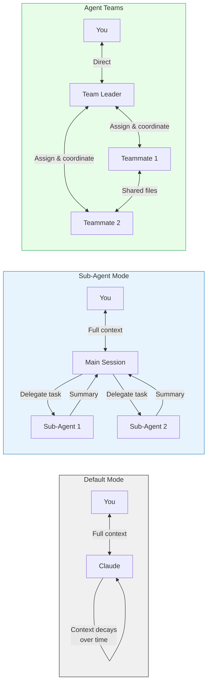
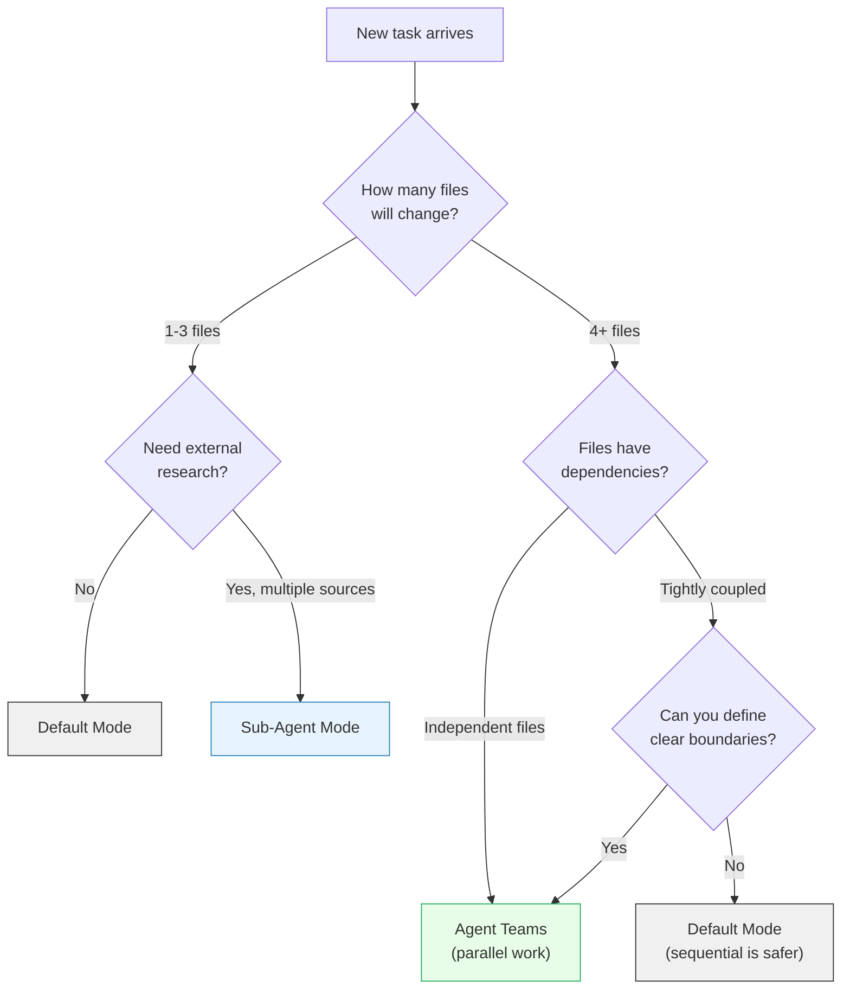
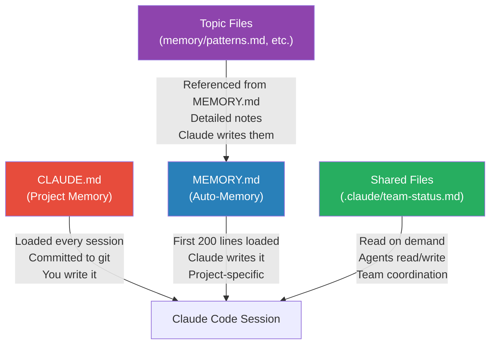
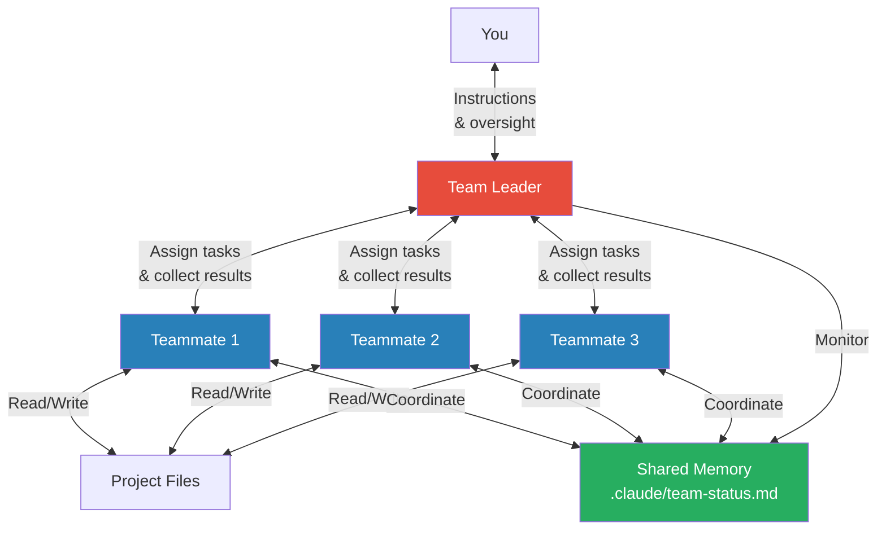

In February 2026, Anthropic shipped a C compiler written almost entirely by Claude Code. **16 agents**, working in parallel across **~2,000 sessions**, produced over **100,000 lines of Rust** that compiles the Linux 6.9 kernel on x86, ARM, and RISC-V. Not a toy. Not a demo. A production compiler that handles real-world C code.

Most developers use Claude Code as a fancy autocomplete—type a question, get an answer, copy-paste. That's like buying a CNC machine and using it as a paperweight. The difference between "helpful chatbot" and "16-agent compiler factory" isn't the model. It's the **workflow**.

This post is a practical guide to getting there. We'll cover the three operating modes (default, sub-agents, agent teams), when to use each, how to set up and manage agent teams, memory systems that make sessions smarter over time, the skills system for reusable workflows, and production-ready team prompts you can adapt today.

**Assumptions**: You're on the Claude Max subscription (no per-token cost concerns) and have Claude Code installed. If not, `npm install -g @anthropic-ai/claude-code` gets you started.

---

## 1. The Three Modes of Claude Code

Claude Code operates in three distinct modes, each with different context management and communication patterns. Understanding these modes is the foundation for everything else in this post.

### Default Mode

The simplest mode. You open a terminal, type `claude`, and start a conversation. One session, one context window.

**How it works**: Every message you send and every tool result Claude produces accumulates in a single context window. When the window fills up, older messages get compressed or dropped. For short tasks—fixing a bug, writing a function, explaining code—this is perfect.

**The limitation**: Context decay. After ~30 minutes of intensive work (reading files, running commands, iterating on code), the context window is full. Claude starts losing track of decisions made earlier in the session. You'll notice it re-reading files it already read, or contradicting its own earlier analysis.

### Sub-Agent Mode

Claude Code can spawn **sub-agents**—lightweight worker processes that handle a specific subtask and report a summary back to the main session.

**How it works**: The main session (your conversation) delegates work to sub-agents. Each sub-agent gets its own context window, performs its task (research, code analysis, file exploration), and returns a compressed summary. The main session's context stays clean because it only sees the summary, not the full working trace.

**When it shines**: Research tasks. "Compare these 5 API libraries" spawns 5 sub-agents, each reading docs and source code. The main session gets 5 summaries without burning context on thousands of lines of documentation.

### Agent Teams (New with Opus 4.6)

Agent teams are the most powerful mode. Instead of sub-agents that report back summaries, agent teams are **full independent Claude Code sessions** coordinated by a team leader.

**How it works**: You ask Claude to create an agent team. It spawns a **team leader** and multiple **teammates**, each running in its own terminal pane (typically via tmux). The team leader assigns tasks, teammates execute independently, and they communicate through shared context and direct messaging. Each teammate has full tool access—file editing, terminal commands, web search—just like your main session.

**The key difference from sub-agents**: Sub-agents are fire-and-forget workers that return summaries. Agent team members are persistent sessions that can be reassigned, asked follow-up questions, and communicate with each other.

### Context Flow Comparison



### Mode Comparison

| Feature | Default | Sub-Agents | Agent Teams |
|---------|---------|------------|-------------|
| **Context** | Single window, decays | Main preserved, workers ephemeral | Each agent has full context |
| **Communication** | You ↔ Claude | Main ↔ workers (one-way summaries) | Leader ↔ teammates (bidirectional) |
| **Persistence** | One session | Workers terminate after task | Sessions persist until shutdown |
| **Tool Access** | Full | Limited (read-only exploration) | Full per agent |
| **Best For** | Quick tasks, single-file edits | Research, multi-source analysis | Multi-file refactors, large features |
| **Limitations** | Context decay on long tasks | No follow-up with workers | Requires tmux, higher resource usage |

---

## 2. Decision Framework: Which Mode When

Choosing the right mode is straightforward once you internalize the decision tree:



### Worked Examples

**Example 1: Fix a typo in the README** → **Default mode**. One file, no research, 10-second task. Starting an agent team for this would be like renting a crane to hang a picture frame.

**Example 2: Research 5 authentication libraries for a new project** → **Sub-agents**. Each library needs its docs read, examples analyzed, and trade-offs summarized. Five sub-agents work in parallel, each returning a structured comparison. Your main session stays clean and gets five summaries to synthesize. Compare this to the [ReAct pattern](/posts/Building-ReAct-Agents-with-Microsoft-Agent-Framework-From-Theory-to-Production/) where a single agent loops through observations—sub-agents parallelize the observation step.

**Example 3: Refactor authentication across 30 files** → **Agent teams**. You need an analyzer to map the current auth flow, a refactorer to update the implementation, and a reviewer to verify nothing broke. Each agent owns distinct files, works in parallel, and the team leader coordinates the handoffs.

---

## 3. Setting Up Agent Teams

### Prerequisites

Agent teams require:
- **Claude Code** at the latest version (run `claude update`)
- **A Claude Max or Team subscription** (agent teams use multiple parallel sessions)

### Enabling Agent Teams

Agent teams are **disabled by default** and currently marked as experimental. You enable them with a single environment variable—either in your shell or in Claude Code's settings file.

**Option A: Environment variable** (quick test):

```bash
export CLAUDE_CODE_EXPERIMENTAL_AGENT_TEAMS=1
claude
```

**Option B: Settings file** (persistent across sessions):

```json
// ~/.claude/settings.json
{
  "env": {
    "CLAUDE_CODE_EXPERIMENTAL_AGENT_TEAMS": "1"
  }
}
```

That's it. No other configuration keys are needed. Claude Code handles the rest.

### Display Modes: In-Process vs. Split Panes

Agent teams support two display modes:

**In-process (default, no extra setup)**:
All teammates run inside your main terminal. Use `Shift+Up/Down` to select and message individual teammates. Works everywhere—Terminal.app, VS Code terminal, iTerm2.

**Split panes (requires tmux or iTerm2)**:
Each teammate gets its own visible pane. You can see all agents working simultaneously and click into any pane to interact directly.

To use split panes, start inside a tmux session **before** launching Claude:

```bash
# Install tmux if needed (macOS)
brew install tmux

# Start a tmux session, then launch Claude Code inside it
tmux new-session -s myproject
claude
```

You can also force split-pane mode for a single session:

```bash
claude --teammate-mode split-panes
```

> **Tip**: If you're not in tmux, Claude defaults to in-process mode. You'll still get the full agent team functionality—you just won't see each agent in a separate pane.

### Starting Your First Team

You must explicitly ask Claude to create a team. Simply describing a complex task won't trigger team creation. Be direct:

```
You: Create an agent team to refactor our authentication module.
     The auth code is in src/auth/ and tests are in tests/auth/.
     We need to migrate from JWT to session-based auth.
```

Claude will:
1. Analyze the task and determine the number of teammates needed
2. Spawn teammate sessions (in separate panes if in tmux, or in-process otherwise)
3. Assign specific subtasks to each teammate
4. Begin coordinated execution

---

## 4. Session Management

### Team Creation Prompts

The quality of your initial prompt determines team effectiveness. Here are three production-tested patterns:

**Research team** (information gathering):

```
Create an agent team for researching GraphQL migration options.

Team structure:
- Agent 1 (docs-researcher): Read Apollo, Relay, and urql documentation.
  Compare feature sets, bundle sizes, and TypeScript support.
- Agent 2 (code-analyzer): Analyze our current REST endpoints in src/api/
  and map them to potential GraphQL schema types.
- Agent 3 (report-writer): Wait for Agents 1 and 2, then compile a
  migration plan with effort estimates per endpoint.

Output: A single markdown file at docs/graphql-migration-plan.md
```

**Refactoring team** (code transformation):

```
Create an agent team to migrate our state management from Redux to Zustand.

Team structure:
- Agent 1 (analyzer): Map all Redux usage—stores, actions, reducers,
  selectors, connected components. Output a dependency graph to
  docs/redux-inventory.md.
- Agent 2 (migrator): After Agent 1 finishes, convert each store to
  Zustand. Work file-by-file: src/stores/ first, then components.
- Agent 3 (test-updater): After Agent 2 converts each store, update
  corresponding tests. Run tests after each file.

Constraint: Only one agent writes to any given file at a time.
```

**Debugging team** (hypothesis testing):

```
Create an agent team to investigate the intermittent 500 errors in
production (see logs in docs/error-samples.log).

Team structure:
- Agent 1: Hypothesis—database connection pool exhaustion. Check
  connection pool config, query durations, and pool metrics.
- Agent 2: Hypothesis—race condition in the order processing pipeline.
  Trace the async flow in src/orders/ and look for unguarded shared state.
- Agent 3: Hypothesis—memory leak causing OOM kills. Analyze heap
  snapshots and check for growing collections.

Rules: Evidence-gathering only. Do NOT fix anything. Report findings
to team leader for joint analysis.
```

### Communicating with Individual Agents

Once the team is running, you can:
- **Talk to the team leader**: Type in the main session. The leader coordinates and can relay instructions to teammates.
- **Talk to a specific teammate (in-process mode)**: Use `Shift+Up/Down` to select a teammate, then type your message directly to that agent.
- **Talk to a specific teammate (split-pane mode)**: Click into the agent's tmux pane (or `Ctrl-b` + arrow key) and type directly.
- **Monitor progress**: The team leader tracks status updates from all teammates. Use `Ctrl+T` to toggle the task list in in-process mode.

### Graceful Shutdown

When the task is complete:
- **Normal shutdown**: Tell the team leader "wrap up and close all sessions." It will signal each teammate to finish, collect final outputs, and terminate.
- **Selective shutdown**: Switch to a specific agent's pane and type `/quit` to close just that session.
- **Emergency shutdown**: Kill the tmux session with `tmux kill-session -t myproject`.

### Keeping Agents Alive

For iterative work, the team leader keeps agents alive after their initial tasks complete. This means you can say "Agent 2, now also update the API documentation" without spinning up a new session. The agent retains full context from its previous work.

---

## 5. Memory Management: The Real Superpower

Claude Code sessions are ephemeral by default—close the terminal, lose the context. Memory management is what turns Claude Code from a tool you use into a tool that **learns your project**.

There are three memory layers, each serving a different purpose.

### Layer 1: CLAUDE.md (Project Memory)

`CLAUDE.md` lives in your project root. It's loaded into **every** Claude Code session that starts in that directory. Think of it as your project's onboarding document for Claude.

**What goes in it**: Architecture decisions, coding conventions, key file paths, current sprint goals. Anything a new developer would need to know on day one.

```markdown
# CLAUDE.md

## Architecture
- Monorepo: apps/web (Next.js 15), apps/api (FastAPI), packages/shared
- Database: PostgreSQL 16 via Prisma ORM
- Auth: NextAuth.js with GitHub + Google providers
- State: Zustand stores in apps/web/src/stores/

## Conventions
- TypeScript strict mode everywhere
- React components: functional only, named exports
- API routes: RESTful, versioned (v1/v2), snake_case
- Tests: Vitest for unit, Playwright for E2E
- Commits: conventional commits (feat:, fix:, chore:)

## Key Files
- apps/web/src/app/layout.tsx — root layout, providers
- apps/api/src/main.py — FastAPI entry point
- packages/shared/src/types.ts — shared type definitions
- docker-compose.yml — local development stack

## Current Sprint (Feb 10-21)
- [ ] Migrate auth from v1 to v2 (breaking change)
- [ ] Add rate limiting to public API endpoints
- [x] Fix memory leak in WebSocket handler
```

**Commit it to git**. Your whole team benefits. Claude reads it automatically—no need to paste context at the start of every session.

### Layer 2: Auto-Memory (Claude's Notes)

Claude Code maintains its own memory at `~/.claude/projects/<project-hash>/memory/`. The file `MEMORY.md` is automatically loaded (first 200 lines) into every session.

**How it works**: As Claude works on your project, it notices patterns—debugging insights, file relationships, your preferences. It writes these to memory files so future sessions start smarter.

**You can also tell Claude what to remember**:

```
You: Remember that we always run tests with --coverage flag
     and that the CI pipeline requires 80% coverage minimum.
```

Claude writes this to its memory files. Next session, it knows.

### The `#` Quick Memory Trick

Prefix any instruction with `#` to persist it to Claude's memory:

```
You: # Always use pnpm, never npm
You: # Our staging environment is at staging.example.com
You: # The payments module is in src/billing/, not src/payments/
```

These get saved to auto-memory and loaded in future sessions. Quick, low-friction way to build up project knowledge over time.

### Layer 3: Shared Memory Files (Agent Team Coordination)

When running agent teams, agents coordinate through shared markdown files. This is how a team leader tracks progress and agents avoid stepping on each other.

```markdown
<!-- File: .claude/team-status.md (created and maintained by agents) -->

# Migration Status

## Completed
- [x] src/stores/auth.ts → Zustand (Agent 2, 14:03)
- [x] src/stores/cart.ts → Zustand (Agent 2, 14:07)
- [x] tests/stores/auth.test.ts updated (Agent 3, 14:12)

## In Progress
- [ ] src/stores/user.ts → Zustand (Agent 2, started 14:15)
- [ ] tests/stores/cart.test.ts update (Agent 3, started 14:14)

## Blocked
- [ ] src/components/Checkout.tsx — depends on cart.ts + user.ts migration

## Notes
- Cart store had a circular dependency with orders store. Resolved by
  extracting shared types to packages/shared/src/cart-types.ts.
- Auth store migration required updating 12 components (list in
  docs/auth-migration-components.md).
```

### Memory Hierarchy



### Memory Anti-Patterns

- **Overstuffing CLAUDE.md**: If it's over 200 lines, Claude spends too much context reading it. Keep it focused on what matters *right now*. Archive old sprint goals.
- **Not cleaning stale memories**: Auto-memory accumulates. Periodically review `~/.claude/projects/<hash>/memory/MEMORY.md` and delete outdated entries.
- **Duplicating CLAUDE.md in prompts**: Don't paste your conventions into every prompt. Claude already read CLAUDE.md. Trust the system.
- **Ignoring memory between sessions**: If Claude made a mistake, tell it to remember the fix. `# The payments API returns cents, not dollars—always divide by 100`. This prevents the same mistake in future sessions.

---

## 6. The Skills System

Skills are **reusable workflows** stored as markdown files. Think of them as macros—you define a process once, then invoke it with a slash command.

### What Skills Are

A skill is a `SKILL.md` file that describes a multi-step workflow with variables. When invoked, Claude follows the steps, filling in the variables from your command.

### Creating Skills the Right Way

Don't write skills from scratch. Instead:
1. **Do the workflow manually** with Claude in a regular session
2. **Iterate until it works** exactly how you want
3. **Ask Claude to turn it into a skill**: "Turn what we just did into a reusable skill"

Claude will extract the pattern, identify variables, and create the SKILL.md file.

### Example Skill: Research Workflow

```markdown
<!-- .claude/skills/research/SKILL.md -->
---
name: research
description: Research a topic and produce a structured analysis
arguments:
  - name: TOPIC
    description: The subject to research
    required: true
  - name: DEPTH
    description: "shallow (summary), medium (analysis), deep (comprehensive)"
    default: medium
  - name: OUTPUT_FORMAT
    description: "markdown, bullet-points, or comparison-table"
    default: markdown
---

# Research Workflow

## Step 1: Scope Definition
Define the research boundaries for {{TOPIC}} at {{DEPTH}} depth.
- Identify 3-5 key questions to answer
- List authoritative sources to consult

## Step 2: Information Gathering
For each key question:
- Search web for recent (2025-2026) information
- Read relevant documentation and papers
- Note conflicting claims with sources

## Step 3: Analysis
- Synthesize findings across sources
- Identify consensus vs. disagreement
- Note confidence levels (high/medium/low) for each finding

## Step 4: Output
Format results as {{OUTPUT_FORMAT}}:
- Lead with the most important finding
- Include source links for every claim
- Flag areas where information is uncertain or rapidly changing

Save output to docs/research/{{TOPIC | slugify}}.md
```

### Invoking Skills

Once a skill is created, invoke it with a slash command:

```
You: /research why is bitcoin dropping
You: /research GraphQL vs tRPC DEPTH=deep OUTPUT_FORMAT=comparison-table
```

### Skill Scopes

Skills can live at different levels:
- **Project level**: `.claude/skills/` — available in this project only
- **User level**: `~/.claude/skills/` — available across all your projects
- **Organization level**: Shared via git submodules or published skill packs

### Skills + Agent Teams

Skills become especially powerful with agent teams. A team leader can invoke skills as part of task delegation:

```
You: Create an agent team. Agent 1 runs /research OAuth 2.1 changes.
     Agent 2 runs /research PKCE implementation patterns.
     Agent 3 waits for both, then drafts an implementation plan.
```

### Iterating on Skills

Skills aren't write-once. After using a skill a few times:

```
You: The research skill should also include a "competitive landscape"
     section when DEPTH=deep. Update the skill.
```

Claude modifies the SKILL.md file. Next invocation picks up the changes.

---

## 7. Model Selection and Effort Levels

Claude Code supports different effort levels that trade speed for reasoning depth. Combined with model selection in agent teams, this gives you fine-grained control over cost and quality.

### Effort Levels

| Effort Level | Speed | Reasoning | Best For |
|-------------|-------|-----------|----------|
| **Low** (`/fast`) | Fastest | Surface-level, may miss edge cases | Boilerplate, simple edits, formatting |
| **Medium** (default) | Balanced | Good reasoning, handles most tasks | Day-to-day development, code review |
| **High** (`/think-hard`) | Slowest | Deep reasoning, considers edge cases | Architecture decisions, complex debugging, security review |

Toggle during a session:
- `/fast` — switch to low effort (faster responses)
- `/think-hard` — switch to high effort (deeper reasoning)

### Model Routing in Agent Teams

When creating agent teams, you can specify different effort levels for different roles:

- **Team leader**: High effort—it's making coordination decisions, tracking dependencies, and synthesizing results. This is where deep reasoning matters most.
- **Teammates doing mechanical work** (file edits, test updates): Medium or low effort—the task is well-defined, less reasoning needed.
- **Teammates doing analysis** (code review, architecture assessment): High effort—these tasks benefit from deeper reasoning.

### The "Opus Plan" Strategy

A common pattern in production teams:

1. **Opus at high effort** plans the work (architecture, task decomposition, dependency mapping)
2. **Sonnet at medium effort** implements the plan (writing code, running tests)
3. **Opus at high effort** reviews the implementation (catches edge cases, security issues)

This mirrors how human teams work: senior architects plan, developers implement, seniors review. You get the best reasoning where it matters most without paying the latency cost everywhere.

---

## 8. Production Workflows

Here are three production-tested team prompts with commentary on what to expect and what can go wrong.

### Research Team

```
Create an agent team for evaluating database options for our new
analytics service.

Context: We need a time-series database for storing event data.
Current volume: 50M events/day, growing 20% monthly. Query pattern:
mostly aggregations over time windows (1h, 24h, 7d, 30d).

Team structure:
- Agent 1 (docs-researcher):
  Research TimescaleDB, ClickHouse, and Apache Druid.
  For each: architecture, query performance benchmarks for our
  volume, operational complexity, managed service options.
  Output: docs/research/tsdb-comparison.md

- Agent 2 (code-analyzer):
  Analyze our current PostgreSQL event schema in src/db/migrations/.
  Map our existing queries in src/analytics/queries/ to equivalent
  syntax in each database. Identify queries that won't translate
  cleanly.
  Output: docs/research/query-migration-analysis.md

- Agent 3 (report-writer):
  WAIT for Agents 1 and 2 to complete.
  Compile a decision document with:
  - Recommendation (with confidence level)
  - Migration effort estimate
  - Risk assessment
  - 90-day migration timeline
  Output: docs/research/tsdb-decision.md
```

**What to expect**: Agents 1 and 2 work in parallel for 5-10 minutes. Agent 3 activates once both finish. Total time: ~15 minutes for research that would take a human engineer a full day.

**What can go wrong**: Agent 1 may find outdated benchmarks. Always verify benchmark claims against the database vendor's official documentation. Add "prefer official documentation over blog posts" to the prompt if you see this.

### Refactoring Team

This follows the [planning pattern](/posts/Planning-Pattern-for-AI-Agents-Strategic-Reasoning-Before-Action/)—analyze first, then act:

```
Create an agent team to refactor our API from Express to Fastify.

Team structure:
- Agent 1 (analyzer):
  Map every Express route in src/routes/.
  Document: route path, HTTP method, middleware chain, request
  validation, response format. Check for Express-specific features
  (res.redirect, req.ip, etc.).
  Output: docs/refactor/express-inventory.md
  IMPORTANT: Do not modify any source files.

- Agent 2 (refactorer):
  WAIT for Agent 1 to complete.
  For each route in the inventory:
  1. Create Fastify equivalent in src/routes-v2/
  2. Migrate middleware to Fastify hooks/plugins
  3. Ensure request/response schemas match
  File ownership: Only Agent 2 writes to src/routes-v2/

- Agent 3 (reviewer):
  After Agent 2 completes each file:
  1. Run existing tests against the new route
  2. Compare response shapes (old vs new) for 3 sample requests
  3. Flag any behavioral differences
  File ownership: Only Agent 3 writes to tests/ and docs/refactor/review-notes.md

Coordination: Use .claude/team-status.md to track which routes are
analyzed → migrated → reviewed. Only one agent writes to a file at a time.
```

**What to expect**: A pipeline—Agent 1 finishes in ~5 minutes, then Agents 2 and 3 work in a producer-consumer pattern. Agent 2 migrates a route, Agent 3 reviews it, in parallel.

**What can go wrong**: Express middleware that relies on `req` mutation patterns doesn't translate cleanly to Fastify. Expect Agent 3 to flag 2-3 routes that need manual attention.

### Debugging Team

Three hypotheses, investigated in parallel. Evidence-gathering only—no fixes until the team leader synthesizes findings:

```
Create an agent team to investigate why our WebSocket connections
drop after exactly 60 seconds of inactivity.

Team structure:
- Agent 1 (infra-hypothesis):
  Investigate infrastructure causes:
  - Check nginx/load balancer timeout configs in deploy/
  - Check cloud provider WebSocket idle timeouts
  - Review Kubernetes ingress annotations
  DO NOT modify any configuration files.

- Agent 2 (app-hypothesis):
  Investigate application-level causes:
  - Check WebSocket server config in src/ws/server.ts
  - Look for heartbeat/ping-pong implementation
  - Check client-side reconnection logic in src/ws/client.ts
  DO NOT modify any source files.

- Agent 3 (network-hypothesis):
  Investigate network-level causes:
  - Check if 60s matches any known proxy timeout defaults
  - Review TLS session ticket lifetime configuration
  - Check for TCP keepalive settings in the deployment
  DO NOT modify any files.

Rules:
- Evidence-gathering ONLY. No fixes.
- Each agent reports: hypothesis, evidence found, confidence level (1-10)
- Team leader synthesizes and recommends the fix
```

**What to expect**: All three agents work simultaneously for 3-5 minutes. The team leader compiles findings—usually one hypothesis has high confidence, and you get a clear fix recommendation.

**What can go wrong**: If the issue is a combination of factors (e.g., nginx timeout *and* missing heartbeat), individual agents might each report medium confidence. The team leader needs to consider combined causes.

### Agent Teams Architecture



---

## 9. Best Practices and Pitfalls

### Context Hygiene

- **`/clear` between unrelated tasks**: If you just finished debugging a memory leak and now want to add a feature, clear the context. Stale debugging context pollutes feature implementation.
- **`/compact` for long sessions**: If you've been working for 30+ minutes on a single task, `/compact` compresses the context while preserving key decisions. Better than starting fresh—you keep continuity.
- **Don't fight context decay**: If Claude starts repeating itself or re-reading files, it's a sign the context is saturated. Either `/compact` or start a new session with a summary.

### When Agent Teams Are Overkill

Agent teams are powerful but not always appropriate:
- **Single-file changes**: Default mode. Always.
- **Tasks under 5 minutes**: The overhead of spinning up a team (~30 seconds) isn't worth it.
- **Tightly coupled code with no clear boundaries**: If every file depends on every other file, parallel agents will create merge conflicts. Use default mode and work sequentially.
- **Exploratory work**: "I'm not sure what's wrong yet" is better suited to a single session or sub-agents for research.

### File Conflict Avoidance

The most common agent team failure mode is two agents editing the same file simultaneously. Prevent this by:
1. **Explicit file ownership in your prompt**: "Only Agent 2 writes to `src/`"
2. **Pipeline structure**: Agent 1 analyzes, Agent 2 modifies, Agent 3 reviews—sequential for the same files
3. **Shared status tracking**: Use `.claude/team-status.md` so agents know what's in progress

Claude Code has built-in file-level locking for agent teams, but explicit ownership in your prompt prevents even the attempt.

### Task Sizing

From Anthropic's own experience building the C compiler:
- **5-6 tasks per teammate** is the sweet spot. Enough to stay busy, not so many that context gets overloaded.
- **Each task should be completable in 2-5 minutes**. If a task takes longer, it should be split.
- **Include acceptance criteria**: "Migrate auth store to Zustand" is vague. "Migrate auth store to Zustand; all 8 existing tests pass; no Redux imports remain in auth-related files" is actionable.

### Security Note

Agent teams execute with **your permissions**. Every agent has the same file system access, terminal access, and network access as your user account. This is powerful but means you should:
- Review agent actions in their panes, especially for production-adjacent work
- Use Claude Code's permission system to restrict dangerous operations
- Never run agent teams with elevated privileges unless necessary

For a deeper dive on securing agentic workflows, see the [zero trust and sandboxing post](/posts/Securing-AI-Agents-with-Zero-Trust-and-Sandboxing/).

---

## 10. The 100K Lines Benchmark

Let's come back to where we started: the C compiler.

Anthropic's internal team used Claude Code with agent teams to build a **C-to-Rust transpiler** that compiles the Linux 6.9 kernel. The numbers:

- **16 agents** working in parallel
- **~2,000 Claude Code sessions** over the development period
- **100,000+ lines of Rust** output
- Targets **x86, ARM, and RISC-V** architectures
- Compiles **real-world C code**, not toy examples

This wasn't a stunt. It was a stress test of the agent teams architecture at scale—and it worked.

**What it proves**: The ceiling for agentic development is far higher than most developers assume. The bottleneck isn't Claude's capability. It's our ability to decompose problems into parallelizable tasks with clear boundaries, coordinate agent work effectively, and design memory and skill systems that compound over sessions.

You probably don't need 16 agents. Most real-world projects peak at 3-5 agents for refactoring, 2-3 for research, and 1 (default mode) for daily development. But knowing the ceiling exists changes how you think about your 3-agent team. You're not at the limit—you're at the beginning.

---

## 11. Key Takeaways

- **Three modes, three use cases**: Default for quick tasks, sub-agents for parallel research, agent teams for multi-file coordinated work.
- **Memory is the multiplier**: CLAUDE.md for project knowledge, auto-memory for learned patterns, shared files for team coordination. The `#` prefix is the fastest way to teach Claude.
- **Skills turn workflows into commands**: Do it once manually, then encode it as a skill. Especially powerful when combined with agent teams.
- **Task decomposition is the skill**: The difference between a 16-agent compiler and a broken mess is how well you define task boundaries, file ownership, and acceptance criteria.
- **Start small**: Use default mode daily. Try sub-agents for your next research task. When you have a 10+ file refactoring, that's your moment for agent teams.
- **Context hygiene matters**: `/clear` between tasks, `/compact` during long sessions, explicit file ownership in team prompts.
- **Effort levels are free leverage**: Use high effort for planning and review, medium for implementation.

---

## Need Help with Your AI Project?

I consult on production AI systems—from architecture to deployment to agentic workflows. If you're building with Claude Code, agent teams, or any LLM-based system and need guidance on getting it right, [let's talk](https://calendly.com/gsantopaolo/ai-consulting).

---

## Resources

### Official Documentation
- [Orchestrate teams of Claude Code sessions](https://code.claude.com/docs/en/agent-teams) — Agent teams documentation
- [Create custom subagents](https://code.claude.com/docs/en/sub-agents) — Sub-agent documentation
- [Manage Claude's memory](https://code.claude.com/docs/en/memory) — Memory management documentation
- [Extend Claude with skills](https://code.claude.com/docs/en/skills) — Skills system documentation

### Anthropic Announcements
- [Introducing Claude Opus 4.6](https://www.anthropic.com/news/claude-opus-4-6) — Anthropic blog announcement
- [Anthropic releases Opus 4.6 with agent teams](https://techcrunch.com/2026/02/05/anthropic-releases-opus-4-6-with-new-agent-teams/) — TechCrunch coverage

### Related Posts
- [Planning Pattern for AI Agents: Strategic Reasoning Before Action](/posts/Planning-Pattern-for-AI-Agents-Strategic-Reasoning-Before-Action/) — The planning pattern used by agent team leaders
- [Building ReAct Agents with Microsoft Agent Framework](/posts/Building-ReAct-Agents-with-Microsoft-Agent-Framework-From-Theory-to-Production/) — Contrast with single-agent ReAct loops
- [Securing AI Agents with Zero Trust and Sandboxing](/posts/Securing-AI-Agents-with-Zero-Trust-and-Sandboxing/) — Security considerations for agentic workflows
