Your chatbot forgets who it's talking to after 15 messages. Your RAG pipeline hallucinates because the relevant answer is buried in token 47,000. You're paying $3.20 per conversation because you send the full history every turn. The context window is not a memory system — it's a scratchpad.

This is Part 1 of a two-part series on LLM memory management in production. We'll cover the full taxonomy of memory strategies — from naive buffer memory to external systems like Mem0 and Zep — with real cost math, architectural tradeoffs, and the peer-reviewed research that explains why your 128K-context model still forgets things it saw an hour ago. For the infrastructure side — RAG pipelines, vector store selection, and GPU math — see Part 2: [RAG, Vector Stores, and the GPU Math Behind LLM Memory](https://genmind.ch/posts/RAG-Vector-Stores-and-the-GPU-Math-Behind-LLM-Memory/).

---

## 1. Bottom Line First

Before we get into the mechanics, here's the full strategy comparison. Find your use case, skip to what matters.

| Strategy | Tokens/Turn (10-turn) | Tokens/Turn (100-turn) | Fidelity | Cost Tier | Best For |
|---|---|---|---|---|---|
| **Buffer (full history)** | ~10K (growing) | ~100K → hits limit | Highest | $$$$$ | Short conversations (<10 turns) |
| **Sliding Window (k=10)** | ~10K (constant) | ~10K (constant) | Medium — loses old context | $ | Recency-only apps |
| **ConversationSummaryMemory** | ~5K (sub-linear) | ~8K (sub-linear) | Medium — contextual drift risk | $$ | Mid-length conversations |
| **SummaryBufferMemory (hybrid)** | ~6K (sub-linear + raw) | ~8K (sub-linear + raw) | High | $$ | General-purpose **best default** |
| **Entity / Knowledge Graph** | ~3K (constant extraction) | ~3K (constant) | High for entities | $$$ | Multi-session apps |
| **External Memory (Mem0 / Zep)** | ~1.8K (constant) | ~1.8K (constant) | High | $ per-turn | Production at scale |

> **SummaryBufferMemory is the right default for most applications.** It keeps recent turns verbatim — so the model sees exactly what was just said — while compressing older context into a rolling summary. Near-full fidelity without the linear token growth that will eventually make your CFO cry.
{: .prompt-tip}

> Buffer memory will hit the context limit on long conversations — silently, or with a hard error depending on your framework. If you're using it in production past 20 turns, you're flying blind.
{: .prompt-warning}

---

## 2. The Context Window Is Not Memory

Here's what most developers get wrong: they treat the context window as if it's persistent memory. It isn't. It's a **stateless input buffer that resets with every API call.** You pay to fill it from scratch each turn. Whatever you don't include in the prompt is gone — permanently, until you put it back yourself.

### What You're Actually Paying For

| Model | Window | Input $/MTok | Output $/MTok | 128K Input Cost |
|---|---|---|---|---|
| GPT-4o | 128K | $2.50 | $10.00 | **$0.32** |
| GPT-4o-mini | 128K | $0.15 | $0.60 | $0.019 |
| Claude Sonnet 4 | 200K | $3.00 | $15.00 | **$0.38** |
| Claude Opus 4 | 200K | $5.00 | $25.00 | **$0.64** |

That $0.32 per turn for GPT-4o sounds manageable. Multiply by 10 turns with a growing history buffer: **$3.20 per conversation.** At 10,000 daily active users averaging 3 conversations each, that's $96,000/month — before you've shipped a single product feature.

The diagram below shows how this compounds as conversation history grows under naive buffer memory:


### The "Lost in the Middle" Problem

Bigger context doesn't mean better comprehension. Liu et al. demonstrated in a peer-reviewed TACL 2024 paper [1] that LLMs show **>30% accuracy degradation when relevant information is positioned in the middle of a long context.** Models have a strong recency bias — and to a lesser extent a primacy bias — so everything sandwiched in between gets probabilistically deprioritized.

Concretely: if your system prompt is at position 0 and the user's key constraint lands at token 47,000 in a 100K context, there's a meaningful chance the model quietly ignores it. It won't tell you. It'll just confidently produce the wrong answer.

> This is not a bug that will get patched away. It's an architectural characteristic of how attention works at scale. Larger context windows reduce but don't eliminate the effect.
{: .prompt-warning}

### Context Rot: Degradation Before the Limit

Here's the more insidious problem: **performance degrades silently well before you hit the token limit.** No error. No warning. Just gradually increasing hallucination rates, quietly ignored instructions, and user complaints that are impossible to reproduce consistently in a clean eval.

Context rot happens because:

1. **Attention dilution** — as context grows, attention heads spread thinner over more tokens
2. **Instruction burial** — your carefully engineered system prompt at token 0 competes with 80K tokens of conversational noise
3. **Recency dominance** — the model anchors on the last few exchanges and progressively discounts older context

You won't catch this in your eval suite. Your evals run on clean, short prompts. Context rot shows up in week-3 production conversations that nobody has bothered to log.

### The Agent Loop Multiplier

If you're building agentic systems, the math gets brutal fast. A **50-step agent workflow** with 20K tokens of context per step = **1 million tokens per task execution.** At GPT-4o pricing, that's $2.50 in input costs for a single task. With 1,000 daily task executions, you're at $2,500/day from input tokens alone — before outputs, before retries, before the multi-agent orchestration layer you're inevitably going to add.

> If your agent passes the full conversation history through every tool call loop, you're not building an intelligent system — you're building an expensive one.
{: .prompt-tip}

The rest of this post covers the strategies that break this pattern: summarization, windowing, entity extraction, and external memory systems that keep your per-turn token count roughly constant regardless of conversation length.

---

## 3. Memory Strategy Taxonomy

Not all memory is created equal. Each strategy makes a different bet on what to keep, what to compress, and what to forget. Here's how they work — and when each one is the right call.

### Buffer Memory (ConversationBufferMemory)

The simplest approach: **store everything, verbatim.** Every user message, every assistant response, concatenated and sent back with every new turn.

It works exactly as well as you'd expect for exactly as long as you'd expect. At turn 1, it's perfect. At turn 50, you're sending 50K+ tokens of raw history — most of which is irrelevant to the current question — and paying through the nose for the privilege.

**Use when:** Short conversations where every detail matters. Customer intake forms. Diagnostic workflows that complete in under 10 exchanges.

**Don't use when:** Anything that might exceed 15-20 turns. Anything cost-sensitive. Anything in production.

### Sliding Window (ConversationBufferWindowMemory)

Keep the **last k interactions** and drop everything older. Token count stays constant. Simple to implement, simple to reason about.

The tradeoff is brutal: **total amnesia for anything outside the window.** If k=10 and the user mentioned their project requirements at turn 3, by turn 14 those requirements are gone. The model will confidently make recommendations that contradict what the user already told it.

**Use when:** Recency is all that matters — live monitoring dashboards, turn-by-turn game interactions, streaming commentary.

**Don't use when:** Users expect the system to remember things they said earlier.

### ConversationSummaryMemory

Instead of keeping raw messages, an **LLM call progressively summarizes** the conversation history. Older exchanges get compressed into a rolling summary; newer exchanges are appended raw until the next summarization pass.

Token growth becomes sub-linear over time — a 100-turn conversation might compress to 2-3K tokens of summary instead of 100K of raw history. The crossover point where summarization becomes cheaper than raw buffer is **around 27 interactions** [3].

The risk is **contextual drift**: each round of summarization loses nuance. After five rounds of summarize-the-summary, specific details, exact numbers, and subtle constraints tend to evaporate. The model remembers the *gist* but forgets the *specifics*.

> Summarization also adds latency and cost on every summarization pass. For short conversations, you're paying MORE than buffer memory — the extra LLM call overhead exceeds the token savings.
{: .prompt-warning}

**Use when:** Mid-length conversations (20-50 turns) where approximate context is sufficient.

**Don't use when:** Exact recall matters — legal, medical, compliance workflows.

### SummaryBufferMemory (Hybrid — Best Default)

The best of both worlds: **summary of older messages + raw recent messages**, controlled by a `max_token_limit` parameter. Once the raw history exceeds the limit, older messages get summarized while recent ones stay verbatim.

This gives you:
- **High-fidelity recent context** — the model sees exactly what was just said
- **Compressed distant context** — older exchanges are summarized but not forgotten
- **Bounded token growth** — total stays under your configured ceiling

The cost is tuning two parameters (summary threshold and token limit) and the summarization LLM call overhead. In practice, this is rarely a problem — and the fidelity improvement over pure summarization is substantial.

> **This is the right default for 80% of applications.** Start here. Graduate to entity memory or external memory when you have evidence that summary-buffer isn't enough.
{: .prompt-tip}

### Entity Memory / Knowledge Graph Memory

Instead of summarizing conversation text, **extract structured facts** — entities, relationships, and timestamps — and store them in a knowledge graph.

The most mature implementation is **Zep's Graphiti engine** [2]: a temporal knowledge graph that tracks not just *what* was said but *when*. It uses hybrid retrieval (semantic embeddings + BM25 keyword + graph traversal) and achieves **94.8% accuracy on Deep Memory Retrieval** with **P95 latency of 300ms** — critically, with **no LLM calls during retrieval** [2].

That last point matters: unlike summarization-based approaches, knowledge graph retrieval doesn't consume LLM tokens at query time. The extraction cost is paid upfront; retrieval is pure database operations.

**Limitation at scale:** at 10M+ nodes, query latency grows from 500ms to 3-9 seconds. Plan your graph pruning strategy accordingly.

**Use when:** Multi-session applications, customer profiles that accumulate over weeks/months, anything where "who said what when" matters.

### External Memory (Mem0, Letta)

For production at scale, dedicated memory systems decouple memory management entirely from the LLM context window.

**Mem0** uses a hybrid vector + knowledge graph architecture: facts are extracted from conversations, deduplicated, and selectively injected at inference time. On the LOCOMO benchmark, it achieves **2× better multi-hop reasoning** than MemGPT with **6-7× token reduction** [12].

**Letta** (formerly MemGPT [11]) takes an OS-inspired approach: the LLM manages its own memory via function calls, moving data between "main memory" (context window) and "archival memory" (external storage) — like an operating system paging between RAM and disk.

**A-MEM** [12] is the newest entrant: a Zettelkasten-inspired system that achieved 2× better multi-hop F1 than MemGPT with 6-7× token reduction on the LoCoMo benchmark.

**Use when:** You've outgrown in-process memory. 50+ turn conversations, multi-session users, production systems where token cost is a line item.

### Choosing the Right Strategy

```mermaid
flowchart TD
    A["How many conversation turns?"] --> B{"< 10 turns?"}
    B -->|Yes| C["Buffer Memory\n✅ Simple, full fidelity"]
    B -->|No| D{"10–50 turns?"}
    D -->|Yes| E{"Need entity\ntracking?"}
    E -->|Yes| F["Entity Memory\n🔮 Structured facts"]
    E -->|No| G["SummaryBufferMemory\n⭐ Best Default"]
    D -->|No| H{"50+ turns"}
    H --> I{"Multi-session?"}
    I -->|Yes| J["External Memory\nMem0 / Letta"]
    I -->|No| K{"Need temporal\nrelationships?"}
    K -->|Yes| L["Knowledge Graph\nZep / Graphiti"]
    K -->|No| M["SummaryBuffer +\nperiodic archival"]

    style C fill:#27ae60,color:#fff
    style G fill:#27ae60,color:#fff,stroke:#fff,stroke-width:3px
    style F fill:#8e44ad,color:#fff
    style J fill:#2980b9,color:#fff
    style L fill:#8e44ad,color:#fff
    style M fill:#e67e22,color:#fff
```



---

## 4. Cost Optimization: When to Summarize vs Retain

Memory strategy selection is ultimately an economic decision. Here's the math.

### The Decision Framework

| Conversation Length | Recommended Strategy | Token Profile | Cost Profile |
|---|---|---|---|
| < 10 turns | Buffer (full history) | Linear growth, manageable | Cheap enough — don't optimize |
| 10–50 turns | SummaryBufferMemory | Sub-linear + raw recent | Moderate — summarization overhead pays for itself |
| 50+ turns | External memory (Mem0/Zep) | ~1.8K constant | Low per-turn — extraction cost amortized |
| Multi-session | Knowledge graph + external | Constant retrieval | Investment upfront, pays off over user lifetime |

### The Numbers That Matter

**Mem0** [3] benchmarked against full-context approaches on the LOCOMO evaluation:
- Token reduction: **26K → 1.8K per turn** (93% savings)
- P95 latency: **1.44s vs 17.12s** (91% reduction)
- Accuracy: **26% higher** than OpenAI's built-in memory on LLM-judge evaluation

**LightMem** [4], a three-stage human-memory-inspired system (sensory → short-term → long-term with sleep-time consolidation):
- **117× token reduction**
- **159× fewer API calls**
- **12× faster runtime**
- Up to 10.9% accuracy gains on LongMemEval

**JetBrains Research** [14] found that observation masking — simply hiding irrelevant past observations from the context — **matched LLM summarization in both cost savings and problem-solving ability**, with both approaches cutting costs by over 50%. Sometimes the cheapest optimization is just sending less.

### Cost Calculator: 500K Requests/Month

Here's what the strategies look like at scale, assuming average conversation depth of 50 turns:

| Strategy | Avg Tokens/Request | Monthly Volume | GPT-4o Cost | GPT-4o-mini Cost | Savings vs Buffer |
|---|---|---|---|---|---|
| **Buffer (full)** | 50K | 25B tokens | $62,500 | $3,750 | — |
| **Sliding Window (k=10)** | 10K | 5B tokens | $12,500 | $750 | 80% |
| **SummaryBuffer** | 8K | 4B tokens | $10,000 | $600 | 84% |
| **External Memory (Mem0)** | 1.8K | 900M tokens | $2,250 | $135 | **96%** |

> The single biggest cost optimization isn't a smarter memory strategy — it's **routing summarization calls to GPT-4o-mini** ($0.15/MTok) instead of GPT-4o ($2.50/MTok). That's a **16× cost reduction** on the summarization step alone. The summary quality is nearly identical for conversation compression tasks.
{: .prompt-tip}

### The Model Routing Pattern

If you're using SummaryBufferMemory or any summarization-based approach, you're making two types of LLM calls:

1. **Primary inference** — the actual response to the user (use your best model)
2. **Summarization** — compressing older context (use your cheapest model)

There's no reason these should hit the same model. Route summarization to GPT-4o-mini or Claude Haiku and keep your primary inference on GPT-4o or Claude Sonnet. The user never sees the summary directly — it's internal context management. Quality tolerance is high; cost sensitivity should be higher.

---

## 5. Real-World Memory Architectures

Every major AI vendor has now shipped some form of persistent memory — but they've all made radically different architectural bets. Understanding *why* they differ tells you a lot about the tradeoffs you'll face when building your own.

### ChatGPT Memory (OpenAI)

OpenAI's memory system is the oldest and most widely studied. Rolled out to select users in February 2024 and to all tiers by September 2024, it operates on a **four-layer stack** (reverse-engineered from behavior, since OpenAI hasn't published a whitepaper):

1. **Session metadata** — who you are, what device, what timestamp
2. **Long-term facts** — explicit user preferences and biographical details ("I'm vegetarian," "I live in Berlin")
3. **Conversation summaries** — compressed digests of prior sessions
4. **Current session window** — the live context window in flight [5]

The critical insight most people miss: **ChatGPT does not use vector RAG over conversation history.** There's no embedding database being queried at inference time. It's a much simpler layered injection model — which is probably why it scales so well. Sometimes the boring answer is the right one.

### Google Gemini Memory

Gemini takes a more **structured profile** approach. Rather than raw summaries, memory is stored as typed user context: demographic information, stated interests, relationships, and dated events — each category with its own **half-life decay** characteristic.

The intuition here is obvious once you hear it: your name doesn't expire, but your interest in sourdough baking might. Gemini's memory layer models this explicitly. Recent conversation turns are stored as deltas against the stable profile, not re-summarized wholesale.

A few things worth knowing:

- **Memory is ON by default** — users must opt out, which has attracted some privacy commentary
- It's only available on the slower **"thinking" Pro models** — the inference overhead is apparently too heavy for Gemini Flash
- The demographic + interest + relationship categorization is richer than ChatGPT's fact store, but also more brittle if the extraction model gets a category wrong

> Gemini's opt-out-by-default stance means your users' conversations are being remembered whether they know it or not. If you're building on top of Gemini APIs, factor this into your privacy policy.
{: .prompt-warning}

### Claude Memory (Anthropic)

Claude's approach is the most **transparent by design** — and deliberately the most human-legible. There are two components:

1. **CLAUDE.md files** — plain Markdown files, project-scoped, that you write and edit yourself. No embeddings, no black-box extraction. You decide what's remembered.
2. **Auto-memory** — since September 2025 (Team/Enterprise), Claude can write to a memory file automatically, appending facts extracted from conversations

Both are injected verbatim at session start — the first 200 lines of CLAUDE.md land in the system prompt every time. **This is not vector RAG.** It's a file read.

The tradeoff is obvious: you get full transparency and editorial control, but you also get the scaling ceiling of a flat file. At 200 lines of context, you have to be ruthless about what you keep. Think of it as a forcing function for good memory hygiene.

> Claude's file-based approach makes it uniquely auditable. You can open CLAUDE.md, read exactly what the model knows about you, and delete anything wrong. No other major vendor gives you that.
{: .prompt-tip}

### Mem0 (Open Source + Managed)

Mem0 is the dark horse in this comparison — open source, with a managed cloud tier, and benchmark numbers that are hard to ignore.

On the LOCOMO benchmark, **Mem0 achieves 26% higher accuracy than OpenAI's baseline memory implementation** [3]. More striking are the operational metrics:

| Metric | Mem0 | Full Context |
|---|---|---|
| p95 latency | 1.44s | 17.12s |
| Token cost | ~10% of baseline | 100% |
| Accuracy (LOCOMO) | +26% vs OpenAI | baseline |

That's **91% lower p95 latency** and **90%+ token cost savings** vs stuffing the full conversation history into context [3]. At scale — 186M API calls per quarter, 80,000+ developers — those numbers matter [6].

Mem0 is also the **exclusive memory provider for AWS's Agent SDK**, which signals that the major cloud vendors see it as production-grade infrastructure, not a research project.

Two real deployments worth noting:

**Sunflower (addiction recovery platform):** 80,000 users, 20,000 messages per day. Switching to Mem0 achieved a **70-80% reduction in token costs** while maintaining the long-term context that's clinically essential for therapeutic continuity [7]. For a mental health application, forgetting a user's history isn't just expensive — it's potentially harmful.

**OpenNote (edtech):** **40% token cost reduction**, integrated over a weekend. When a PhD student can deploy it in two days, the abstraction is doing its job.

Architecturally, Mem0 uses a **hybrid vector + knowledge graph** approach: facts are extracted from conversations, deduplicated, and selectively injected at inference time. It's the most sophisticated of the four systems here — and the most operationally complex to self-host.

### Architecture Comparison


The architectural spread here is instructive. ChatGPT optimizes for simplicity and scale. Gemini optimizes for structured richness. Claude optimizes for user control. Mem0 optimizes for benchmark accuracy and cost efficiency. None of them made the same bet — which tells you this problem doesn't have a settled answer yet.

---

## 6. The Microsoft Agent Framework Approach

If you're building production agentic systems on Azure, there's a new framework you need to know. **Microsoft's Agent Framework** — the official successor to both AutoGen and Semantic Kernel — entered public preview in October 2025, with GA targeted for Q1 2026 [8]. It ships with an explicit, three-tier memory architecture baked in from day one.

This is notable because AutoGen and Semantic Kernel both treated memory as an afterthought — something you bolted on. The Agent Framework treats it as a first-class architectural concern.

### Layer 1: Short-Term Memory — `InMemoryHistoryProvider`

The simplest layer. **Session-scoped message history** that lives for the duration of a single conversation. No persistence, no extraction — just a rolling buffer of what was said.

```python
from agent_framework import InMemoryHistoryProvider
from agent_framework.openai import OpenAIChatClient

agent = OpenAIChatClient().as_agent(
    name="MemoryBot",
    instructions="You are a helpful assistant.",
    # Attach history provider — it loads prior messages into context automatically
    context_providers=[InMemoryHistoryProvider("memory", load_messages=True)],
)

session = agent.create_session()
# First turn: establishes a fact
await agent.run("Remember that I prefer vegetarian food.", session=session)
# Second turn: the provider injects prior messages so the model remembers
await agent.run("What should I order for lunch?", session=session)
```

`load_messages=True` tells the provider to inject all prior session messages into the context window on each turn. Simple, transparent, and exactly right for stateless API deployments where you manage session lifecycle yourself.

> Layer 1 is your starting point for 80% of use cases. Don't reach for Layers 2 or 3 until you've hit a wall with in-session history.
{: .prompt-tip}

### Layer 2: Long-Term Memory — `BaseContextProvider`

This is where it gets interesting. `BaseContextProvider` gives you **two lifecycle hooks** that bracket every LLM call:

- **`invoking()`** — called *before* the LLM sees the messages. Inject known facts into the context.
- **`invoked()`** — called *after* the LLM responds. Extract new facts and persist them.

The pattern is: read before, write after. Here's a concrete implementation that extracts user name and age:

```python
class UserInfoMemory(BaseContextProvider):
    def __init__(self, chat_client, user_info_store):
        self._chat_client = chat_client
        self.user_info = user_info_store  # your persistent backing store

    async def invoking(self, messages, **kwargs) -> Context:
        # Called before LLM — inject what we already know
        instructions = []
        if self.user_info.name:
            instructions.append(f"The user's name is {self.user_info.name}.")
        if self.user_info.age:
            instructions.append(f"The user is {self.user_info.age} years old.")
        return Context(instructions=" ".join(instructions))

    async def invoked(self, request_messages, response_messages=None, **kwargs) -> None:
        # Called after LLM — extract any new facts from this exchange
        result = await self._chat_client.get_response(
            messages=request_messages,
            instructions="Extract the user's name and age if present. Return null for fields not mentioned.",
            options={"response_format": UserInfo},  # structured output schema
        )
        # Merge extracted facts into persistent store
        if result.name:
            self.user_info.name = result.name
        if result.age:
            self.user_info.age = result.age
```

The elegance here is that **extraction uses the LLM itself** — you're not writing regex or NER pipelines. You're delegating fact extraction to a structured output call. The framework handles the orchestration; you define the schema.

> The `invoked()` hook runs on every turn. If your extraction call costs $0.01 and you have 10,000 active users sending 10 messages each, that's $1,000 in extraction overhead per day before your main inference costs. Profile before you deploy.
{: .prompt-warning}

### Layer 3: Managed Cloud — Azure Foundry Agent Service

If you don't want to implement `BaseContextProvider` yourself — or if you need enterprise-grade reliability and compliance — Layer 3 is the answer.

**Azure Foundry Agent Service** entered public preview in December 2025. It handles **automatic extraction, consolidation, and hybrid retrieval** of memories with zero application code required. You enable it in the Azure portal, point it at your agent, and it manages the rest.

The tradeoff: **you give up transparency for convenience.** You can't open a file and read what Azure Foundry knows about your users. For many enterprise deployments, that's an acceptable bargain.

### Checkpoint System: State Persistence Across Workflow Steps

The Agent Framework also ships a **checkpoint system** for long-running agentic workflows — conceptually distinct from memory, but architecturally related.

Checkpoints capture full workflow state at each **superstep** (a discrete execution boundary). This gives you:

- **Resumability** — crash mid-workflow? Resume from the last checkpoint, not from scratch
- **Time-travel debugging** — replay from any saved checkpoint to reproduce behavior
- **Auditability** — an immutable log of every state transition in a complex agent pipeline

> Checkpoints are the unsexy feature that saves your production incident. Build them in from the start on any workflow that takes more than 30 seconds or touches external APIs. You'll thank yourself at 2am when something fails on step 7 of 12.
{: .prompt-tip}

### The Three-Tier Architecture


The framework's layered design is its strongest feature: **you choose your complexity tier**, and the layers compose cleanly. Start with Layer 1, graduate to Layer 2 when you need cross-session memory, hand off to Layer 3 when you need enterprise compliance. You don't have to rebuild when you outgrow a layer.

That said, it's still a preview — the API surface has shifted between October and February, and GA may bring more changes. If you're building on this today, pin your dependency versions aggressively.

---

## 7. Key Takeaways

- **The context window is a scratchpad, not a memory system** — it's stateless, expensive at scale, and degrades with length. LLMs show >30% accuracy drop for information positioned in the middle of long contexts [1].

- **SummaryBufferMemory is the best general-purpose default** — summary of old turns + raw recent gives the best fidelity-to-cost tradeoff for 10-50 turn conversations. Start here before reaching for anything more complex.

- **External memory delivers 90%+ token savings at scale** — Mem0 reduces tokens from 26K to 1.8K per turn with 26% higher accuracy than OpenAI's built-in memory on the LOCOMO benchmark [3].

- **Route summarization calls to cheap models** — using GPT-4o-mini ($0.15/MTok) instead of GPT-4o ($2.50/MTok) for context summarization is a 16× cost cut with minimal quality loss.

- **Nobody uses vector RAG for conversation memory** — ChatGPT, Gemini, and Claude all use simpler approaches: fact extraction, structured profiles, and markdown files respectively. The industry consensus is that RAG is for knowledge retrieval, not conversation recall.

- **Microsoft Agent Framework provides three composable memory tiers** — from `InMemoryHistoryProvider` (simple sessions) to `BaseContextProvider` (custom extraction) to Azure Foundry managed memory (zero-code enterprise) [8].

- **Knowledge graphs beat flat memory for multi-session apps** — Zep's Graphiti engine achieves 94.8% accuracy with sub-300ms retrieval and no LLM calls at query time [2]. If you need temporal relationships, this is your tool.

- **Match your strategy to your conversation length** — buffer for <10 turns, summary-buffer for 10-50, external memory for 50+. Over-engineering short conversations wastes development time; under-engineering long ones wastes production money.

---

## Need Help with Your AI Project?

I consult on production AI systems — from architecture to deployment to agentic workflows. If you're building with Microsoft Agent Framework, memory management, or any LLM-based system and need guidance on getting it right, [let's talk](https://calendly.com/gsantopaolo/ai-consulting).

---

## Resources

### Related Posts

- [RAG, Vector Stores, and the GPU Math Behind LLM Memory](RAG-Vector-Stores-and-the-GPU-Math-Behind-LLM-Memory/) — Part 2 of this series
- [Building ReAct Agents with Microsoft Agent Framework](https://genmind.ch/posts/Building-ReAct-Agents-with-Microsoft-Agent-Framework-From-Theory-to-Production/)
- [Stop Buying GPUs for the Wrong Spec](https://genmind.ch/posts/Stop-Buying-GPUs-for-the-Wrong-Spec-The-Training-vs-Inference-Resource-Trap/)
- [Predict Peak VRAM Before Downloading a Model](https://genmind.ch/posts/Predict-Peak-VRAM-Before-Downloading-A-Model/)
- [Multi-Agent Orchestration Patterns](/posts/Multi-Agent-Orchestration-Patterns-Building-Collaborative-AI-Teams/)

### Papers & Research

- Liu et al. "Lost in the Middle" — TACL 2024
- Mem0 — arXiv 2504.19413, Apr 2025
- Zep/Graphiti — arXiv 2501.13956, Jan 2025
- LightMem — arXiv 2510.18866, Oct 2025
- MemGPT — arXiv 2310.08560, Oct 2023
- A-MEM — arXiv 2502.12110, Feb 2025
- "Memory in the Age of AI Agents" survey — arXiv 2512.13564, Dec 2025

### Official Documentation

- [Microsoft Agent Framework](https://learn.microsoft.com/en-us/agent-framework/)
- [Agent Framework Memory Tutorial](https://learn.microsoft.com/en-us/agent-framework/tutorials/agents/memory)
- [Mem0](https://github.com/mem0ai/mem0)
- [Letta (formerly MemGPT)](https://docs.letta.com/)
- [Zep](https://www.getzep.com/)

### Open-Source Tools

- **Mem0** — universal memory layer for AI apps (Apache 2.0)
- **Letta** — stateful agent platform with OS-inspired memory (open source + cloud)
- **Zep** — temporal knowledge graph engine for agent memory (SOC 2 Type 2, HIPAA)
- **LangMem** — LangChain SDK for long-term agent memory

---

## References

[1] Liu et al. "Lost in the Middle: How Language Models Use Long Contexts." *Transactions of the ACL*, 2024. [https://arxiv.org/abs/2307.03172](https://arxiv.org/abs/2307.03172)

[2] Tripathi et al. "Graphiti: Building Real-Time Knowledge Graphs for AI Agents." arXiv, Jan 2025. [https://arxiv.org/abs/2501.13956](https://arxiv.org/abs/2501.13956)

[3] Mem0 Team. "Mem0: Building Production-Ready AI Agents with Scalable Long-Term Memory." arXiv, Apr 2025. [https://arxiv.org/abs/2504.19413](https://arxiv.org/abs/2504.19413)

[4] LightMem. "LightMem: Lightweight Memory-Augmented Generation." arXiv, Oct 2025. [https://arxiv.org/abs/2510.18866](https://arxiv.org/abs/2510.18866)

[5] ChatGPT Memory Architecture Analysis. llmrefs.com, 2024. [https://llmrefs.com/blog/reverse-engineering-chatgpt-memory](https://llmrefs.com/blog/reverse-engineering-chatgpt-memory)

[6] Mem0 Raises $24M. TechCrunch, Oct 2025. [https://techcrunch.com/2025/10/28/mem0-raises-24m/](https://techcrunch.com/2025/10/28/mem0-raises-24m/)

[7] Sunflower + Mem0 Case Study. mem0.ai, 2025. [https://mem0.ai/blog/how-sunflower-scaled-personalized-recovery-support-to-80-000-users-with-mem0](https://mem0.ai/blog/how-sunflower-scaled-personalized-recovery-support-to-80-000-users-with-mem0)

[8] Microsoft Agent Framework Overview. Microsoft Learn, Feb 2026. [https://learn.microsoft.com/en-us/agent-framework/overview/agent-framework-overview](https://learn.microsoft.com/en-us/agent-framework/overview/agent-framework-overview)

[9] Anthropic Pricing. platform.claude.com, Feb 2026. [https://platform.claude.com/docs/en/about-claude/pricing](https://platform.claude.com/docs/en/about-claude/pricing)

[10] OpenAI Pricing. platform.openai.com, Feb 2026. [https://platform.openai.com/docs/pricing](https://platform.openai.com/docs/pricing)

[11] Packer et al. "MemGPT: Towards LLMs as Operating Systems." arXiv, Oct 2023. [https://arxiv.org/abs/2310.08560](https://arxiv.org/abs/2310.08560)

[12] Xu et al. "A-MEM: Agentic Memory for LLM Agents." arXiv, Feb 2025. [https://arxiv.org/abs/2502.12110](https://arxiv.org/abs/2502.12110)

[13] "Memory in the Age of AI Agents." arXiv, Dec 2025. [https://arxiv.org/abs/2512.13564](https://arxiv.org/abs/2512.13564)

[14] JetBrains Research. "Efficient Context Management for AI Agents." Dec 2025. [https://blog.jetbrains.com/research/2025/12/efficient-context-management/](https://blog.jetbrains.com/research/2025/12/efficient-context-management/)
