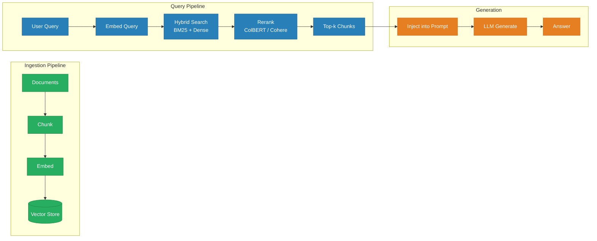
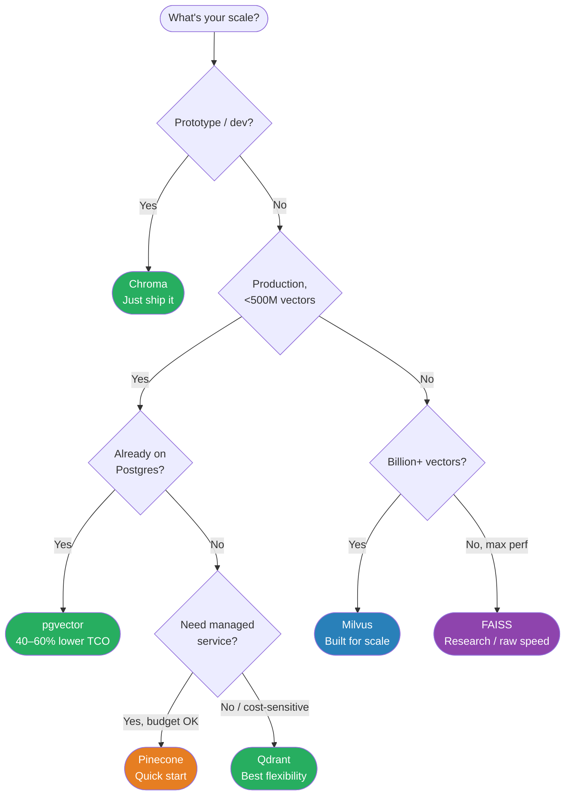
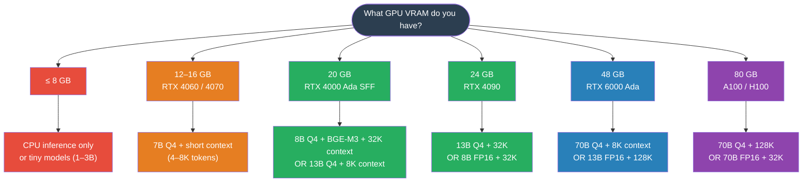
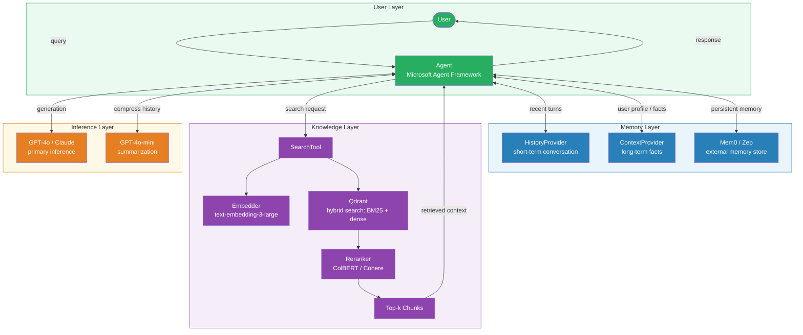

You built a RAG pipeline. It retrieves 20 chunks, sends 20,000 tokens to the LLM, and 16 of those chunks are noise. Your RTX 6000 Ada has 48 GB of VRAM — and your KV cache just ate 40 of them. Memory management isn't just a software problem. It's a hardware budget.

This is **Part 2** of a two-part series on LLM memory management in production. Where [Part 1](https://genmind.ch/posts/Your-LLM-Has-Amnesia-A-Production-Guide-to-Memory-That-Actually-Works/) covered in-process memory strategies — buffer memory, summarization, entity graphs, and managed systems like Mem0 and Zep — this post covers the external infrastructure layer: RAG pipelines, chunking strategies, vector store selection, hybrid search, and the GPU math that determines whether your system fits in VRAM or falls over. Expect concrete benchmarks, cost numbers, and decision tables you can act on today.

---

## 1. Bottom Line First

Skip the deep dive if you just need a decision. Here's the full recommendation table:

| Decision | Recommended Default | Why |
|---|---|---|
| **Chunking strategy** | Recursive character splitting, 512 tokens, 10–20% overlap | Covers 80% of cases; semantic chunking costs 10× more for ~3% recall gain |
| **Embedding model (API)** | `text-embedding-3-large` ($0.13/MTok) | Best price/performance for most use cases |
| **Embedding model (open-source)** | Qwen3-Embedding-8B or BGE-M3 | Qwen3: #1 multilingual MTEB (70.58); BGE-M3: multi-functional (dense+sparse+multi-vector) |
| **Vector store (prototype)** | Chroma | Zero setup, embedded, no infra |
| **Vector store (production)** | Qdrant or pgvector | Qdrant: flexibility + performance; pgvector: 40–60% lower TCO if already on Postgres |
| **Retrieval** | Hybrid (BM25 + dense) + reranking | 26–31% NDCG improvement over dense-only |
| **GPU (7–13B local + embeddings)** | RTX 4000 Ada SFF (20 GB) | 8B Q4 + BGE-M3 + 32K context fits in ~11 GB |
| **GPU (70B local + embeddings)** | RTX 6000 Ada (48 GB) | 70B Q4 + BGE-M3 + 8K context fits in ~37 GB |

---

## 2. RAG as External Memory

In Part 1, we covered strategies that keep memory *inside* the inference loop — summaries, entity extraction, sliding windows. **RAG is the bridge to knowledge that lives outside**: documents, databases, previous conversations stored externally. It gives your LLM long-term recall without consuming context tokens until the moment they're needed.

The pipeline has two phases. **Ingestion**: split documents into chunks, embed them into vectors, store in a vector database. **Retrieval**: at query time, embed the question, search for semantically similar chunks, inject the top results into the prompt. Simple in concept. The failure modes are in the details.



### Chunking Strategies

How you split documents before embedding determines retrieval quality more than almost any other variable. Get this wrong and nothing downstream saves you.

**Recursive character splitting** is the default — and for most teams, the right answer. LangChain's `RecursiveCharacterTextSplitter` splits on paragraph → sentence → word, hierarchically. If you haven't run ablations on your dataset yet, start here. For general RAG, **256–512 tokens** is the empirically validated sweet spot. For factual Q&A tasks, **1,024 tokens with 15% overlap** performs better — per NVIDIA's internal benchmarks, the larger chunks preserve enough surrounding context to anchor precise answers [1].

**Semantic chunking** sounds attractive: uses embedding similarity to detect topic shifts rather than character counts, so chunk boundaries align with meaning. LlamaIndex's `SemanticSplitterNodeParser` implements this. One published test showed 70% accuracy improvement over naive fixed-size splitting. The catch: semantic chunking costs **10× more to process** for a retrieval gain of roughly **3% over recursive splitting** [2]. That math rarely pencils out.

> Reach for semantic chunking only after you've *measured* an accuracy gap that justifies the cost. For most production systems, recursive splitting closes 80% of the gap at 10% of the price.
{: .prompt-warning}

**Structure-aware splitting** is often the single biggest improvement for structured documents. `MarkdownHeaderTextSplitter` keeps sections together by header hierarchy — a README's installation instructions land in one chunk, not scattered across three. If your knowledge base is Markdown, Notion exports, or HTML documentation, implement this before you reach for anything fancier.

**The 80/20 rule**: `RecursiveCharacterTextSplitter` covers 80% of use cases. Only reach for semantic chunking when you've proven the accuracy gap justifies the cost. Structure-aware splitting is the one exception — it's cheap, and if your docs are structured, it pays immediately.

### Advanced RAG Patterns

Standard RAG — embed, retrieve, inject — leaves accuracy on the table for complex queries. These patterns address the most common failure modes:

**HyDE (Hypothetical Document Embeddings)**: Instead of embedding the user's query, the LLM first generates a *hypothetical answer*, then that answer is embedded and used for retrieval. This bridges the phrasing mismatch between terse questions and verbose documents. Particularly effective when queries are short and documents are long.

**Self-RAG**: A fine-tuned variant where the model learns to insert reflection tokens — `[Retrieve]`, `[Relevant]`, `[Supported]` — to self-critique whether retrieval is needed and whether retrieved passages actually support the answer. Requires a specially trained model but eliminates a class of hallucinations.

**CRAG (Corrective RAG)**: A lighter-weight feedback loop that evaluates retrieved chunk quality with a lightweight classifier and triggers web search or re-retrieval if the initial results score below a confidence threshold. No model fine-tuning required.

**Agentic RAG**: The dominant 2025 pattern. An agent decomposes the task into sub-queries, retrieves iteratively, verifies each step, and re-retrieves when confidence is low. Expensive per query but dramatically higher accuracy on multi-hop reasoning tasks. If you're building anything beyond simple Q&A — research assistants, code generation with large codebases, document analysis — this is where the field is heading.

> For prototypes: start with standard RAG + hybrid search. For production with complex queries: add reranking. For high-stakes accuracy: evaluate Agentic RAG against your benchmark before committing.
{: .prompt-tip}

---

## 3. Embedding Models: What to Pick

Your embedding model determines the ceiling of your retrieval quality. A bad chunking strategy is recoverable. A bad embedding model means you're encoding semantic noise into every vector you store.

The good news is the market has consolidated around a handful of genuinely excellent options:

| Model | Type | Dimensions | MTEB Score | Price/MTok | Context | Best For |
|---|---|---|---|---|---|---|
| **gemini-embedding-001** | Closed (Google) | variable | ~71 | Google pricing | — | Overall best accuracy |
| **Qwen3-Embedding-8B** | Open (Apache 2.0) | variable | 70.58 | Free (self-hosted) | — | Best open-source, multilingual |
| **Cohere embed-v4** | Closed | 256–1536 (Matryoshka) | 65.2 | $0.12/MTok | 128K | Multimodal (text + images) |
| **text-embedding-3-large** | Closed (OpenAI) | 3072 (truncatable) | 64.6 | $0.13/MTok | 8191 | Best OpenAI, Matryoshka dims |
| **text-embedding-3-small** | Closed (OpenAI) | 1536 (truncatable) | ~62 | $0.02/MTok | 8191 | Budget API option |
| **BGE-M3** | Open (BAAI) | multi | ~63 | Free | 8192 | Dense + sparse + multi-vector in one |
| **Nomic Embed Text v2** | Open | 768 → 256 (Matryoshka) | — | Free | 8192 | MoE, 100+ programming languages |

### The Math You Actually Need

**text-embedding-3-small** is 6.5× cheaper than large ($0.02 vs $0.13 per MTok). For most RAG pipelines the accuracy gap does not justify that cost difference. Start small, run retrieval evals against your actual corpus, and only upgrade if you see meaningful recall degradation.

**BGE-M3** is the Swiss Army knife of the open-source world: dense retrieval, sparse retrieval (SPLADE-style), and multi-vector (ColBERT-style) — all from one model, 100+ languages, 8K context window. If you're self-hosting and want maximum flexibility without juggling multiple models, BGE-M3 is your answer.

**Qwen3-Embedding-8B** hits MTEB 70.58 under Apache 2.0. That's competitive with Google's flagship closed model. The open-source embedding story has quietly become very good.

**Cohere embed-v4** is the outlier: it's the only major embedding model that natively handles interleaved text and images at a 128K context window. If you're building enterprise RAG over document-heavy corpora — PDFs with charts, slides, mixed content — this is worth the $0.12/MTok [10].

### A Note on VRAM

Local embedding models are not the memory problem you think they are. BGE-M3 in FP16 is about **1 GB**. Your LLM weights are the VRAM story; embeddings are a rounding error. Don't let VRAM concerns be the reason you skip self-hosting your embedder.

> For most production RAG systems, **text-embedding-3-small is the right starting point.** At $0.02/MTok you can embed your entire knowledge base for pennies. Upgrade to large only if retrieval evaluation shows a meaningful accuracy gap for your specific domain.
{: .prompt-tip}

---

## 4. Vector Store Showdown

Picking a vector database is a "right tool for the job" problem, but the job description changes at different scales and budgets. Here's the honest comparison:

| Database | Hybrid Search | Filtering | Multi-tenancy | Deployment | QPS at Scale | Best For |
|---|---|---|---|---|---|---|
| **Chroma** | No | Basic | Limited | Embedded / server | — | Prototypes, dev |
| **pgvector** | Partial (FTS + vector) | Full SQL | PostgreSQL native | Self-hosted | 471 QPS | Teams already on Postgres |
| **Qdrant** | Yes (SPLADE + dense) | Advanced payload | Collections / tenants | Self-hosted + Cloud | 41 QPS @ 99% recall | Flexibility + performance |
| **Pinecone** | Yes (sparse + dense) | Yes | Namespaces | Managed only | 10–100ms p99 | Quick start, enterprise managed |
| **Milvus** | Yes | Yes | Partitions | Self-hosted + Zilliz | 46 QPS | Billion-scale |
| **Weaviate** | Yes (BM25 + dense) | Yes | Multi-tenancy native | Self-hosted + Cloud | moderate | Complex data graphs |
| **FAISS** | No | External | No | Library only | highest raw | Max perf, research |

### What This Actually Costs

The managed vs self-hosted decision is fundamentally a cost question, and the numbers get interesting fast:

- **Pinecone**: $70–500+/month at production scale. They've been losing customers to cost-sensitive alternatives — this is not a secret.
- **Weaviate Cloud**: starts at $25/month; 1M vectors at 1536 dimensions runs ~$153/month without compression, ~$25 with compression enabled.
- **Qdrant Cloud**: ~$102/month on AWS us-east; 1GB free tier to get started.
- **pgvector**: 40–60% lower TCO than dedicated vector DBs for workloads under 500M vectors [7]. If you're already paying for Postgres, you may already have your vector store.

The self-hosting tipping point is roughly 50–100M vectors or $500+/month in managed costs. The typical trajectory: start on Pinecone for developer experience, migrate to Qdrant or Milvus when the invoice stops feeling reasonable.

### Which One Do You Actually Pick?



> If you're building a new production system with no existing infrastructure constraints, **Qdrant** is the default recommendation in 2025: hybrid search built in, strong filtering, active development, and self-hostable when costs demand it.
{: .prompt-tip}

---

## 5. Hybrid Search: The Production Standard

Dense-only vector retrieval is an elegant idea that quietly fails on a subset of queries that happen to be important: exact product codes, proper nouns, legal citations, error messages, version strings. Anything where the *precise string* matters more than the semantic neighborhood.

BM25-only keyword search fails in the other direction: ask it for "documents about vehicle locomotion" and it won't find anything about "cars."

**Hybrid search** runs both in parallel and fuses the results. This is not a research curiosity — it's the production standard.

### How Reciprocal Rank Fusion Works

The fusion step is simpler than it sounds. **Reciprocal Rank Fusion (RRF)** assigns each document a score based on its rank in each retrieval list:

```
score(d) = Σ 1 / (k + rank(d))
```

Where `k` is a smoothing constant (typically 60) and the sum is across all retrieval lists. Documents that rank well in both lists accumulate score; documents that only appear in one list get partial credit. No calibration of score scales needed — just ranks.

The result: hybrid retrieval improves NDCG by **26–31% over dense-only** on standard benchmarks [3]. "No serious production RAG system uses dense-only in 2025" is only a slight exaggeration.

### Re-ranking: The Second Stage

Hybrid fusion gets you a good top-100. Getting from top-100 to top-10 is where **re-ranking** comes in.

| Re-ranker | Latency | Accuracy Gain | Cost | Best For |
|---|---|---|---|---|
| **ColBERT** | ~tens of ms | High | Self-hosted; 180× fewer FLOPs than cross-encoder | Production default |
| **Cross-Encoder** | 3.5–11s | Highest (+52% MAP) | Compute-intensive | Offline evaluation |
| **Cohere Rerank 3** | +~200ms | +10–25% precision | ~$1/1K requests | API-first teams |

**ColBERT** is the production default for good reason: it precomputes document token embeddings offline, so at query time it only needs to compute query token embeddings and run a late-interaction scoring step. The result is cross-encoder-level quality at a fraction of the compute.

**Cross-encoders** are slow but accurate — they're the right tool for offline evaluation and for establishing what "best possible" looks like on your dataset. Don't use them in the hot path unless your SLA has nothing to say about latency.

**Cohere Rerank 3** is the API option if you'd rather not run inference infrastructure. The +200ms overhead is acceptable for most conversational use cases.

### The Production Recipe

Put it together and the retrieval pipeline looks like this:

1. Retrieve **k = 100 candidates** via hybrid search (BM25 + dense vectors in parallel)
2. Fuse rankings with **RRF**
3. Re-rank the top 30–50 with **ColBERT** (or Cohere Rerank 3 for API-first teams)
4. Send the **top 5–10** to the LLM as context

This is not premature optimization. The retrieval stage is where most RAG systems leave the most performance on the table, and fixing it costs far less than rewriting your chunking strategy or fine-tuning your embedding model.

> Reranking is the highest-ROI optimization in most RAG pipelines. Adding ColBERT or Cohere Rerank to an existing dense retrieval system typically improves precision by 10–25% with minimal latency impact. Do this before optimizing your chunking strategy.
{: .prompt-tip}

---

## 6. The GPU Math: VRAM, KV Cache, and What Fits

At some point every practitioner stops asking "will this work?" and starts asking "will this *fit*?" This section gives you the math to answer that before you find out the hard way at 2 AM.

### The KV Cache Formula

Every token you generate requires the model to remember every previous token's key and value tensors — that's the **KV cache**. It's not magic; it's memory. Specifically:

```
KV_cache_GB = 2 × batch × seq_len × layers × kv_heads × head_dim × (bits/8) / 1e9
```

The factor of 2 is because you store one **K tensor** and one **V tensor** per layer, per head. Everything else follows from model architecture. The critical insight is that this relationship is **linear with context length** — double your context window, double your KV cache. No clever tricks, no escape hatches. Physics.

### Llama 3.1 8B: KV Cache Scaling

Architecture: 32 layers, 8 KV heads, head_dim=128.

| Context | KV Cache (FP16) | KV Cache (INT8) | Total VRAM (Q4 weights) |
|---------|----------------|----------------|------------------------|
| 4K      | ~0.5 GB        | ~0.25 GB       | ~5.8 GB               |
| 32K     | ~4 GB          | ~2 GB          | ~9.2 GB               |
| 128K    | ~16 GB         | ~8 GB          | ~21 GB                |

### Llama 3.1 70B: KV Cache Scaling

Architecture: 80 layers, 8 KV heads, head_dim=128. Yes, the layer count is the painful part.

| Context | KV Cache (FP16) | KV Cache (INT8) | Total VRAM (Q4 weights) |
|---------|----------------|----------------|------------------------|
| 4K      | ~1.25 GB       | ~0.63 GB       | ~43 GB                |
| 32K     | ~10 GB         | ~5 GB          | ~52 GB                |
| 128K    | ~40 GB         | ~20 GB         | ~82 GB                |

### Quantization: Your Primary Lever

Before you buy another GPU, reach for quantization. Here's the tradeoff table:

| Precision   | Bytes/element | vs FP16      | Quality Impact                  |
|-------------|---------------|--------------|----------------------------------|
| FP16/BF16   | 2 bytes       | baseline     | None                            |
| INT8/FP8    | 1 byte        | 2× smaller   | Minimal                         |
| INT4        | 0.5 bytes     | ~2.5× smaller | Measurable but acceptable       |

> **INT8 KV quantization is the single best optimization for long-context deployments.** It halves your KV cache VRAM with negligible quality loss. Hugging Face benchmarks show INT4 KV quantization supports 128K tokens on an 80 GB A100 where FP16 maxes out at roughly 40K [4].
{: .prompt-tip}

Apply INT8 KV first. Then consider weight quantization. In that order.

### What Actually Fits: RTX 4000 Ada SFF (20 GB VRAM)

Architecture: Ada Lovelace, 70W TDP, 232 GB/s bandwidth. This card is the sleeper hit of on-premises AI — it runs in a workstation, sips power, and fits in spaces where an A100 would never be approved.

- **Base footprint:** Llama 3.1 8B Q4 (~4.5 GB) + BGE-M3 FP16 (~1 GB) = 5.5 GB
- **At 32K context** (FP16 KV ~4 GB): total ~11 GB → **fits comfortably** with room to breathe
- **At 128K context** (FP16 KV ~16 GB): total ~23 GB → **does not fit** in FP16; switch to INT8 KV (~8 GB) and you're at ~14 GB total, which fits
- **Sweet spot:** 7–13B models with moderate context lengths, excellent for 24/7 production at 70W

### What Actually Fits: RTX 6000 Ada (48 GB VRAM)

Architecture: Ada Lovelace, 300W TDP, 960 GB/s bandwidth. This is the card that makes finance departments wince and ML engineers smile.

- **Base footprint:** Llama 3.1 70B Q4 (~35 GB) + BGE-M3 (~1 GB) = 36 GB
- **At 8K context:** total ~37–39 GB → **comfortable**
- **At 32K context** (FP16 KV ~10 GB): total ~47 GB → barely fits; use INT8 KV to drop that to ~5 GB and you have a proper margin
- **Sweet spot:** 70B quantized models. This is the threshold for "serious" local AI — the point where you stop compromising on model capability and start making real architecture decisions.

### GPU-Accelerated Vector Indexing

The vectors you're storing aren't free to index either. If you're running **Qdrant v1.13+** with GPU support, you get roughly **10× faster indexing** versus CPU [5]. **FAISS CAGRA** (via cuVS) pushes that further: up to **12.3× faster index builds** and **4.7× lower search latency** [6].

One constraint to plan around: Qdrant GPU indexing operates in 16 GB VRAM segments. With scalar quantization at 1536 dimensions, that's approximately 11M vectors per segment — enough for most production deployments, but worth knowing before you throw 50M documents at it.

### The Decision Tree: What Fits on Your GPU?



> If your numbers don't fit in the green or blue tiers, **quantize before you spend**. INT8 KV cache alone can shift you an entire tier without touching your hardware budget.
{: .prompt-tip}

---

## 7. Putting It Together: Production Architecture

You've seen the theory. You've done the VRAM math. Now let's wire it all up into something you can actually deploy.

The architecture has four layers, and each layer has a job. Get the boundaries right and the system is debuggable. Blur them and you'll spend your Fridays on incidents.

**Orchestration:** Microsoft Agent Framework coordinates the agent's reasoning, tool dispatch, and memory access. It's the control plane.

**Embedding:** OpenAI `text-embedding-3-large` for cloud deployments, or **BGE-M3** if you're self-hosting. BGE-M3's multi-vector output makes it particularly strong for hybrid retrieval.

**Vector Storage:** **Qdrant** with hybrid search — dense vectors plus BM25 in a single query. Dense retrieval handles semantic similarity; BM25 handles exact keyword matches. Neither alone is sufficient for production.

**Re-ranking:** **ColBERT** or **Cohere Rerank** narrows your top-10 candidates to the top-3 that actually matter.

**Conversation Memory:** The `SummaryBufferMemory` or Mem0 patterns from [Part 1](https://genmind.ch/posts/Your-LLM-Has-Amnesia-A-Production-Guide-to-Memory-That-Actually-Works/) slot in as the `HistoryProvider` and `ContextProvider`. The agent framework treats them as just another context source — which is exactly right.

### The Code

```python
from semantic_kernel.connectors.azure_ai_search import AzureAISearchCollection
from semantic_kernel.connectors.ai.open_ai import OpenAITextEmbedding

# Define your knowledge base schema
collection = AzureAISearchCollection[str, SupportArticle](
    record_type=SupportArticle,
    embedding_generator=OpenAITextEmbedding(model_id="text-embedding-3-large")
)

# Create a search function with hybrid retrieval
search_function = collection.create_search_function(
    function_name="search_knowledge_base",
    search_type="keyword_hybrid",  # BM25 + dense vectors
    string_mapper=lambda x: f"[{x.record.category}] {x.record.title}: {x.record.content}",
    top=10,
)

# Convert to agent tool and attach to agent
search_tool = search_function.as_agent_framework_tool()
agent = OpenAIResponsesClient(model_id="gpt-4o").as_agent(
    instructions="Use the search tool to answer questions. Always cite your sources.",
    tools=[search_tool],
    context_providers=[InMemoryHistoryProvider("memory", load_messages=True)],
)
```

A few things worth noting:

- `keyword_hybrid` is doing the heavy lifting — don't downgrade to pure dense unless you've profiled and confirmed BM25 adds no value for your data
- `top=10` retrieves a wider candidate set that your reranker will narrow down
- `InMemoryHistoryProvider` is the short-term memory bridge from Part 1 — the agent carries conversation context without any additional plumbing
- The `string_mapper` controls what text lands in the agent's context window; be deliberate about including category and title, because it helps the agent cite correctly

> Don't use `top=3` and skip the reranker. Retrieve wide (10–20), rerank, then pass only the top 3–5 to the model. Retrieval is cheap. Context window tokens are not.
{: .prompt-warning}

### The Full Architecture



### Failure Modes to Plan For

Production means planning for things going wrong. The three that will actually bite you:

**Context window overflow.** Your retrieval returns 10 chunks, each 500 tokens, plus a 2K conversation history. Set hard limits on retrieved context and enforce them in the `string_mapper`, not as an afterthought.

**Embedding drift.** If you retrain or swap your embedding model, re-index everything. Mixing embeddings from different models in the same collection produces quietly terrible retrieval that's nearly impossible to debug from symptoms alone.

**Memory accumulation.** Mem0 and Zep are excellent, but they'll store whatever the agent decides is worth storing. Without a TTL or importance threshold, your memory store becomes a graveyard of stale facts. Set a decay policy on day one, not after you notice retrieval quality degrading.

> The architecture above is not magic. It's plumbing. The quality of what comes out depends almost entirely on the quality of what goes in — your chunking strategy, your metadata schema, your embedding model choice. Tune those before you tune anything else.
{: .prompt-tip}

---

## 8. Key Takeaways

- **Recursive character splitting covers 80% of chunking needs** — semantic chunking costs 10× more for ~3% recall gain. Start with `RecursiveCharacterTextSplitter` at 512 tokens with 10–20% overlap and only invest in fancier strategies after you've measured the gap [1].

- **Hybrid search is table stakes for production RAG** — BM25 + dense retrieval with RRF fusion improves NDCG by 26–31% over dense-only. No serious production system runs dense-only in 2025; if yours does, that's your next sprint [3].

- **Reranking is the highest-ROI RAG optimization** — adding ColBERT or Cohere Rerank to an existing retrieval pipeline typically lifts precision by 10–25% with minimal added latency. Do this before you touch chunking or embeddings.

- **`text-embedding-3-small` is the right default for most teams** — at $0.02/MTok it's 6.5× cheaper than the large variant. Upgrade only after domain-specific evaluation proves the gap matters for your workload [9].

- **pgvector is underrated for production** — version 0.8 delivers 3–5× throughput improvement and 40–60% lower TCO than dedicated vector databases for datasets under 500M vectors. If you're already on Postgres, start here before evaluating anything else [7].

- **KV cache grows linearly with context length** — double the context, double the VRAM. INT8 quantization halves KV cache footprint with negligible quality loss and is the single best optimization for long-context inference [4].

- **RTX 4000 Ada SFF (20 GB) is the sweet spot for 7–13B models** — an 8B Q4 model plus embeddings plus 32K context fits comfortably at 70W. The RTX 6000 Ada (48 GB) unlocks 70B quantized, the practical "serious local AI" threshold.

- **The production RAG stack has converged** — Microsoft Agent Framework for orchestration, hybrid search with reranking for retrieval, `SummaryBufferMemory` or Mem0 for conversation state. The components are commoditized; the integration is the hard part.

---

## Need Help with Your AI Project?

I consult on production AI systems — from RAG architecture to GPU selection to vector store deployment. If you're building retrieval pipelines, optimizing inference costs, or scaling your AI infrastructure, [let's talk](https://calendly.com/gsantopaolo/ai-consulting).

---

## Resources

### Related Posts

- [Your LLM Has Amnesia: A Production Guide to Memory That Actually Works](https://genmind.ch/posts/Your-LLM-Has-Amnesia-A-Production-Guide-to-Memory-That-Actually-Works/) — Part 1 of this series
- [Building ReAct Agents with Microsoft Agent Framework](https://genmind.ch/posts/Building-ReAct-Agents-with-Microsoft-Agent-Framework-From-Theory-to-Production/)
- [Stop Buying GPUs for the Wrong Spec](https://genmind.ch/posts/Stop-Buying-GPUs-for-the-Wrong-Spec-The-Training-vs-Inference-Resource-Trap/)
- [Predict Peak VRAM Before Downloading a Model](https://genmind.ch/posts/Predict-Peak-VRAM-Before-Downloading-A-Model/)

### Papers & Research

- NVIDIA chunking benchmark — developer.nvidia.com, 2024
- Superlinked hybrid search benchmarks, 2025
- Hugging Face KV cache quantization blog, 2024

### Official Documentation

- [Microsoft Agent Framework RAG](https://learn.microsoft.com/en-us/agent-framework/agents/rag)
- [Qdrant](https://qdrant.tech/documentation/)
- [pgvector](https://github.com/pgvector/pgvector)
- [FAISS](https://github.com/facebookresearch/faiss)
- [Sentence Transformers](https://sbert.net/)

---

## References

[1] NVIDIA. "Finding the Best Chunking Strategy for Accurate AI Responses." NVIDIA Developer Blog, 2024. [https://developer.nvidia.com/blog/finding-the-best-chunking-strategy-for-accurate-ai-responses/](https://developer.nvidia.com/blog/finding-the-best-chunking-strategy-for-accurate-ai-responses/)

[2] LangCoPilot. "Document Chunking for RAG: 9 Strategies Tested." Oct 2025. [https://langcopilot.com/posts/2025-10-11-document-chunking-for-rag-practical-guide](https://langcopilot.com/posts/2025-10-11-document-chunking-for-rag-practical-guide)

[3] Superlinked. "Optimizing RAG with Hybrid Search & Reranking." 2025. [https://superlinked.com/vectorhub/articles/optimizing-rag-with-hybrid-search-reranking](https://superlinked.com/vectorhub/articles/optimizing-rag-with-hybrid-search-reranking)

[4] Hugging Face. "Unlocking Longer Generation with KV Cache Quantization." 2024. [https://huggingface.co/blog/kv-cache-quantization](https://huggingface.co/blog/kv-cache-quantization)

[5] Qdrant. "Qdrant 1.13 Release — GPU Indexing." Jan 2025. [https://qdrant.tech/blog/qdrant-1.13.x/](https://qdrant.tech/blog/qdrant-1.13.x/)

[6] NVIDIA. "Enhancing GPU-Accelerated Vector Search in FAISS with cuVS." 2024. [https://developer.nvidia.com/blog/enhancing-gpu-accelerated-vector-search-in-faiss-with-nvidia-cuvs/](https://developer.nvidia.com/blog/enhancing-gpu-accelerated-vector-search-in-faiss-with-nvidia-cuvs/)

[7] Instaclustr. "pgvector Key Features and Tutorial — 2026 Guide." 2026. [https://www.instaclustr.com/education/vector-database/pgvector-key-features-tutorial-and-pros-and-cons-2026-guide/](https://www.instaclustr.com/education/vector-database/pgvector-key-features-tutorial-and-pros-and-cons-2026-guide/)

[8] Microsoft. "RAG — Microsoft Agent Framework." Microsoft Learn, Feb 2026. [https://learn.microsoft.com/en-us/agent-framework/agents/rag](https://learn.microsoft.com/en-us/agent-framework/agents/rag)

[9] OpenAI. "New Embedding Models and API Updates." 2024. [https://openai.com/index/new-embedding-models-and-api-updates/](https://openai.com/index/new-embedding-models-and-api-updates/)

[10] Cohere. "Embed v4 Changelog." 2025. [https://docs.cohere.com/changelog/embed-multimodal-v4](https://docs.cohere.com/changelog/embed-multimodal-v4)

[11] MTEB Leaderboard. Hugging Face, 2026. [https://huggingface.co/spaces/mteb/leaderboard](https://huggingface.co/spaces/mteb/leaderboard)

[12] Hardware Corner. "LLM VRAM Usage Compared." 2025. [https://www.hardware-corner.net/llm-vram-usage-compared/](https://www.hardware-corner.net/llm-vram-usage-compared/)

[13] Hardware Corner. "RTX 4000 SFF Ada for LLM." 2025. [https://www.hardware-corner.net/guides/rtx-4000-sff-ada-for-llm/](https://www.hardware-corner.net/guides/rtx-4000-sff-ada-for-llm/)

[14] Puget Systems. "LLM Inference Professional GPU Performance." 2025. [https://www.pugetsystems.com/labs/articles/llm-inference-professional-gpu-performance/](https://www.pugetsystems.com/labs/articles/llm-inference-professional-gpu-performance/)
