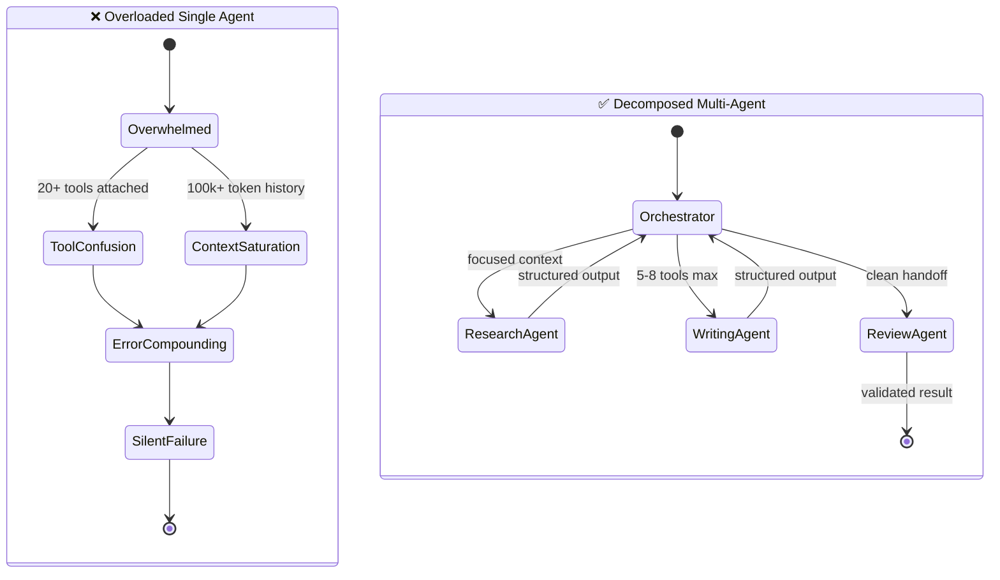
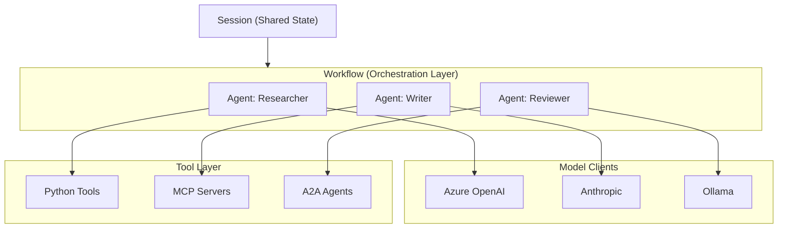
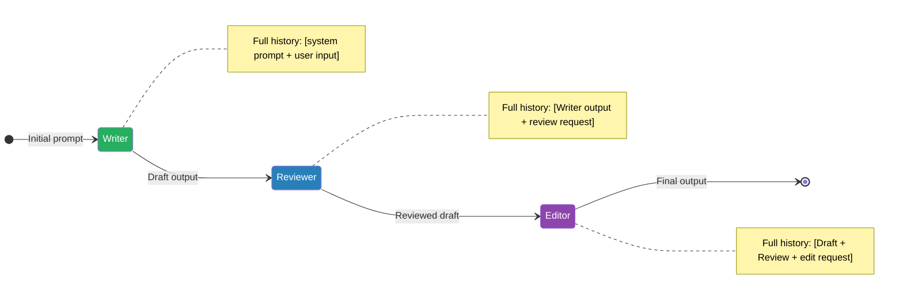
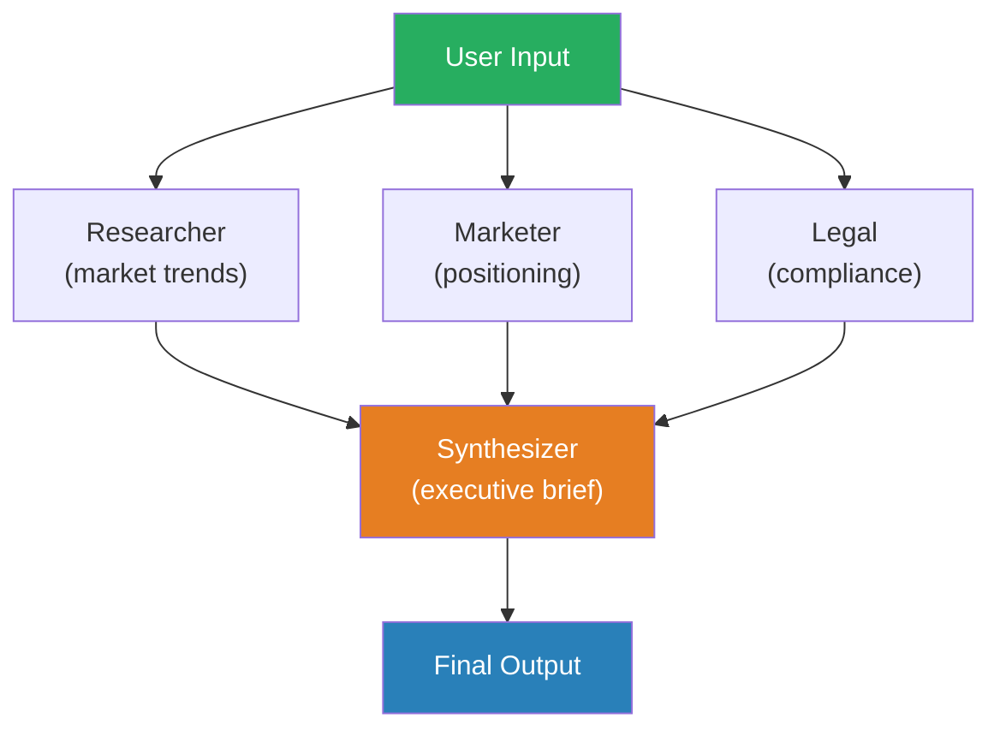
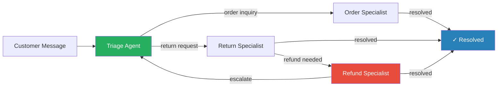
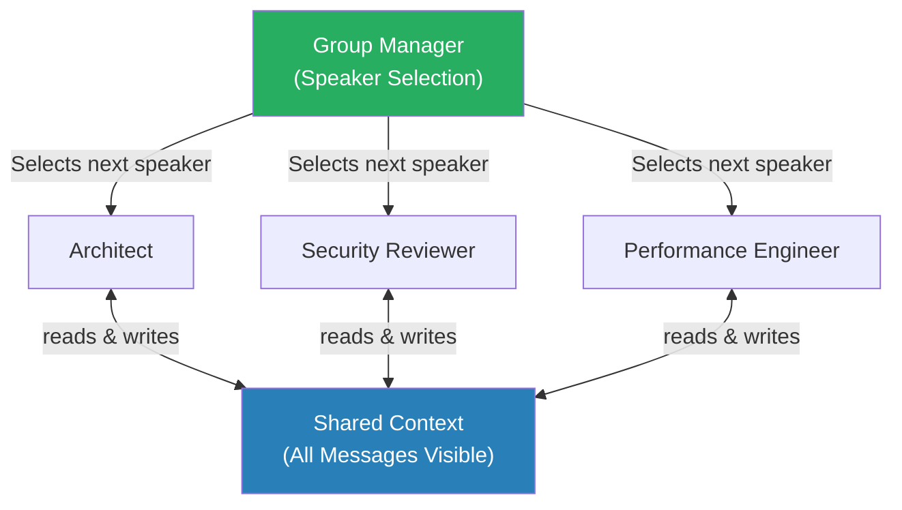
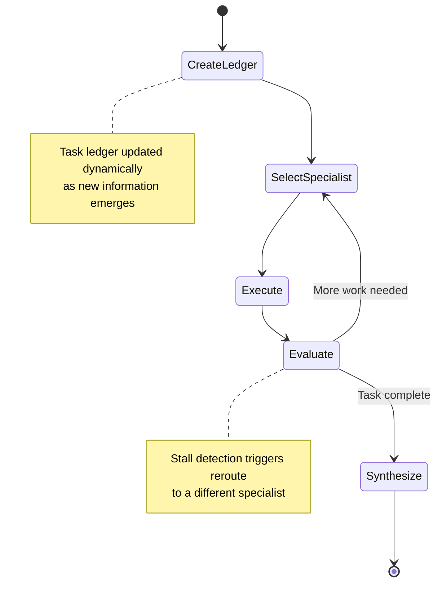
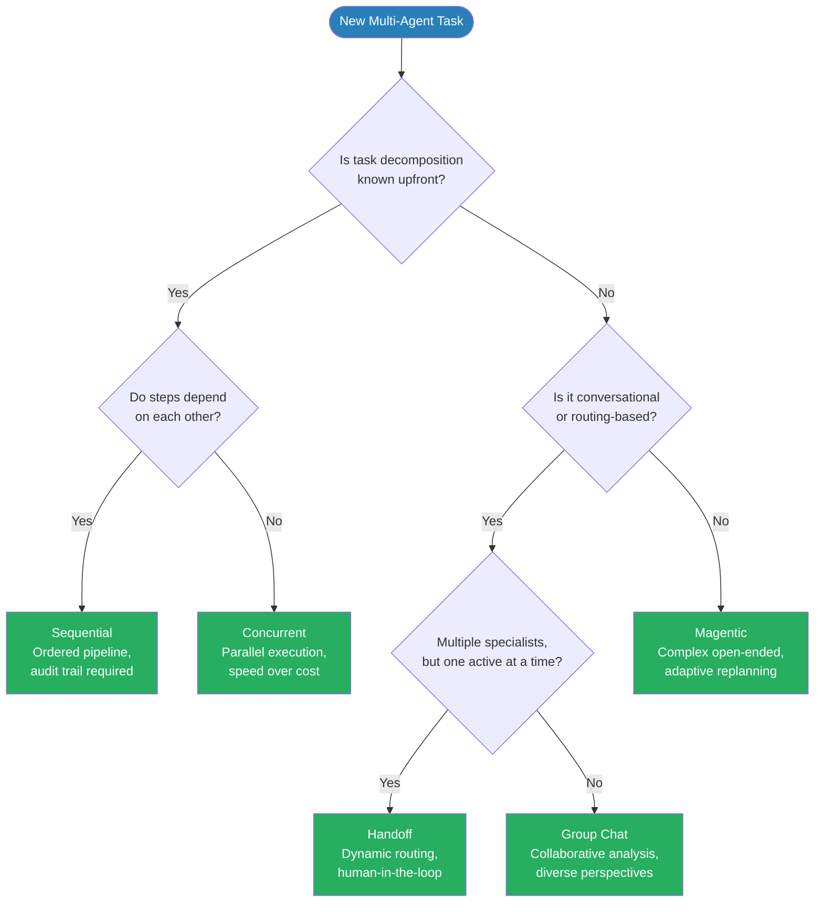

Microsoft just shipped Agent Framework RC — merging AutoGen and Semantic Kernel into one SDK. Production teams are running 5+ specialist agents in parallel for tasks that took a single agent 45 minutes. The question isn't whether to go multi-agent — it's which orchestration pattern fits your problem.

**Here's the thing**: there are exactly five patterns that cover 95% of multi-agent use cases. Each has clear tradeoffs. This post gives you the pattern catalog, full code examples, and a decision framework — all built on Microsoft Agent Framework v1.0.0rc1.

---

## Bottom Line First

Before diving into implementation, here's the full pattern catalog in one place. Bookmark this table.

| **Pattern** | **Best For** | **Key Tradeoff** | **MAF Class** |
|---|---|---|---|
| **Sequential** | Ordered pipelines, document processing, ETL | Simple but no parallelism; one bottleneck stalls all | `SequentialBuilder` |
| **Concurrent** | Independent subtasks, parallel research, batch jobs | Fast but requires merging divergent outputs | `ConcurrentBuilder` |
| **Handoff** | Role-based routing, triage, escalation chains | Clean specialization; inter-agent latency adds up | `HandoffBuilder` |
| **Group Chat** | Collaborative reasoning, multi-perspective review, debate | Rich but expensive; token costs scale with agent count | `GroupChatBuilder` |
| **Magentic** | Dynamic task decomposition, unknown-shape problems | Most powerful; hardest to debug and constrain | `MagenticBuilder` |

> Pick the **simplest pattern that solves your problem**. Group Chat and Magentic are tempting — they're also the patterns most teams over-apply.
{: .prompt-warning}

---

## When a Single Agent Isn't Enough

Single agents work. Until they don't.

The ceiling appears in three places. First, **context window saturation**: a long-running research or coding task accumulates tool outputs, intermediate reasoning, and retry traces until you're burning 90% of your context on history rather than thinking. Second, **tool sprawl**: once you attach 15+ tools to a single agent, retrieval quality degrades — the model struggles to select the right tool and starts hallucinating tool calls that don't exist [see [Building ReAct Agents with Microsoft Agent Framework](https://genmind.ch/posts/Building-ReAct-Agents-with-Microsoft-Agent-Framework-From-Theory-to-Production/)]. Third, **error compounding**: in a 20-step ReAct chain, a mistake at step 4 propagates silently. By step 18 you have a confident, coherent, completely wrong result.

**Here's the thing**: decomposition fixes all three problems at once. Smaller agents carry smaller context, own fewer tools, and fail in bounded, observable ways.



The [Planning Pattern for AI Agents](https://genmind.ch/posts/Planning-Pattern-for-AI-Agents-Strategic-Reasoning-Before-Action/) addresses the orchestration side of this — how an agent reasons about decomposition before acting. Multi-agent architecture is the runtime manifestation of that same principle: **plan at the system level, execute at the agent level**.

This isn't theoretical. In [How to Get the Best from Claude Code Teams](https://genmind.ch/posts/How-to-Get-the-Best-from-Claude-Code-Teams/), you can see exactly how multi-agent coordination plays out in a real developer workflow — specialist agents owning scoped tasks, results merged by a team lead. The pattern holds whether you're orchestrating Claude Code subagents or MAF agents on Azure.

> When your ReAct trace exceeds 30 steps or your tool list exceeds 12 items, stop tuning the single agent. **Decompose**.
{: .prompt-tip}

---

## The Microsoft Agent Framework (What & Why Now)

For years, the Python multi-agent ecosystem was split. **AutoGen** owned the conversational multi-agent space. **Semantic Kernel** owned enterprise orchestration and plugin management. Teams running both SDKs maintained two dependency trees, two agent abstractions, two sets of idioms.

That's over. Microsoft merged both projects into a single unified SDK: **Microsoft Agent Framework** [1]. AutoGen and Semantic Kernel are now in maintenance mode — bug fixes only, no new features. MAF is where the investment goes.

The RC landed on February 19, 2026. GA is imminent.

```bash
pip install agent-framework --pre
```

### Core Concepts

The framework's object model is deliberately flat:

| **Concept** | **Role** |
|---|---|
| **Agent** | Encapsulates a model client + system prompt + tool set |
| **Workflow** | Defines the orchestration pattern (sequential, concurrent, handoff, group chat) |
| **Session** | Manages shared message history and state across agents |
| **Tools** | Python callables or MCP-connected tool servers |
| **MCP** | Native Model Context Protocol support for external tool ecosystems |
| **A2A** | Agent-to-Agent protocol for cross-framework interoperability |

**Model support is broad by design**: Azure OpenAI, OpenAI, Anthropic, Amazon Bedrock, and Ollama all work through a unified `ModelClient` interface. You swap providers by changing one constructor argument.



The architecture matters for a practical reason: **the model client is decoupled from the agent**. You can run a high-capability model for your orchestrator and a cheaper model for subtask agents without changing any orchestration logic. That's a significant cost lever in production.

**Here's the thing**: MAF isn't just AutoGen with a new name. The Semantic Kernel lineage brings production-grade plugin management, enterprise auth, and telemetry hooks that AutoGen never had. The merger gives you conversational agent flexibility *and* enterprise deployment robustness in one package [2].

For a broader view of where MAF sits in the framework landscape, see [Top Agentic AI Frameworks](https://genmind.ch/posts/Top-Agentic-AI-Frameworks/).

> **RC means production-ready for evaluation, not yet for regulated workloads.** Pin your version (`agent-framework==1.0.0rc1`) and watch the GA release notes for breaking changes in the Workflow API surface.
{: .prompt-warning}

---

## Pattern 1 — Sequential Pipeline

The **sequential pipeline** is the simplest orchestration pattern and the right default when your workflow has a defined order of operations. Think: write → review → edit, translate → verify → format, generate → test → fix. Each stage depends on the output of the previous one.

The defining characteristic: **every agent in the chain receives the full conversation history** from all prior agents. The reviewer sees what the writer produced. The editor sees both the original draft and the reviewer's critique. Nothing is lost between steps.



```python
from agent_framework.orchestrations import SequentialBuilder

# Create specialist agents
writer = chat_client.as_agent(
    name="writer",
    instructions="You are a concise technical copywriter. Write clear, engaging content."
)
reviewer = chat_client.as_agent(
    name="reviewer",
    instructions="You are a thorough code reviewer. Check for accuracy, clarity, and completeness."
)
editor = chat_client.as_agent(
    name="editor",
    instructions="You are a final editor. Polish the text for publication quality."
)

# Build sequential pipeline
workflow = SequentialBuilder(participants=[writer, reviewer, editor]).build()

# Run and stream results
async for event in workflow.run_stream("Write a technical summary of transformer attention mechanisms."):
    if event.type == "output":
        for msg in event.data:
            print(f"[{msg.author_name}] {msg.text}")
```

**Tradeoffs:**

| Strength | Weakness |
|---|---|
| Simple, predictable, easy to debug | Sequential bottleneck — no parallelism |
| Full context preserved at every stage | Total latency = sum of all agent latencies |
| Auditability — clear chain of custody | Overkill for single-step tasks |

**✅ Use sequential pipelines when:** order matters, each step genuinely depends on the prior output, and you need a clear audit trail of what each agent contributed.

---

## Pattern 2 — Concurrent (Fan-Out / Fan-In)

When your subtasks are **independent of each other**, running them sequentially is pure waste. The **concurrent pattern** fans out the same input to multiple agents simultaneously, then fans the results back in to an aggregator.

Classic use cases: multi-source research (analyst + lawyer + marketer all reading the same brief), parallel code review from security/performance/readability perspectives, or generating content variants simultaneously.



```python
from agent_framework.orchestrations import ConcurrentBuilder

# Specialist analysts
researcher = chat_client.as_agent(
    name="researcher",
    instructions="You are a market researcher. Analyze market trends and competitive landscape."
)
marketer = chat_client.as_agent(
    name="marketer",
    instructions="You are a marketing strategist. Identify positioning opportunities and messaging."
)
legal = chat_client.as_agent(
    name="legal",
    instructions="You are a compliance analyst. Flag regulatory risks and IP concerns."
)

# Custom aggregator function
async def synthesize_results(responses: list) -> str:
    summary_agent = chat_client.as_agent(
        name="synthesizer",
        instructions="Combine these independent analyses into a unified executive brief."
    )
    combined = "\n\n".join(f"**{r.author_name}**: {r.text}" for r in responses)
    result = await summary_agent.run(f"Synthesize these analyses:\n{combined}")
    return result

# Build concurrent workflow
workflow = (
    ConcurrentBuilder()
    .participants([researcher, marketer, legal])
    .with_aggregator(synthesize_results)
    .build()
)

async for event in workflow.run_stream("We are launching a new AI-powered code review tool."):
    if isinstance(event, WorkflowOutputEvent):
        print(event.data)
```

> Your aggregator is load-bearing. A weak synthesizer will lose information from the parallel agents or introduce contradictions. Invest in the aggregator's instructions — it's doing the hardest reasoning in the entire pipeline.
{: .prompt-tip}

**Tradeoffs:**

| Strength | Weakness |
|---|---|
| Wall-clock latency = slowest single agent | Higher token cost (N agents × input tokens) |
| Naturally parallel, scales horizontally | No inter-agent communication during execution |
| Great isolation — agents can't corrupt each other | Aggregation quality determines final output quality |

**✅ Use concurrent patterns when:** subtasks are genuinely independent, speed matters more than token cost, and you can write a meaningful aggregation strategy.

---

## Pattern 3 — Handoff (Dynamic Routing)

The **handoff pattern** is what you reach for when you can't predict the path through your workflow ahead of time. Routing decisions happen at runtime, based on conversation context. The canonical example: customer support. You don't know whether an incoming message needs order tracking, a return label, or a refund until you read it.

The critical distinction from other patterns: **in a handoff, the receiving agent takes full ownership of the conversation**. This is not a tool call where the caller gets control back. When the triage agent hands off to the refund specialist, the triage agent is done. The refund specialist owns the thread from that point forward [1].



```python
from agent_framework.orchestrations import HandoffBuilder
from agent_framework import tool

@tool(approval_mode="always_require")
def process_refund(order_id: str, amount: float) -> str:
    """Process a customer refund. Requires human approval."""
    # In production: call payment API
    return f"Refund of ${amount:.2f} processed for order {order_id}"

# Define specialist agents
triage = chat_client.as_agent(
    name="triage",
    instructions="You are a customer support triage agent. Determine the customer's need and route to the appropriate specialist."
)
order_agent = chat_client.as_agent(
    name="order_specialist",
    instructions="You handle order status inquiries. Check order details and provide updates."
)
return_agent = chat_client.as_agent(
    name="return_specialist",
    instructions="You handle product returns. Guide customers through the return process."
)
refund_agent = chat_client.as_agent(
    name="refund_specialist",
    instructions="You process refunds after returns are confirmed.",
    tools=[process_refund]
)

# Build handoff workflow
workflow = (
    HandoffBuilder(
        name="customer_support",
        participants=[triage, order_agent, return_agent, refund_agent],
        termination_condition=lambda conv: any(
            "resolved" in msg.text.lower() for msg in conv[-3:]
        ),
    )
    .with_start_agent(triage)
    .add_handoff(triage, [order_agent, return_agent])
    .add_handoff(return_agent, [refund_agent])
    .build()
)

# Interactive mode — emits request_info when human input needed
async for event in workflow.run_stream("I want to return my broken headphones"):
    if event.type == "request_info":
        user_input = input(f"Agent needs input: ")
        await workflow.provide_input(user_input)
    elif event.type == "output":
        for msg in event.data:
            print(f"[{msg.author_name}] {msg.text}")
```

The `approval_mode="always_require"` on `process_refund` is your **human-in-the-loop gate**. The workflow pauses and emits a `request_info` event before any money moves. This is the pattern for any irreversible action — payments, database writes, external API calls — where a human sign-off is non-negotiable.

> Always set explicit termination conditions in Handoff workflows. Without them, agents can bounce requests indefinitely — triage hands to return specialist, return specialist re-triages, repeat until token budget is exhausted.
{: .prompt-warning}

**Tradeoffs:**

| Strength | Weakness |
|---|---|
| Flexible — routing adapts to conversation context | Non-deterministic — hard to unit test exhaustively |
| Natural conversation flow across specializations | Loop risk without tight termination conditions |
| HITL approval gates on sensitive actions | Debugging requires full conversation replay |

**✅ Use handoff patterns when:** routing logic depends on conversation context you can't enumerate upfront, you need human approval gates on high-stakes actions, or your workflow is fundamentally conversational rather than procedural.

---

## Pattern 4 — Group Chat

**When to use:** brainstorming sessions, design reviews, collaborative problem-solving where **multiple simultaneous perspectives** improve the outcome. Group Chat shines when no single agent has the full picture.

In this pattern, **all agents share a single conversation space** — every message is visible to every participant. A **group manager** (either rule-based or LLM-driven) determines who speaks next, preventing agents from talking over each other while preserving the richness of multi-agent dialogue.



Here's a full 3-agent design review in action:

```python
from agent_framework.orchestrations import GroupChatBuilder

architect = chat_client.as_agent(
    name="architect",
    instructions="You are a senior software architect. Evaluate system design for scalability, maintainability, and correctness."
)
security = chat_client.as_agent(
    name="security_reviewer",
    instructions="You are a security engineer. Identify vulnerabilities, auth gaps, and data exposure risks."
)
perf = chat_client.as_agent(
    name="performance_engineer",
    instructions="You are a performance engineer. Analyze for bottlenecks, latency issues, and resource efficiency."
)

workflow = (
    GroupChatBuilder(
        participants=[architect, security, perf],
        max_rounds=6,
        speaker_selection="llm",  # LLM-driven turn selection
    )
    .build()
)

async for event in workflow.run_stream(
    "Review this design: A REST API with JWT auth, PostgreSQL backend, Redis cache, and S3 for file storage."
):
    if event.type == "output":
        for msg in event.data:
            print(f"[{msg.author_name}] {msg.text}")
```

> Always set `max_rounds` explicitly in Group Chat. Without it, agents will keep debating until token limits are hit — and LLM-driven speaker selection will happily let them.
{: .prompt-tip}

**Tradeoffs:**

| Strength | Weakness |
|---|---|
| Rich multi-perspective analysis | Token cost grows **O(n × rounds)** — all agents read all messages |
| Agents build on each other's insights | Speaker selection can be unpredictable |
| No rigid structure required | Hard to control conversation direction |

**✅ Use Group Chat when:** you want diverse expert perspectives on the same problem, collaborative refinement matters more than efficiency, and there's no clear sequential dependency between contributions.

---

## Pattern 5 — Magentic (Hierarchical / Dynamic Planning)

Based on Microsoft Research's **MagenticOne** system [3], this is the most sophisticated pattern in the toolkit. Unlike every other pattern, Magentic doesn't require you to know the task decomposition upfront.

A dedicated **Manager agent** sits at the top of the hierarchy. It:
1. Creates and maintains a **dynamic task ledger**
2. Selects which specialist executes next based on current state
3. **Detects stalls** — if an agent is stuck or producing garbage, the manager reroutes
4. Synthesizes all specialist outputs into a final result

This self-correcting loop is what makes Magentic uniquely powerful for open-ended, complex tasks.



Here's a full research pipeline using Magentic:

```python
from agent_framework.orchestrations import MagenticBuilder

# Specialist agents
web_searcher = chat_client.as_agent(
    name="web_searcher",
    instructions="You search the web for current information. Return structured findings with source URLs.",
    tools=[web_search_tool]
)
data_analyst = chat_client.as_agent(
    name="data_analyst",
    instructions="You analyze data and extract insights. Produce tables and statistical summaries.",
    tools=[python_executor]
)
report_writer = chat_client.as_agent(
    name="report_writer",
    instructions="You write clear, well-structured research reports with citations."
)

# The manager orchestrates dynamically
workflow = (
    MagenticBuilder(
        participants=[web_searcher, data_analyst, report_writer],
        manager_instructions="You are a research director. Break complex research questions into subtasks, assign to specialists, and synthesize findings into a final report.",
        max_rounds=15,
    )
    .build()
)

async for event in workflow.run_stream(
    "Research the current state of multi-agent AI frameworks: market leaders, adoption trends, and technical tradeoffs."
):
    if event.type == "output":
        for msg in event.data:
            print(f"[{msg.author_name}] {msg.text}")
```

**How Magentic differs from the Planning Pattern:** The [Planning Pattern for AI Agents](https://genmind.ch/posts/Planning-Pattern-for-AI-Agents-Strategic-Reasoning-Before-Action/) creates a **fixed plan upfront** — it reasons before acting and commits to a sequence. Magentic maintains a **dynamic ledger that adapts mid-execution**: if the web searcher returns unexpected data, the manager can re-order subsequent steps, insert new specialists, or abandon dead-end paths entirely. Planning is a blueprint; Magentic is an adaptive project manager.

> The manager agent in Magentic adds a full LLM call per orchestration step. On a 15-round task with 3 specialists, you're looking at 15 manager deliberations on top of specialist calls. Budget accordingly.
{: .prompt-warning}

**Tradeoffs:**

| Strength | Weakness |
|---|---|
| Handles **unknown decomposition** | Highest token cost — manager overhead per step |
| Self-correcting via stall detection | Slowest pattern — manager deliberates each round |
| Adaptive replanning mid-execution | Hardest to debug — execution path is non-deterministic |

**✅ Use Magentic when:** task decomposition is unknown upfront, you need adaptive replanning, and the task is complex enough to justify the coordination overhead.

---

## Choosing Your Pattern — Decision Flowchart

Stop guessing. Use this flowchart to select the right pattern before you write a single line of orchestration code.



### Pattern Selection Cheatsheet

✅ **Sequential** — deterministic pipelines, auditability required, each step feeds the next

✅ **Concurrent** — independent subtasks, speed over cost, results merged at the end

✅ **Handoff** — dynamic routing, human-in-the-loop, one specialist active at a time

✅ **Group Chat** — collaborative analysis, diverse perspectives, no clear sequential dependency

✅ **Magentic** — complex open-ended tasks, unknown decomposition, self-correcting execution required

When in doubt, **start simpler than you think you need**. A Sequential pipeline you can reason about and debug is worth more in production than a Magentic workflow that burns tokens unpredictably. Reach for Magentic only when the task genuinely resists upfront decomposition — which is rarer than it looks.

---

## Production Concerns

### Error Handling & Recovery

Every multi-agent pattern fails differently, and knowing the failure mode determines your recovery strategy.

**Sequential pipelines halt completely** when any agent fails — if the reviewer crashes, the editor never runs. **Concurrent patterns produce partial results** — some branches complete, others don't, and your aggregator must handle missing inputs gracefully. **Handoff patterns get stuck** when a routing decision points to an agent that's unavailable or returns an unexpected result.

The Microsoft Agent Framework addresses this with **durable checkpointing**. State is serialized after each agent completes, so a failure mid-pipeline doesn't mean starting over.

```python
from agent_framework.checkpoints import FileCheckpointStorage

storage = FileCheckpointStorage(path="./checkpoints")
workflow = SequentialBuilder(
    participants=[writer, reviewer, editor]
).with_checkpoint_storage(storage).build()

# Resume from last checkpoint after failure
workflow = SequentialBuilder.restore_from_checkpoint(storage, workflow_id="abc-123")
```

In development, `FileCheckpointStorage` is sufficient. In staging, swap to Redis. In production, Cosmos DB gives you geo-redundancy and query capability for debugging. The API is identical across backends — just change the storage class.

---

### Observability

Multi-agent systems are black boxes without instrumentation. You need to know which agent called which tool, how many tokens each consumed, and where latency spikes occurred.

MAF ships with **native OpenTelemetry integration**. Every agent call generates a trace span containing: agent name, model used, token counts (prompt + completion), tool calls made, and end-to-end latency. Spans are nested, so you see the full causal chain across agent boundaries.

```python
from opentelemetry import trace
from agent_framework.telemetry import configure_telemetry

configure_telemetry(
    service_name="multi-agent-pipeline",
    export_endpoint="http://localhost:4317"  # OTLP endpoint
)
```

This works with **Azure Monitor**, **Jaeger**, **Grafana Tempo**, or any OTEL-compatible backend. In practice, the two metrics you'll watch most are token usage per agent (for cost forecasting) and P95 latency per stage (for SLA compliance). Wire these up before going to production — debugging a multi-agent system without traces is a nightmare.

---

### Security: Agent-to-Agent Trust

The attack surface of a multi-agent system scales with the number of agents and the tools they can access. A compromised or misbehaving agent can chain tool calls across the entire pipeline if permissions aren't scoped correctly.

The foundational principle is **least privilege**: each agent gets only the tools it needs for its specific role. A research agent needs web search and document retrieval. It has no business touching a payment API or a database write endpoint.

```python
researcher = chat_client.as_agent(
    name="researcher",
    tools=[web_search, document_retrieval],  # scoped — no write access
    instructions="You are a research agent. Search and summarize — never modify external systems."
)
```

The `approval_mode="always_require"` flag inserts a **human-in-the-loop approval gate** before any tool execution. Use this for sensitive operations: file writes, external API calls, anything with side effects.

For cross-organization agent communication, the **A2A (Agent-to-Agent) protocol** provides authenticated, auditable message passing — agents prove identity before routing is accepted.

> **Never give all agents access to all tools.** A researcher agent has no business calling a payment API. Over-permissioned agents are the fastest path to a production incident.
{: .prompt-warning}

For a full treatment of agent security including sandboxing and Zero Trust architecture, see [Securing AI Agents with Zero Trust and Sandboxing](https://genmind.ch/posts/Securing-AI-Agents-with-Zero-Trust-and-Sandboxing/).

---

### Cost: Token Multiplication

Multi-agent systems don't just use more compute — they **multiply** token usage in ways that surprise teams coming from single-agent architectures.

**Sequential pattern**: each downstream agent receives the original input plus all prior agents' outputs. Total tokens ≈ Σ(input + all prior outputs) across N agents. A 3-agent sequential chain with 1K input tokens and 500-token outputs costs roughly 1K + 1.5K + 2K = **4.5K tokens** — 4.5× the naive estimate.

**Concurrent pattern**: each agent processes only the original input, so total = N × input tokens + aggregation. More predictable, but scales linearly with agent count.

**Group Chat**: tokens grow **O(agents × rounds × avg\_message\_length)**. Every new message is appended to the shared context, which every agent reads in full. This is the most expensive pattern by a significant margin. A 5-agent group chat running 10 rounds with 300-token average messages burns **15,000 tokens** in context alone — before any actual work happens.

**Magentic**: the manager adds **15–30% overhead** on top of specialist costs due to planning, routing decisions, and result aggregation passes.

> Start with **Sequential** or **Concurrent**. Only move to **Group Chat** or **Magentic** when simpler patterns genuinely can't solve the problem. Token costs compound fast in production.
{: .prompt-tip}

---

### Checkpointing & Long-Running Workflows

Not all workflows complete in seconds. **Human-in-the-loop pipelines** may pause for hours or days — a legal review agent hands off a draft, waits for a paralegal to approve, then continues. The process can't hold an in-memory state object across that window.

MAF's durable checkpointing handles this with full state serialization: agent outputs, message history, current pipeline position, and pending approvals are all written to the checkpoint store. The workflow can resume on a completely different machine.

| **Storage Backend** | **Use Case** |
|---|---|
| `FileCheckpointStorage` | Local development, single machine |
| `RedisCheckpointStorage` | Staging, low-latency resumption |
| `CosmosDBCheckpointStorage` | Production, geo-redundancy + audit queries |

For **compliance workflows** — KYC, legal contract review, financial approvals — checkpointing isn't optional. You need an auditable, immutable record of which agent made which decision at what time. Cosmos DB checkpoints give you that plus queryability, so compliance teams can inspect workflow history without engineering intervention.

---

## Resources

### Framework & Documentation

- [Microsoft Agent Framework — Overview](https://learn.microsoft.com/en-us/agent-framework/overview/) [2] — official docs, start here
- [GitHub — microsoft/agent-framework](https://github.com/microsoft/agent-framework) — source, examples, issue tracker
- [PyPI — agent-framework](https://pypi.org/project/agent-framework/) — installation and version history

### Microsoft Announcements

- [Introducing Microsoft Agent Framework — Azure Blog, Oct 2025](https://azure.microsoft.com/en-us/blog/introducing-microsoft-agent-framework/) [1] — original announcement, design rationale
- [Agent Framework Reaches Release Candidate — Foundry DevBlog, Feb 2026](https://devblogs.microsoft.com/foundry/microsoft-agent-framework-reaches-release-candidate/) [4] — RC status, breaking changes from beta

### Research

- [MagenticOne: A Generalist Multi-Agent System — Microsoft Research, 2024](https://www.microsoft.com/en-us/research/articles/magentic-one-a-generalist-multi-agent-system-for-solving-complex-tasks/) [3] — the research behind the Magentic pattern
- [AutoGen v0.4: Reimagining Agentic AI — Microsoft Research, 2025](https://www.microsoft.com/en-us/research/articles/autogen-v0-4-reimagining-the-foundation-of-agentic-ai-for-scale-extensibility-and-robustness/) — architectural evolution that informed MAF

### Related Posts on This Blog

- [Building ReAct Agents with Microsoft Agent Framework](https://genmind.ch/posts/Building-ReAct-Agents-with-Microsoft-Agent-Framework-From-Theory-to-Production/) — single-agent reasoning patterns before you add orchestration complexity
- [Planning Pattern for AI Agents](https://genmind.ch/posts/Planning-Pattern-for-AI-Agents-Strategic-Reasoning-Before-Action/) — upfront planning vs. dynamic orchestration tradeoffs
- [Securing AI Agents with Zero Trust](https://genmind.ch/posts/Securing-AI-Agents-with-Zero-Trust-and-Sandboxing/) — hardening multi-agent pipelines for production
- [Your LLM Has Amnesia](https://genmind.ch/posts/Your-LLM-Has-Amnesia-A-Production-Guide-to-Memory-That-Actually-Works/) — memory strategies that complement agent orchestration
- [Top Agentic AI Frameworks](https://genmind.ch/posts/Top-Agentic-AI-Frameworks/) — where MAF sits in the broader framework landscape
- [How to Get the Best from Claude Code Teams](https://genmind.ch/posts/How-to-Get-the-Best-from-Claude-Code-Teams/) — practical multi-agent coordination, applied

---

## References

[1] Microsoft, "Introducing Microsoft Agent Framework," Azure Blog, October 2025. [https://azure.microsoft.com/en-us/blog/introducing-microsoft-agent-framework/](https://azure.microsoft.com/en-us/blog/introducing-microsoft-agent-framework/)

[2] Microsoft, "Agent Framework Documentation," Microsoft Learn, February 2026. [https://learn.microsoft.com/en-us/agent-framework/overview/](https://learn.microsoft.com/en-us/agent-framework/overview/)

[3] Microsoft Research, "MagenticOne: A Generalist Multi-Agent System for Solving Complex Tasks," 2024. [https://www.microsoft.com/en-us/research/articles/magentic-one-a-generalist-multi-agent-system-for-solving-complex-tasks/](https://www.microsoft.com/en-us/research/articles/magentic-one-a-generalist-multi-agent-system-for-solving-complex-tasks/)

[4] Microsoft, "Microsoft Agent Framework Reaches Release Candidate," Foundry DevBlog, February 2026. [https://devblogs.microsoft.com/foundry/microsoft-agent-framework-reaches-release-candidate/](https://devblogs.microsoft.com/foundry/microsoft-agent-framework-reaches-release-candidate/)
